# D12 Ball: Learn to Play

This book teaches you to play D12 Ball in **basic mode**, which is the whole game as a new table should meet it. **The Charter settles every question.** If this book and the Charter disagree, the Charter is right, and this book has left something out on purpose. Every rule here names the Law it comes from, as *(Law 6.4)*, so you can read the whole of it when you want to.

Two coaches. Nine players each, six on the field. Thirty minutes on a clock that never stops. You win on goals -- and a level game goes to the shootout, so somebody always wins.

## What is in the box

- **The field board**, in three sizes: 6, 7 and 9 spaces. This book plays the 7-space board.
- **The jumbotron**: the clock, the score, and the piles the tokens come from.
- **Two team boards**, one a coach: the bench, the back bench, and a reminder of the six maneuvers.
- **Eighteen player cards**, nine a team, and a meeple for each.
- **Twelve maneuver cards.** Six are the basic cards this book teaches; the six with the gambit band are advanced mode and stay in the box for now.
- **The ball**: a d12. **Four more d12s** for rolling.
- **Exhaustion tokens**, and the two condition markers, Exhausted and Injured.
- **The coin**, for the toss.

> **Basic and advanced mode.** Basic mode is everything in this book. Advanced mode adds a second card to every maneuver and gives each species an ability; the appendix on the last page says what it adds, and Part II of the Charter says all of it.

## The field, the players, the deal

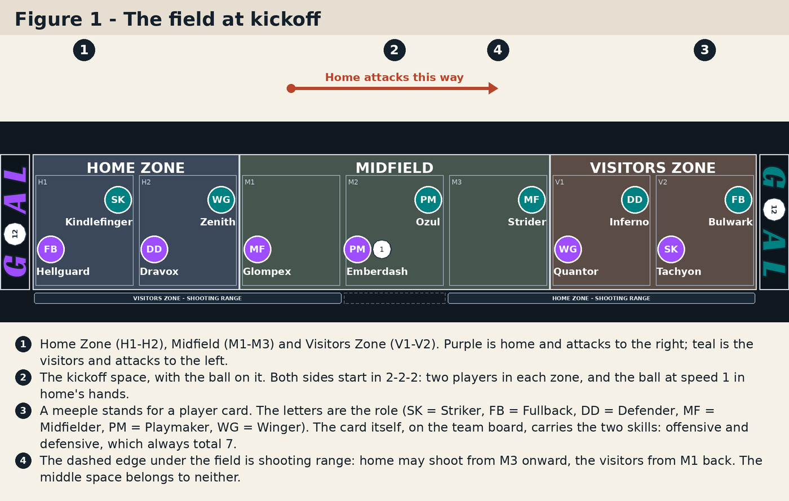

**Three zones.** The field is a row of spaces in three zones: Home Zone (H1, H2), Midfield (M1, M2, M3) and Visitors Zone (V1, V2). Home attacks to the right and the visitors attack to the left, so *forward* and *back* point opposite ways for the two coaches. Any number of players may stand on one space. *(Law 2.1, 2.2)*

**Shooting range.** The dashed band under the field. Home may shoot from M3 onward and the visitors from M1 back; the middle space, M2, is in neither range. This is the one time this book says what you cannot do: **you cannot shoot from outside your range.** *(Law 2.3)*

**The kickoff space** is M2. Both sides kick off from it on this board. *(Law 2.4)*

**The players.** Every player has an **offensive skill** and a **defensive skill**, printed on their card, and the two always total 7. Every player has a **role**, and every role has one ability -- the Fullback throws a longer pass, the Striker adds 3 to a shot off a set-up. The role table is on the back page. *(Law 2.6)*

**The standard deal.** Both sides start in **2-2-2**: the Fullback and a Defender in their own zone, the Midfielder and a Playmaker in midfield, the Winger and a Striker in the zone they attack. Six on the field; the other Defender, Playmaker and Striker wait on the bench. *(Law 3.2)*

**Set up your first game**

1. Choose the 7-space board and flip the coin: a fortune face wins the toss, and the winner picks home or the visitors. *(Law 3.1)*
2. Deal both sides 2-2-2, exactly as Figure 1 shows.
3. Put the ball on M2 showing **1** -- that is its speed -- in home's hands, and the clock marker on 00. *(Law 3.4)*
4. Skip the setup Coaching Choice for your first game. The Charter offers one before kickoff *(Law 3.3)*; you will meet it on page 11.

## A turn, and the six cards

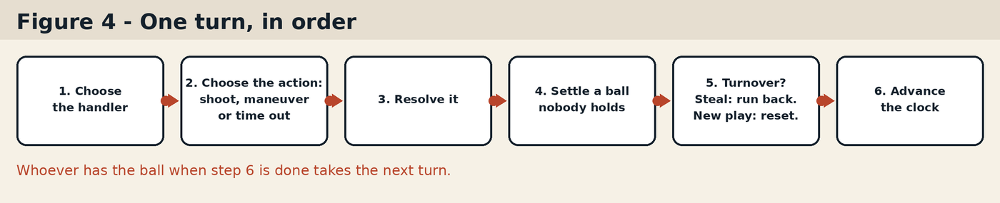

**The handler** is whoever of yours is standing on the ball. If more than one of your players is there, you choose -- unless the last play left the ball with somebody in particular, in which case it is theirs to play. *(Law 4.2)*

**Three things a handler can do:** shoot, if the ball is in your range; play a maneuver; or call a time out. Most turns are maneuvers. *(Law 4.3)*

**Whoever has the ball when the turn ends takes the next one.** *(Law 4.1)*

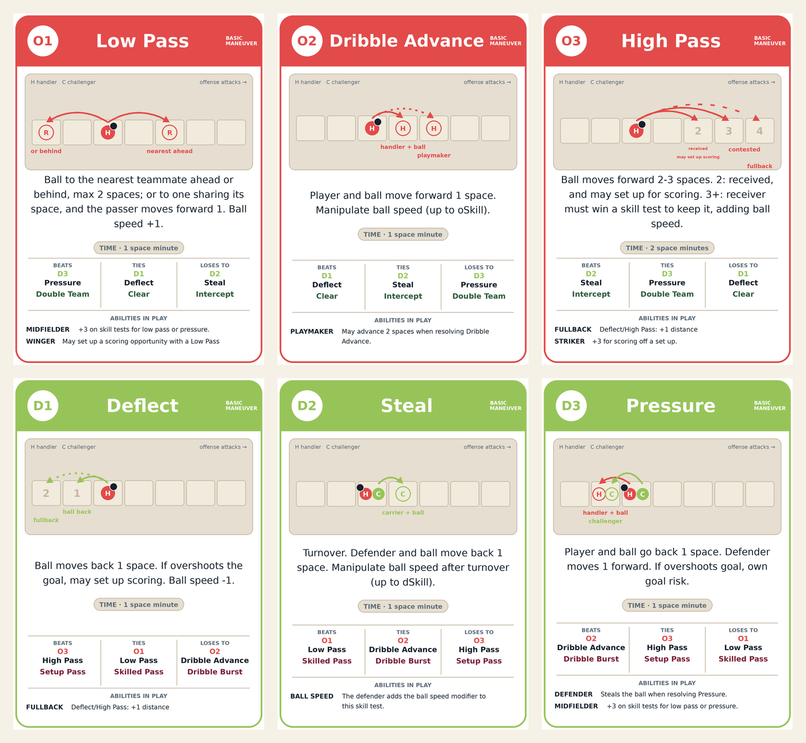

**A maneuver is a fight for the ball between two players**: your handler, and one defender. Both coaches choose a card in secret and reveal together. The offense chooses from Low Pass, Dribble Advance and High Pass; the defense from Deflect, Steal and Pressure. Each card says what it does. *(Law 6.1, 6.2)*

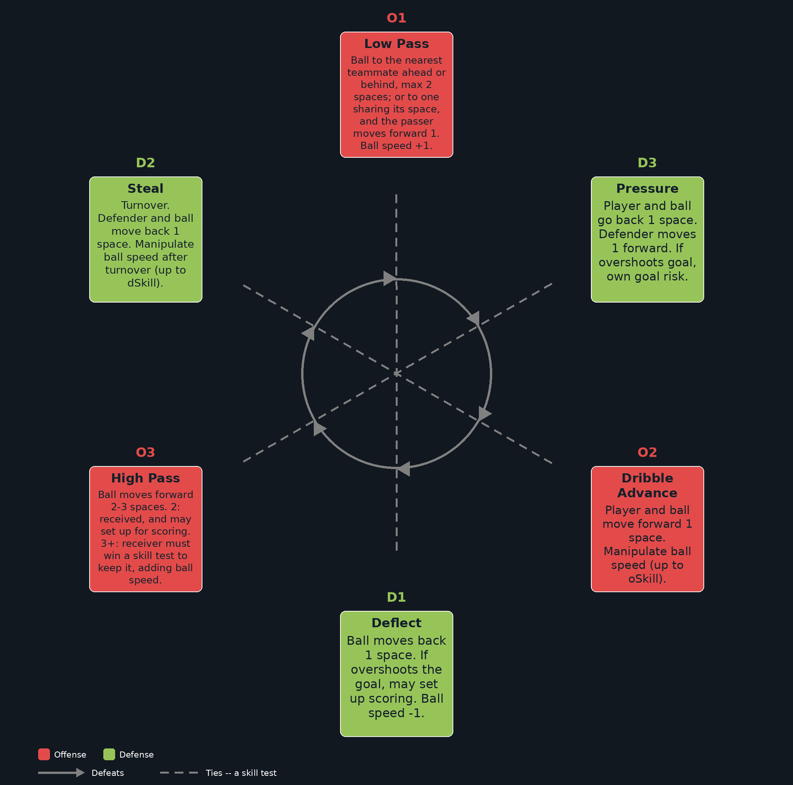

**Rank decides, not dice.** Each card beats one of the other side's cards, ties one, and loses to one. The card that wins is what happens. *(Law 6.3)*

**A tie is not a draw.** It goes to a **skill test**: each player rolls a d12, the handler adds their offensive skill and the defender their defensive skill, and the higher total wins -- their card is what happens. Both players take an **exhaustion token** for the effort. A tied test is rolled again, at another token each. *(Law 6.4)*

**Who defends?** A defender already standing on the ball challenges, and cannot refuse. Otherwise the defending coach may **send** one of their two nearest players to the ball -- the nearest in front of it or the nearest behind it -- paying one exhaustion token for every space walked. Or they may send nobody, and the maneuver simply succeeds. *(Law 6.1, Law 9)*

## Your first five turns

The board is set up as in Figure 1. You play home, purple. A friend, or your other hand, plays the visitors, teal, and plays the card this book names. Each turn is one lesson: the position, what both sides play, what happens, and the rule it shows. This is the same opening the bot's tutorial plays, turn for turn.

### Turn 1: Dribble Advance beats Deflect

Your Playmaker, Emberdash, is on the ball at M2, with the visitors' Playmaker standing on the same space -- so they challenge. **You play Dribble Advance. The visitors play Deflect.**

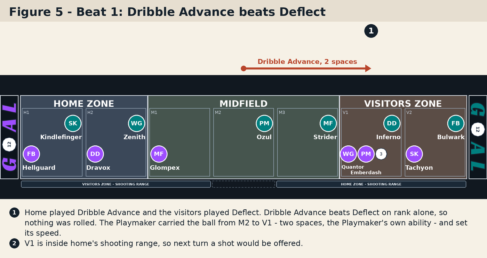

Dribble Advance beats Deflect on rank alone, so nothing is rolled. Your Playmaker carries the ball forward -- **two spaces**, M2 to V1, which is the Playmaker's own ability; anyone else moves one -- and then sets the ball's speed by up to their offensive skill. Pick any speed you like this turn; it will not survive to matter. *(Law 6.6, 2.6)*

You are standing in your shooting range now, so next turn a shot would be offered.

### Turn 2: a tie, a skill test, and a Deflect that lands on somebody

**You play Low Pass. The visitors play Deflect.** Both are rank 1, so they tie: roll the skill test. For this lesson, the visitors win it.

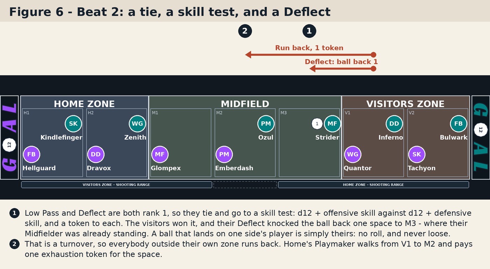

The visitors' Deflect knocks the ball **one space back** for you, from V1 to M3 -- and their Midfielder is already standing on M3. A ball that lands on one side's players is simply theirs: no roll, and never loose. *(Law 6.8, 10.1)*

That is a **turnover**, and a turnover by steal makes everyone outside their own zone **run back**: your Playmaker walks from V1 to M2, one exhaustion token for the one space. The ball's speed resets to 1. *(Law 12.4)*

> A ball only comes **loose** when it lands on an empty space. Page 12 shows all three cases.

### Turn 3: a challenger is sent, and Pressure beats Dribble Advance

The visitors have the ball on M3 and nobody of yours is standing there, so before they play you are asked to **send a challenger**: your Playmaker on M2 or your Winger on V1, one space and one token either way. Send the Playmaker. **The visitors play Dribble Advance. You play Pressure.**

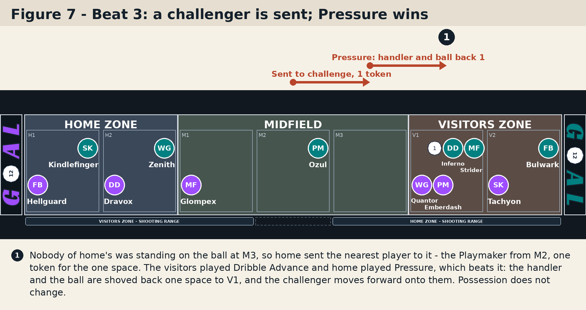

Pressure beats Dribble Advance. Their handler and the ball are **shoved one space back** for them, to V1, and your challenger moves forward onto the same space. Possession does not change -- they still have the ball -- but they have lost ground, and you are standing on it. *(Law 6.10, Law 9)*

> Push a handler who is already on their last space and they roll to avoid an **own goal** *(Law 11)*.

### Turn 4: Steal beats Low Pass, and everyone runs back

The visitors' Midfielder has the ball on V1 with your Playmaker and Winger standing on it, so one of yours challenges; choose the Playmaker. **The visitors play Low Pass. You play Steal.**

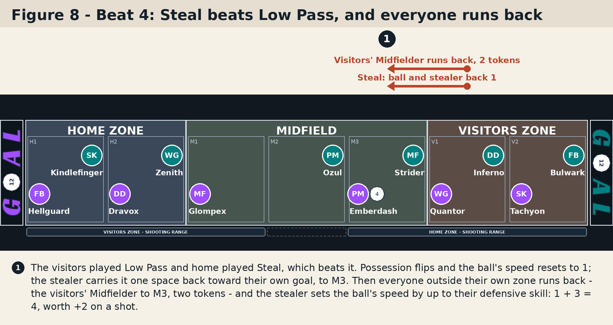

Steal beats Low Pass. Possession flips, the ball's speed resets to 1, and your stealer carries the ball **one space back toward your own goal**, to M3. Then everyone out of position runs back: the visitors' Midfielder walks two spaces home to M3 and pays two tokens. *(Law 6.9, 12.1, 12.4)*

Last, the stealer **sets the ball's speed**, up or down by up to their defensive skill. Take the most: 1 + 3 = **4**. Half the speed, rounded down, is added to a shot -- speed 4 is worth **+2** on the one you are about to take. *(Law 6.9, 7.1)*

### Turn 5: a 2-space High Pass sets up the shot

Your Playmaker has the ball on M3, in range, with the visitors' Midfielder standing on it to challenge. **You play High Pass. The visitors play Steal.** High Pass beats Steal.

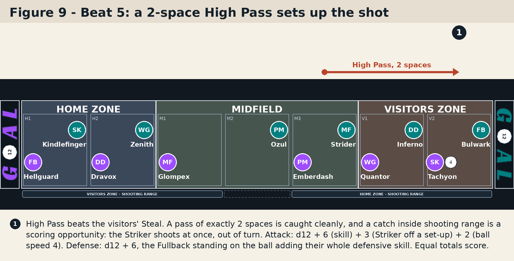

You are asked how far to throw: **2 spaces** lands on V2, where your Striker has been standing all game. A pass of exactly 2 is caught cleanly; a pass of 3 or more has to be won by the receiver. And a catch inside shooting range is a **scoring opportunity**: the Striker shoots at once, out of turn, and the Striker's ability adds 3 to exactly that shot. *(Law 6.7, 8.1, 8.3)*

**Roll the shot.** Attack: d12 + 6 (the Striker's skill) + 3 (a Striker off a set-up) + 2 (ball speed 4). Defense: d12 + 6 -- the visitors' Fullback is standing on the ball and adds their whole defensive skill. **Equal totals score.** About six times in seven, that is a goal. *(Law 5.2, 5.3)*

Goal or miss, the ball is dead and the game restarts as a **new play**: both sides go back to where they started, and the side restarting -- the visitors, from their kickoff space after a goal -- may take a Coaching Choice, which page 11 explains. Then keep playing: you know enough now. *(Law 5.5, 12.5)*

## Shooting, ball speed, and where the ball lands

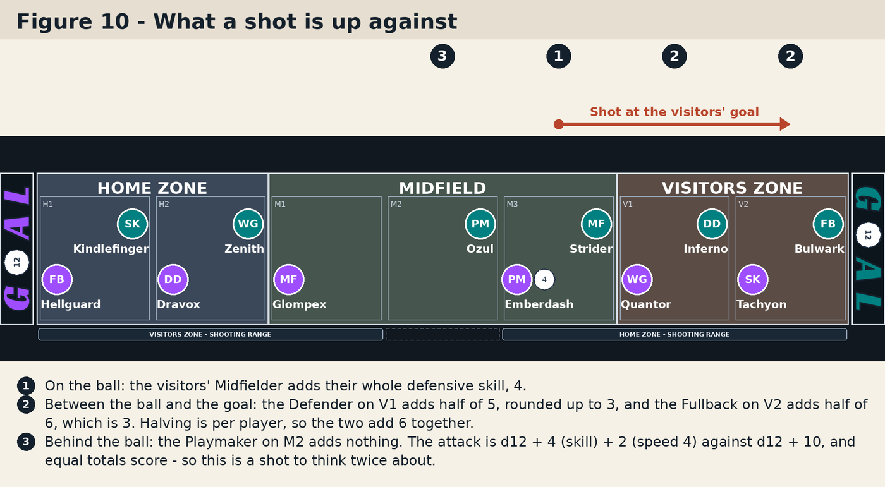

**What a shot is up against.** Every defender between the ball and the goal counts. One standing **on** the ball adds their whole defensive skill. One anywhere **beyond** it, between the ball and the goal, adds half of it, rounded up -- each one, not the group. One **behind** the ball adds nothing. The attack is d12 + the shooter's offensive skill + the ball's speed modifier; the defense is d12 + all of that; equal totals score. *(Law 5.2, 5.3)*

**A shot costs** one minute on the clock and nothing else. Goal or miss, it is a new play. A goal restarts from the conceding side's kickoff space with them in possession; a miss gives the ball to the defending side on their own last space. *(Law 5.4, 5.5)*

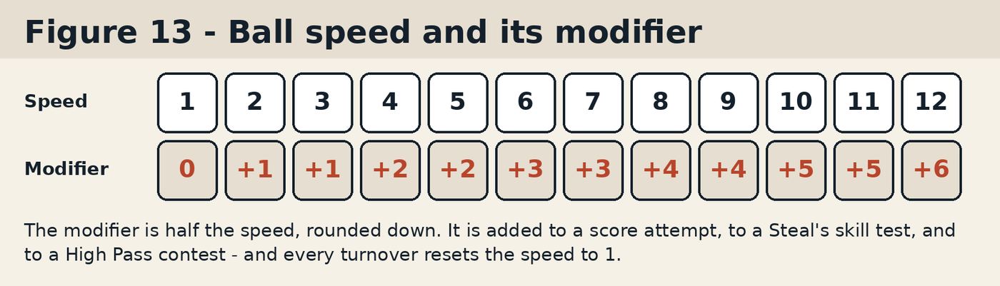

**Ball speed.** The ball is a d12 and the face it shows is its speed. Half the speed, rounded down, is the **modifier**: it is added to your shot, and to a defender's Steal against you. Only maneuvers change the speed -- Low Pass +1, Deflect -1, and a Dribble Advance or a Steal by up to the player's own skill -- and every turnover resets it to 1. *(Law 7)*

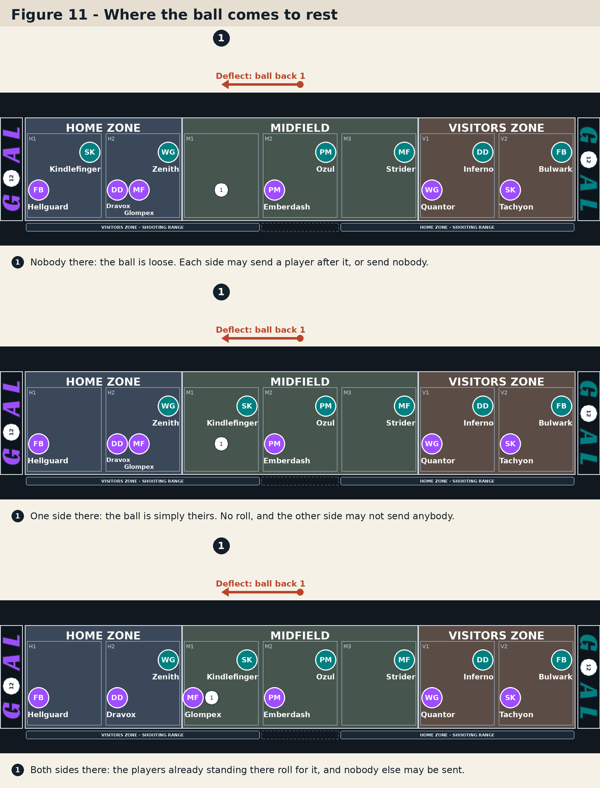

**Where the ball lands.** Some plays leave the ball on a space with nobody holding it -- a Deflect, or a pass that reaches nobody. Whoever is standing there decides. **Nobody:** the ball is loose, and each side may send a player after it, or not; if only one side sends, they simply take it, and if both do, the two roll for it. **One side:** the ball is simply theirs. **Both sides:** the players already there roll for it, and nobody else may be sent. If neither side goes after a loose ball, it goes out of bounds to the other side, who send somebody to pick it up. *(Law 10.1, 10.3, 10.5, 10.6)*

---

## Turnovers, the Coaching Choice, tokens and the clock

**Two kinds of turnover.** A **steal** -- a Steal card, a lost contest for the ball -- keeps the ball live: everyone outside their own zone runs back, one token a space, and play carries straight on. A **new play** -- a goal, a missed shot, a ball out of bounds -- resets both sides to their arrangement, free, and offers the restarting side a Coaching Choice. *(Law 12)*

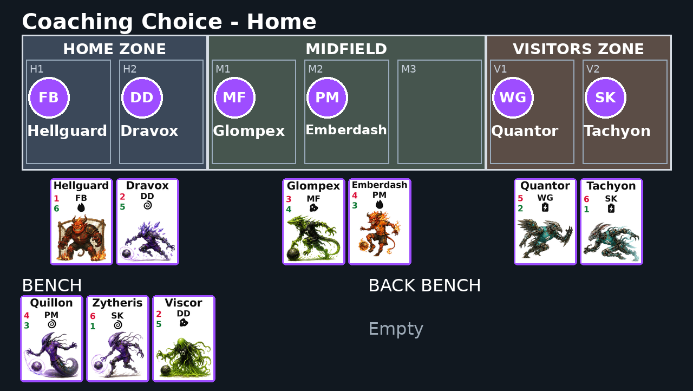

**The Coaching Choice.** A pause, in which you may do any of four things, in any order: change **formation**, **substitute** a player from the bench, **swap two players' zones**, or **move a player** to another space in their zone. You have **two substitutions a half**. You must finish with a player on your kickoff space, and the positions you finish on are your **arrangement** -- where every later new play puts you back. If the restarting side takes a Coaching Choice, the other coach gets one in reply. *(Law 14.2, 14.5, 14.8)*

**Time out.** Out of range, once a half, and not in the last minute, a side may call a time out instead of playing the ball. It costs a minute on the clock, the ball stays where it is, and both coaches take a Coaching Choice, the caller first. *(Law 13)*

**Exhaustion and injury.** Tokens come from skill tests, from walking to the ball, from running back, and from taking a set-up shot. A player carrying **more tokens than their defensive skill is Exhausted**, and rolls an **injury check** after every skill test they are in: a d12, safe if it is higher than their tokens. An **Injured** player loses their tokens, loses ties outright, and adds no skill in a contest for the ball -- until a substitution takes them off, which nothing forces. Halftime takes one token off every player on the field, and one more off a player of each coach's choice. *(Law 15)*

**The clock.** Every maneuver costs one space minute, a High Pass two, a shot one; running back, contests and Coaching Choices cost nothing. The clock never stops. When it reaches the period's last minute, whoever holds the ball once the action resolves has **last possession**: their next turnover ends the half. Halftime recovers a token, offers both coaches a Coaching Choice, and the second half starts at 16 with the visitors kicking off. *(Law 16)*

**Full time and the shootout.** The higher score wins. Level, and each coach lines up their six in secret and the pairs shoot one against one: d12 + offensive skill, higher scores, a tie stands. Best of six, then sudden death. *(Law 17)*

## Appendix: advanced mode

Advanced mode switches on two things, and a game may take either without the other. Everything here is Part II of the Charter, Laws 18 to 20.

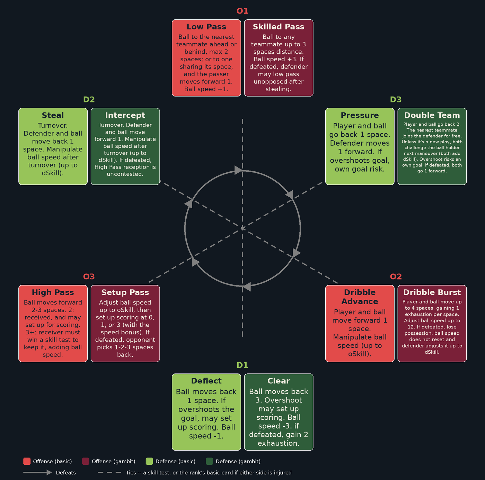

**Gambits.** Every rank gets a second card, the **gambit**: the same maneuver, bigger, and with a price when it is beaten. Skilled Pass reaches any teammate within 3; Dribble Burst runs up to 4; Setup Pass sets up a shot; Clear knocks the ball back 3; Intercept steals forward; Double Team pushes 2 with help. A gambit is the advanced version of the basic card on its rank, so the cycle does not change. You hold your gambits only while your team is **behind** -- fewer goals, or more Exhausted-or-Injured players on the field -- and a gambit can only be played against a challenge. *(Law 19)*

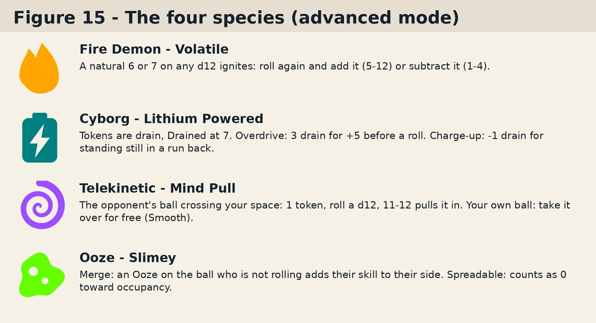

**Species abilities.** Fire Demons **ignite** on a natural 6 or 7. Cyborgs run on **drain** and can **Overdrive** a roll. Telekinetics **pull** the opponent's ball as it crosses them, and take their own ball for free. Oozes **merge** into a skill test on their space. The species reference cards in the box carry the rest, and the Charter carries all of it. *(Law 20)*

## Quick reference

**The roles** *(Law 2.6)*

| Role | Off | Def | Ability |
| --- | ---: | ---: | --- |
| Fullback | 1 | 6 | +1 space on a pass or a deflection |
| Defender | 2 | 5 | A won Pressure also steals the ball |
| Midfielder | 3 | 4 | +3 on a skill test for a Low Pass or a Pressure |
| Playmaker | 4 | 3 | May Dribble Advance 2 spaces |
| Winger | 5 | 2 | A completed Low Pass may set up a shot |
| Striker | 6 | 1 | +3 on a shot off a set-up |

**The rolls** *(Appendix A of the Charter)*

| Roll | Dice | How it reads |
| --- | --- | --- |
| Score attempt | 1d12 each | Attack adds offense and the speed modifier; defense adds full skill on the ball and half beyond it. Equal totals score. |
| Skill test | 1d12 each | Offense against defense, plus any ability and modifier. Higher wins; a tie is re-rolled at a token each. |
| Own goal | 2d12, keep the higher | Add offensive skill. 7 or more avoids it. |
| Injury check | 1d12 | Higher than the player's token count is safe. |
| Shootout test | 1d12 each | Both add offensive skill. Higher scores; a tie stands. |

**A turn:** choose the handler, choose the action, resolve it, settle the ball, turnover, clock. Whoever has the ball takes the next turn.

**A turnover:** speed to 1, then -- a steal runs players back; a new play resets both sides and offers a Coaching Choice. A time out is not a turnover.

**The clock:** a maneuver 1, a High Pass 2, a shot 1, a time out 1, everything else 0.
