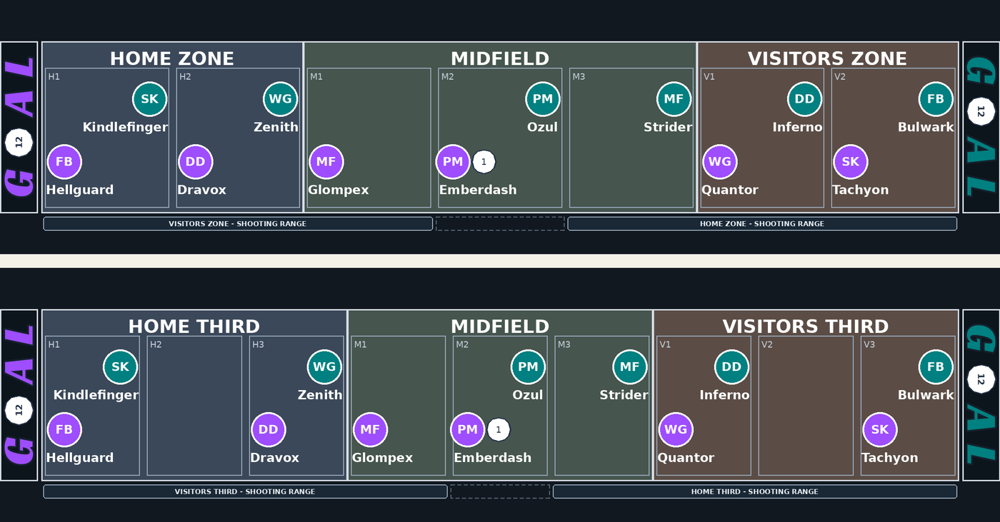

# The D12Ball Charter: Laws of the Game

This document is the final authority on the rules of D12 Ball. It states each rule once and settled, for each of the three modes a game may be played in: **training**, **basic** and **advanced**. History, open questions and the places upstream has not caught up yet all belong in [rules-log.md](rules-log.md), and the illustrated introduction to the game is [learn-to-play.md](learn-to-play.md).

## Contents

- [How to read this document](#how-to-read-this-document)
- Part I -- The game
  - [Law 1. The game in brief](#the-game-in-brief)
  - [Law 2. Components and definitions](#components-and-definitions)
  - [Law 3. Setting up a game](#setting-up-a-game)
  - [Law 4. The turn](#the-turn)
  - [Law 5. Score attempt](#score-attempt)
  - [Law 6. Maneuvers](#maneuvers)
  - [Law 7. Ball speed](#ball-speed)
  - [Law 8. Scoring opportunities](#scoring-opportunities)
  - [Law 9. Sending a player](#sending-a-player)
  - [Law 10. Contests for the ball](#contests-for-the-ball)
  - [Law 11. Own goal](#own-goal)
  - [Law 12. Turnovers](#turnovers)
  - [Law 13. Time out](#time-out)
  - [Law 14. Coaching Choice](#coaching-choice)
  - [Law 15. Exhaustion and injury](#exhaustion-and-injury)
  - [Law 16. The clock](#the-clock)
  - [Law 17. Extreme shootout](#extreme-shootout)
- Part II -- Basic and advanced mode
  - [Law 18. The three modes](#the-three-modes)
  - [Law 19. Gambits](#gambits)
  - [Law 20. Species abilities](#species-abilities)
  - [Law 21. Personal abilities](#personal-abilities)
- [Appendix A. Quick reference](#appendix-a-quick-reference)
- [Appendix B. Glossary](#appendix-b-glossary)
- [Appendix C. The boards](#appendix-c-the-boards)
- [Appendix D. Edition notes](#appendix-d-edition-notes)

## How to read this document

The Charter is divided into **Laws**, each Law into **sections**, and each section into **paragraphs**. In the printed edition every paragraph carries a number -- Law, section, paragraph, as in *6.4.2* -- and a paragraph that lists cases letters them, as in *6.4.2b*. A number in parentheses is a cross-reference to the paragraph or section it names. In this file the same references are links.

**Precedence.** Where the Charter and any other statement of the rules disagree, the Charter is right: it wins over the Learn to Play, over the text printed on a card or a board, and over the bot. Where the Learn to Play simplifies, it says so and names the Law it simplifies.

**Training, basic and advanced mode.** Laws 1 to 17 are the whole of the game in training mode. Part II is what the other two modes add and change: [Law 18](#the-three-modes) says which mode plays what, [Law 19](#gambits) is the gambits, [Law 20](#species-abilities) the species abilities and [Law 21](#personal-abilities) the personal abilities. A rule in Part II wins over a rule in Part I for a game playing the module it belongs to, and applies nowhere else.

**Defined terms** are in bold where they are defined, and every one is listed in [Appendix B](#appendix-b-glossary) with the paragraph that defines it.

**Notes** are set apart under a paragraph and begin with the word *Note*. A note explains; it is never a rule, and it is never numbered.

**The point of view.** Every rule is written from the point of view of the team it applies to. **Forward** means toward the goal a team is attacking and **back** means toward the goal it is defending, so the two words point opposite ways for the two sides.

## Part I -- The game

The whole of D12 Ball in training mode, Laws 1 to 17. Nothing in Part I depends on Part II.

## The game in brief

Two coaches each control a team of nine players: six on the field and three on the bench.

The game runs over two periods on a single clock, the first from minute 00 to minute 15 and the second from 15 to 30.

The team in possession takes a turn. It shoots if the ball is in its shooting range, and otherwise plays a maneuver against a defender or calls a time out to buy both coaches a pause. Whichever team has the ball when a turn ends takes the next one.

The higher score at full time wins. A level score goes to the [extreme shootout](#extreme-shootout), so every game is settled.

## Components and definitions

### The field

The field is a row of spaces divided into three zones, left to right: the home goal, midfield, and the visitors goal. A game is played on a board of 7 or 9 spaces.

| Board | Home goal | Midfield | Visitors goal |
| --- | ---: | ---: | ---: |
| 7 (default) | 2 | 3 | 2 |
| 9 | 3 | 3 | 3 |

On the board itself, the two outer zones are labelled **Home Zone** and **Visitors Zone** -- **Home Third** and **Visitors Third** on the 9-space board, the only one where all three zones are equal.

A space is named by its zone's letter and its position counted from the home end: H1 and H2 are the home goal on board 7, M1 to M3 its midfield, V1 and V2 the visitors goal.

A space belongs to nobody. Any number of meeples from either team may stand on one, and distances are counted in spaces straight across the zone boundaries.

### Forward and back

The home team attacks the visitors goal and the visiting team attacks the home goal.

**Forward** means toward the goal a team is attacking and **back** means toward the goal it is defending. The two words point opposite ways for the two sides, and every rule in this document is written from the point of view of the team it applies to.

### Shooting range

A team may only shoot from within its **shooting range**, which is the far part of the field measured from the middle of the board. It is not a zone: it takes in the goal zone a team attacks and cuts partway across midfield.

| Board | The visitors may shoot from | Neither | Home may shoot from |
| --- | --- | --- | --- |
| 7 | H1, H2, M1 | M2 | M3, V1, V2 |
| 9 | H1, H2, H3, M1 | M2 | M3, V1, V2, V3 |

Both boards have an odd number of spaces, so both have a true middle space, and that space is in neither team's range.

*Note.* The middle space is also the kickoff space, so no restart ever begins in range.

### The kickoff space

The **kickoff space** is the middle space of midfield, and both teams kick off from it.

Every arrangement a coach settles has to cover their own kickoff space -- see [finishing a Coaching Choice](#finishing-a-coaching-choice).

### Occupancy

Meeples share spaces freely in the run of play. Nothing in a maneuver, a contest or a walk-in is ever refused because a space is crowded.

**Coverage** binds deliberate placement instead: a team may not put a second meeple on a space in a zone while another space in that zone has none of theirs on it.

Coverage is checked one team at a time, so an opposing meeple never covers a space on your behalf. Where a zone holds more of a team's players than it has spaces, they cover every space first and the surplus stacks.

### Players and roles

A team is nine players, and in training mode the two teams are identical.

Every player has an **offensive skill** from 1 to 6 and a **defensive skill** that is its inverse, so the two always total 7.

| Role | Offense | Defense | Ability |
| --- | ---: | ---: | --- |
| Fullback | 1 | 6 | **+1 space** on a pass or a deflection: a High Pass up to 4, a Deflect of 2, a Clear of 4, a Setup Pass that may also reach 4. |
| Defender | 2 | 5 | A won Pressure also steals the ball. |
| Midfielder | 3 | 4 | Adds 3 to a skill test for a Low Pass or a Pressure. |
| Playmaker | 4 | 3 | May advance 2 spaces with a Dribble Advance, and pays one exhaustion token fewer for a Dribble Burst. |
| Winger | 5 | 2 | A completed Low Pass may set up a scoring opportunity. |
| Striker | 6 | 1 | Adds 3 to a score attempt taken off a set-up. |

Each squad is one Fullback, two Defenders, one Midfielder, two Playmakers, one Winger and two Strikers. Beyond the standard deal, no role belongs to any particular zone.

### The ball, the dice and the tokens

The ball is a d12, and the face it shows is its **speed**.

Every roll in the game is a d12: one each for a skill test or a score attempt, and two for an own-goal roll.

Maneuvers are chosen in secret from the six maneuver cards -- twelve in a game played with [gambits](#gambits).

A player's **exhaustion tokens** sit on their card. A player carrying more tokens than their defensive skill is **Exhausted**; a player who fails an injury check is **Injured** -- see [Law 15](#exhaustion-and-injury).

### Definitions

A player's **card** is assigned to a zone and their **meeple** stands on a space. Play pulls the two apart, and a run back is what puts them back together.

The **handler** is the player with the ball, taking their team's turn with it -- see [choosing the handler](#choosing-the-handler).

The **challenger** is the defending player who meets a maneuver on the ball's space -- see [determining the two players](#determining-the-two-players).

The **carrier** is the player a resolution leaves the ball with. The carrier handles the ball on their team's next turn without a choice being offered, and never runs back -- see [choosing the handler](#choosing-the-handler) and [running back after a steal](#running-back-after-a-steal).

An **arrangement** is where a coach's meeples were standing when they last closed a [Coaching Choice](#coaching-choice). It is what a new play puts them back on.

A **set-up** is a scoring opportunity a maneuver has created: a shot its receiver may take out of turn -- see [scoring opportunities](#scoring-opportunities).

A **skill test** is an opposed roll, one d12 to each side -- see [the skill test](#the-skill-test).

A **contest** is a skill test for a ball nobody is holding -- see [contests for the ball](#contests-for-the-ball).

**Sending a player** is a walk-in to the ball's space, paid for in exhaustion -- see [sending a player](#sending-a-player).

A ball is **loose** when it has come to rest on a space with nobody standing on it -- see [where the ball comes to rest](#where-the-ball-comes-to-rest). A ball that comes down on somebody is not loose.

A **space minute** is the unit of game time -- see [the clock](#the-clock).

A **live ball** is one in play. A **dead ball** is one being brought back into play after a goal, a missed shot, an own-goal roll, a ball out of bounds or a period's start: it is carried to where play starts again rather than travelling over the spaces between.

**Exhausted** and **Injured** are the two conditions a player can be in -- see [Law 15](#exhaustion-and-injury). In basic and advanced mode a Cyborg's own words for them are Drained and Damaged -- see [Lithium Powered](#lithium-powered-cyborg).

**Behind** is the condition under which a coach holds gambits in advanced mode -- see [who may play a gambit](#who-may-play-a-gambit).

## Setting up a game

### Winning the toss

Choose a 7- or 9-space board.

One coach flips the coin: a fortune face wins them the toss and a doom face hands it to their opponent.

The winner chooses whether to be home or the visitors. Home kicks off the first half and the visitors kick off the second.

### The standard deal

Both sides are dealt into **2-2-2** by role: the Fullback and one Defender in their own goal, the Midfielder and one Playmaker in midfield, the Winger and one Striker in the goal they attack. The remaining Defender, Playmaker and Striker start on the bench.

A goal zone's two cards take the two ends of the zone, and midfield packs from that side's own end outward. On board 7 that comes out the same as filling each zone in order. It is only visible on board 9, whose zones are three spaces deep: home deals to H1, H3, M1, M2, V1 and V3, and the visitors deal the mirror of it.

*Note.* Midfield packs rather than spreads because the kickoff space is in it. Every arrangement has to cover its own side's kickoff space, and packing from a side's own end reaches that space on every board.

### Setup coaching

Home takes a [Coaching Choice](#coaching-choice) and then the visitors take one.

Setup substitutions are unlimited, and a player taken off at setup goes back to the bench rather than being retired -- nobody has played yet.

Each coach finishes with a player on their own kickoff space, and the positions they finish on become that side's first arrangement.

### Kickoff

The ball goes on the kickoff space at speed 1 in home's possession, with the clock at 00.

## The turn

### The order of a turn

The team in possession takes a turn, in this order:

1. Choose [which of their players on the ball's space handles it](#choosing-the-handler).
2. Choose the action: a [score attempt](#score-attempt) if the ball is in that team's shooting range, and otherwise a [maneuver](#maneuvers) or a [time out](#time-out).
3. Resolve the action, and anything it leads to.
4. If the action left nobody holding the ball, settle it [where it came to rest](#where-the-ball-comes-to-rest).
5. If the ball changed hands, resolve the [turnover](#turnovers).
6. Advance the clock by what the action cost.

Whichever team has the ball at the end of all that takes the next turn.

### Choosing the handler

Any of the possessing team's players standing on the ball's space may handle it, and the coach picks between them -- unless the last resolution left the ball with one player in particular, the carrier, in which case that player handles it and there is nothing to choose.

These leave the ball with a particular player:

- a Dribble Advance, with the player who dribbled it;
- a completed Low Pass and a received 2-space High Pass, with the receiver;
- a Steal, with the interceptor;
- a ball won where it came to rest, or a won High Pass contest, with the winner;
- a Pressure, with the handler who was shoved back still holding it -- including one who has just survived an own-goal roll, and with the Defender instead where their Pressure also stole it.

These leave it with nobody in particular: a kickoff or any other restart, and a required [pickup](#picking-the-ball-up). A [Deflect](#deflect) leaves nobody in possession at all, so who gets it is settled -- by a contest, or automatically if only one side is there -- before anybody handles it.

The carry holds for one turn only. If that player is no longer on the ball by the time the turn comes round, their coach chooses in the ordinary way.

The player holding the ball [never runs back](#running-back-after-a-steal).

### Choosing the action

A score attempt is offered only inside the team's [shooting range](#shooting-range).

A maneuver is always available.

A [time out](#time-out) is offered only outside shooting range, only while that side still has its time out for the half, and never once [last possession](#last-possession) has been declared.

### Finishing the turn

The ball [where it came to rest](#where-the-ball-comes-to-rest) comes first: an action that left nobody holding it is settled before anything else, however it left the ball there.

Then the turnover, if the ball changed hands. A [steal](#running-back-after-a-steal) runs players back and play carries straight on; a [new play](#resetting-after-a-new-play) resets both sides and offers a Coaching Choice.

Then the clock, by the action's own cost -- which is charged whether or not the action turned the ball over. Running back, resetting, contests, rolls, pickups and Coaching Choices all cost no time.

If the clock has reached the period's last minute, [last possession](#last-possession) is in force.

## Score attempt

### When a shot may be taken

A shot may only be taken from within the shooting team's [range](#shooting-range).

### The roll

The handler shoots and both coaches roll one d12.

The attack adds the shooter's offensive skill, the [ball speed modifier](#ball-speed), and 3 more if a Striker is shooting off a [set-up](#scoring-opportunities). The defense adds the skill of every defending player in the way, as [what the defense adds](#what-the-defense-adds) says.

**The attack scores on a total equal to or higher than the defense's.**

### What the defense adds

A defending player standing on the ball's own space adds their **whole** defensive skill.

A defending player standing anywhere between the ball and the goal being shot at adds **half** of it, rounded up.

A defender behind the ball adds nothing at all.

The halving is per player rather than over the group: two defenders of 5 in the way add 3 + 3 = 6, where halving their combined 10 would give 5.

### The cost of a shot

An ordinary shot costs its shooter nothing. A shot taken off a set-up gains its shooter 1 exhaustion token after the roll, whether it went in or not.

A score attempt costs 1 space minute, and a set-up's shot costs that on top of the maneuver that created it.

### After the shot

Goal or miss, the ball is dead and the game restarts as a [new play](#resetting-after-a-new-play), with speed back to 1.

A goal restarts from the conceding side's own kickoff space with them in possession. Every arrangement is required to cover that space, so nothing further is owed.

A miss gives the ball to the side that just defended it, on the space closest to their own goal, which carries no such guarantee: if nobody of theirs is standing there once the reset settles, they [pick it up](#picking-the-ball-up) exactly as after an out-of-bounds ball.

## Maneuvers

### Determining the two players

The player maneuvering for the offense is the handler.

A defending player already standing on the ball's space **challenges**. They have nowhere to walk and nothing to pay, so that challenge cannot be declined, and nobody may be walked in past them. Where more than one of them shares the space, the defending coach chooses which of them challenges.

Otherwise the defending coach may [send a player](#sending-a-player) to the ball's space, at 1 exhaustion token per space, **or send nobody** rather than pay for the challenge.

With no challenger, the maneuver the offense chooses succeeds outright: there is nothing to reveal against, no ranking to read and no test to roll. Nobody moves and nobody pays.

### Choosing and revealing

Both coaches secretly choose one of their maneuvers and reveal together.

The offense chooses from Low Pass, Dribble Advance and High Pass; the defense from Deflect, Steal and Pressure. In a game played with [gambits](#gambits) a coach who may play one chooses from six -- see [Law 19](#gambits).

### Who wins

The three ranks a side form a cycle. Equal ranks tie.

| Offense | Deflect (D1) | Steal (D2) | Pressure (D3) |
| --- | --- | --- | --- |
| Low Pass (O1) | Tie | Steal wins | Low Pass wins |
| Dribble Advance (O2) | Dribble Advance wins | Tie | Pressure wins |
| High Pass (O3) | Deflect wins | High Pass wins | Tie |

An [injured](#playing-injured) participant changes this in both directions: a maneuver they would have won outright goes to a skill test they have to win, and a tie against one healthy opponent is their automatic loss with nothing rolled.

### The skill test

Both participants gain 1 exhaustion token, and then each rolls a d12.

The offense adds the handler's offensive skill and the defense adds the challenger's defensive skill. On top of that:

- a Midfielder adds 3 more when the maneuver being tested is their own Low Pass or their own Pressure;
- a defense contesting with Steal adds the [ball speed modifier](#ball-speed).

The higher total wins and their maneuver is what resolves.

A tie is rolled again, and each participant gains another token for it.

When the test finally resolves, every participant who is Exhausted takes an [injury check](#the-injury-check).

### Low Pass

**Rank O1. Costs 1 space minute. Beats Pressure, loses to Steal.**

The ball goes to a teammate, and there are at most three destinations to choose between: the nearest teammate up to 2 spaces ahead of the ball, the nearest teammate up to 2 spaces behind it, and a teammate standing on the ball's own space. A nearer teammate blocks a farther one in the same direction, so the choice is between directions rather than distances. Where several teammates are standing on the destination, the passer chooses which of them receives it.

A pass has to reach a different player -- the handler cannot pass to themselves -- and a pass across a shared space also sends the passer 1 space forward if there is field to move into.

Ball speed rises by 1, to a maximum of 12. The ball is left with the receiver.

With no legal destination at all, the maneuver still resolves: the ball rolls 1 space forward, its speed still rises, and it settles [where it lands](#where-the-ball-comes-to-rest).

*Winger:* a completed Low Pass may offer its receiver a [scoring opportunity](#scoring-opportunities), at any of the three distances, if the ball is in shooting range.

### Dribble Advance

**Rank O2. Costs 1 space minute. Beats Deflect, loses to Pressure.**

The handler and the ball move 1 space forward together. The handler then changes the ball's speed by up to their offensive skill, in either direction, within the range 1 to 12.

The ball is left with the handler.

*Playmaker:* may advance 2 spaces instead of 1.

### High Pass

**Rank O3. Costs 2 space minutes. Beats Steal, loses to Deflect.**

The ball is thrown 2 or 3 spaces forward, and a Fullback may throw it 4. Only distances that land on a space the field actually has are offered, and a distance is dropped when a shorter one already reaches the space it would land on -- the longer throw would be the same pass at a disadvantage.

| The throw | What happens |
| --- | --- |
| 2 spaces, a teammate on the landing space | Received. The ball is left with the receiver, who may take a [scoring opportunity](#scoring-opportunities) if it is in range. |
| 3 or 4 spaces, a teammate there | Received but contested: the receiver has to win the [High Pass contest](#the-high-pass-contest) to keep it. |
| Nobody there | The ball is [loose](#where-the-ball-comes-to-rest). |

A 2-space pass that lands short of shooting range is still received. The range rule takes away the shot, not the catch.

**An overshoot** is a throw that runs out of field. With the ball 0 or 1 spaces from the end, every distance lands on the same last space, so nothing is offered and the throw overshoots before anyone chooses. An overshoot onto a teammate offers that receiver the scoring opportunity **or** the High Pass contest: they are two halves of one choice, declining the shot means taking the contest, and the ball speed modifier counts **against** them either way.

**A passer never receives their own pass.** Thrown from the last space the ball comes straight back down where it was, and a teammate sharing that space receives it and is offered the choice above.

With no other teammate on that last space, there is nowhere left to throw it and nobody to throw it to: the ball goes [out of play](#out-of-bounds), the other team gains possession, and the gaining side sends somebody to pick it up. The throw still costs its 2 minutes.

### Deflect

**Rank D1. Costs 1 space minute. Beats High Pass, loses to Dribble Advance.**

The ball moves 1 space back -- toward the goal the offense is defending. Ball speed drops by 1, never below 1. Neither player moves.

*Fullback:* deflects the ball 2 spaces instead of 1.

A Deflect turns nothing over by itself, and settles nothing either: it knocks the ball out of anybody's possession, so what happens next depends on who, if anyone, is standing where it lands. That is [the ordinary three-way rule](#where-the-ball-comes-to-rest): nobody there and it is loose, one side there and it is theirs, both there and they contest it on the spot.

The one exception is a deflection that runs out of field **and** finds a defending player standing on the landing space: rather than being contested, that player gets a [scoring opportunity](#scoring-opportunities). Possession flips for it and speed resets, and it is the shot that follows -- goal or miss -- that makes the new play.

### Steal

**Rank D2. Costs 1 space minute. Beats Low Pass, loses to High Pass.**

Possession flips and ball speed resets to 1. The challenger and the ball then move 1 space back for their side, toward the goal the new possessing team is defending.

Once everyone has run back, the interceptor changes the ball's speed by up to their defensive skill, in either direction.

The ball is left with the interceptor, who therefore does not run back.

### Pressure

**Rank D3. Costs 1 space minute. Beats Dribble Advance, loses to Low Pass.**

The handler and the ball go 1 space back, toward the goal the offense is defending, and the challenger moves 1 space forward onto the same space. Possession does not change, and the ball is left with the handler.

Where the handler is already standing on the space closest to their own goal there is nowhere to push them, and the pressure risks an [own goal](#own-goal) instead.

*Defender:* a won Pressure also steals the ball -- unless the push overshot into an own-goal roll, which takes priority whichever way it goes.

## Ball speed

### The speed and its modifier

The ball's speed is the face its d12 shows, from 1 to 12. Its **modifier** is half that, rounded down.

| Speed | 1 | 2-3 | 4-5 | 6-7 | 8-9 | 10-11 | 12 |
| --- | ---: | ---: | ---: | ---: | ---: | ---: | ---: |
| Modifier | 0 | +1 | +2 | +3 | +4 | +5 | +6 |

### What changes it

Only maneuvers change it. In basic mode there are four: Low Pass adds 1, Deflect takes 1 off, and Dribble Advance and Steal let the player change it by up to their own skill.

### Turnovers reset it

Every turnover resets the speed to 1.

### Where the modifier is added

The modifier is added in three places and nowhere else: to a [score attempt](#score-attempt), by the attack; to a maneuver skill test, by a defense contesting with Steal; and to a [High Pass contest](#the-high-pass-contest), by the side that threw the pass.

The ball [where it came to rest](#where-the-ball-comes-to-rest) belongs to nobody yet, so neither contestant adds it there.

### The overshoot

An overshot High Pass turns the sign around: the modifier counts against the shot it sets up and against the contest behind it.

## Scoring opportunities

### What a set-up is

A scoring opportunity is an ordinary [score attempt](#score-attempt) taken out of turn.

What the set-up buys is the shot, not a shot from anywhere: it obeys the range rule like any other, so a set-up out of range simply does not happen.

### The set-ups

| Set up by | Who shoots |
| --- | --- |
| A received 2-space High Pass | The receiver |
| An overshot High Pass onto a teammate | The receiver |
| A Winger's completed Low Pass | The receiver |
| An overshot Deflect | The defending player on the landing space |

### The shooter

The shooter gains 1 exhaustion token after the roll either way, and a Striker adds 3 to it.

### Declining

Declining costs nothing and the maneuver resolves as it otherwise would have.

The one exception is an overshot High Pass, where declining the shot means taking the [High Pass contest](#the-high-pass-contest) instead.

### The cost in time

Taking the shot costs its own space minute on top of the maneuver that set it up.

## Sending a player

### The three occasions

Three rules ask a coach to send a player to the ball's space: the [maneuver challenge](#determining-the-two-players), a [loose ball](#where-the-ball-comes-to-rest) -- the [High Pass contest](#the-high-pass-contest) included, which is the one contest a send may be offered against an occupied space -- and the [pickup](#picking-the-ball-up) after an out-of-bounds ball, a [time out](#time-out), a missed shot or an avoided own goal.

All three ask it in the same way, and a player's zone has nothing to do with it.

### The two nearest

A coach may send either of their two nearest players to the space: the nearest one in front of it and the nearest one behind it, counted in spaces along the field.

Where two or more are tied for nearest on one side, the coach chooses between them.

### A player already there

A player already standing on the space is not sent anywhere -- they are there already, and where the rule makes them act, there is nothing to choose.

### What a send costs

A sent player moves onto the space and gains 1 exhaustion token for every space they travelled.

### Sending nobody

Sending nobody is legal wherever the rule offers the choice.

### Staying put

Nothing brings a sent player home again. They stay where the contest left them until a turnover [runs them back](#running-back-after-a-steal) or [resets](#resetting-after-a-new-play) them.

## Contests for the ball

### Where the ball comes to rest

Some actions leave the ball on a space with nobody named as holding it -- a pass that reaches nobody, a [Deflect](#deflect), and in advanced mode a [Clear](#clear) or a beaten [Setup Pass](#setup-pass). **What is standing on that space decides what happens, and there are three answers.**

| On the space the ball lands on | What happens |
| --- | --- |
| Nobody | The ball is **loose**. Each side may [send a player](#sending-a-player) after it, or send nobody. |
| One side only | The ball is simply **theirs**, uncontested. No roll, and the other side is not offered a send. |
| Both sides | A **contest**. The players already standing there roll for it, and nobody else may be sent. |

**"Loose" means the space was empty, and it means nothing else.** A ball that comes down on somebody has not gone loose: either it has landed on a player who simply has it, or it has landed between two who fight for it on the spot. Nobody walks in on either -- a side is offered a send only against an empty space.

Where a side has several players on the space, their coach picks which of them takes the ball or contests for it. A player already standing there is not sent anywhere and pays nothing, and their side may not withhold them.

### The contest

Both contestants roll a skill test: the side that last had the ball adds their player's offensive skill, the other side adds their player's defensive skill.

The higher total wins the ball and is left holding it. A tie is rolled again, at a token each.

Neither side adds the [ball speed modifier](#ball-speed) -- the ball is nobody's yet. A [High Pass contest](#the-high-pass-contest) is the one exception.

### A loose ball

A loose ball is contested the same way, once each side has decided who to send.

Where both sides send somebody they roll as above; where only one does, that player takes the ball without a test; where neither does, the ball goes [out of bounds](#out-of-bounds). Only an empty space can come to that.

### The High Pass contest

A High Pass of 3 spaces or more onto a teammate is caught, but not kept: the receiver has to win a contest to keep it, and the receiver standing on the ball is their side's contestant. An overshot pass whose set-up was declined comes to the same place. A pass of 2 does not -- a teammate there simply receives it and possession does not change, exactly as with a [Low Pass](#low-pass).

**A High Pass is the one exemption to [where the ball comes to rest](#where-the-ball-comes-to-rest).** A landing space holding only one side's players may still be contested by the other, who [send a player](#sending-a-player) after it exactly as they would to an empty space. Every other way the ball comes to rest is settled by whoever is already standing there.

*Note.* The ball is high in the air, which gives players time to run towards it.

Otherwise it is [the contest](#the-contest) above, with one difference: the side that threw the pass adds the [ball speed modifier](#ball-speed), and adds it against themselves if the pass overshot.

A pass that reaches nobody carries no modifier. It is not this contest at a disadvantage; the ball is simply loose on an empty space, and there is no receiver for the throw to have favoured.

The ball is left with the winner. A receiver who loses it has been stolen from.

### Out of bounds

Where neither side sends anybody after a loose ball, the ball goes out. The side that did not have it takes over at speed 1.

It is a [new play](#resetting-after-a-new-play) rather than a steal -- nobody took the ball off anyone, it simply went dead. Once both sides have reset, the side that gained it [picks the ball up](#picking-the-ball-up).

### Picking the ball up

An out-of-bounds ball, a [missed shot](#score-attempt), an [avoided own goal](#own-goal) and a [time out](#time-out) can all leave the ball on a space nobody of the gaining or keeping side is standing on. Once everything else has settled, that side [sends a player](#sending-a-player) to the ball's space -- unless one of theirs is already standing there, which settles it for nothing.

It costs the usual token a space, **except after a time out, which is free**.

*Note.* That is the one walk to the ball in the game that charges nothing: a time out costs a minute and nothing else, and a coach who rearranges their side is not billed for putting somebody back on a ball their team never lost.

A pickup is a placement rather than a contest: nobody rolls for it, nobody may contest it, and the ball is left with nobody in particular afterwards.

### Who has been stolen from

The ball ending up with the side that did not last have it is a [steal](#turnovers).

## Own goal

### When it is risked

Only a Pressure that runs out of field risks an own goal: the handler is already on the space closest to their own goal, and there is nowhere left to push them back to.

### The own-goal roll

The handler rolls **two d12, keeps the higher, and adds their offensive skill**. On a total of 7 or more the own goal is avoided.

The roll costs that player 1 exhaustion token whichever way it goes. It is not a skill test, so it owes no injury check.

Either result is a [new play](#resetting-after-a-new-play).

### Avoided

The ball stays where the Pressure left it and the same side keeps it. This is the one new play that does not change possession -- but it resets both sides, and it ends last possession, exactly like any other.

That reset carries no guarantee the ball's own space is covered -- unlike a kickoff space, it is wherever the play happened to reach -- so if nobody of that side ends up standing there, they [pick it up](#picking-the-ball-up) exactly as after an out-of-bounds ball.

### Conceded

The goal counts for the other team and is recorded against the player who put it in.

The conceding side restarts from their own kickoff space at speed 1.

## Turnovers

Every change of possession resets ball speed to 1. There are two kinds, and what follows is different for each.

| Cause | Kind | What follows |
| --- | --- | --- |
| Steal, a Defender's won Pressure, a lost High Pass contest, a loose ball the other side wins -- and in advanced mode Intercept and a beaten Dribble Burst | Steal | Players run back. No pause and no Coaching Choice: the ball is still live. |
| A goal, a missed shot, an own goal conceded or avoided, a ball out of bounds -- and in advanced mode a Setup Pass that found nobody | New play | Both sides reset, and the side with the ball may call a Coaching Choice. |

**Only a turnover moves anybody.** A resolution that leaves possession where it was runs nobody back and resets nobody, however far out of position it left them -- a receiver who won their High Pass contest, the defender who walked in and lost it, a side that recovered its own loose ball. Whoever is out of position stays there, and pays nothing for it, until a turnover comes.

### Running back after a steal

A steal sends players back to their own zones. Two groups run, on both sides:

- everyone standing outside the zone their card is assigned to -- they have to come back, so the only question is which space;
- one of any group of teammates sharing a space, while their zone still has a space with none of their team standing on it.

Nobody else moves. A player alone in their own zone is already where they belong and pays nothing, and **the player holding the ball never runs back**.

A player running back goes to a space in their own zone that their team has not covered, and gains 1 exhaustion token for every space they travel. Where the zone is already covered, any space in it will do.

**Where two teammates share a space, the one holding the ball stays and the other runs back. Where neither of them is holding it, their coach chooses which of them goes.**

A stack only has to break up while its zone still has an uncovered space. A formation that puts more players in a zone than the zone has spaces settles doubled up, and nobody moves.

Running back never changes an arrangement.

*Note.* The scramble a steal forces is not a shape anybody chose, and the next new play undoes it.

### Resetting after a new play

Every fielded meeple on **both** sides goes back to the space its coach's [arrangement](#coaching-choice) puts it on. It costs nobody anything, and it happens before either coach is offered a Coaching Choice.

Because every arrangement covers its own side's kickoff space, a goal restarts without anybody having to be dropped back to take the kickoff.

An out-of-bounds ball is [picked up](#picking-the-ball-up) after the reset, at the usual cost -- an arrangement covers a side's zones, not wherever the ball happens to be lying.

## Time out

### What a time out is

A side out of [shooting range](#shooting-range) may call a **time out** instead of playing the ball. **Possession does not change and the ball does not move.** What a time out buys is the pause, not the ball.

### The three conditions

A time out may be called under three conditions, and no others:

- the side is **out of shooting range**;
- the side has **not yet taken a time out this half** -- it is once a half, per side;
- **[last possession](#last-possession) has not been declared** -- a time out is legal on minute 14 and not on 15, on minute 29 and not on 30.

### Nobody to bring on

A side with nobody left to bring on may still call one: what a time out buys is the whole [Coaching Choice](#coaching-choice), not the substitution.

### What a time out costs

A time out costs **1 space minute** and no exhaustion.

### The two Coaching Choices

**Both coaches then take a Coaching Choice** -- the side that called it first, the other in reply -- each opening on its own coach's arrangement. Nobody runs back and nothing resets.

### The free pickup

A Coaching Choice can move the players who called it off the ball. Possession is the team's and stays with them either way; if none of them is standing on the ball once both windows have closed, they [send a player](#sending-a-player) to it **free of exhaustion**.

## Coaching Choice

### What a Coaching Choice is

A Coaching Choice is a pause. The coach may take any number of the actions below, in any order, and then finish. None of it costs exhaustion or time.

### What a coach may do

| Action | What it does |
| --- | --- |
| Formation | Re-deals the six on the field into a new shape. |
| Substitution | Brings a player on for one on the field. Whoever comes on inherits the outgoing player's zone and stands where they stood. |
| Zone assignment | Trades two fielded players' zones, cards and meeples together. |
| Space positioning | Moves a meeple to another space in its own zone. Where the target is taken and the mover would leave their own space empty, the two trade places. |

The Coaching Choice before the shootout offers the substitution alone.

### When a coach gets one

| When | Substitutions | Who goes first | A player taken off | Positioning |
| --- | --- | --- | --- | --- |
| Setup | Unlimited | Home, then the visitors | Returns to the bench | Yes |
| A new play | 2 per half | The side that called it, then the reply | Goes to the back bench | Yes |
| A time out | 2 per half, the same two | The side that called it, then the other | Goes to the back bench | Yes |
| Halftime | 2, its own | The visitors, then home | Goes to the back bench | Yes |
| Before the shootout | 1, its own | Home, then the visitors | Goes to the back bench | No |

The Coaching Choice before the shootout positions nobody, because a shootout is played by who is on the field and by nothing about where they stand. It neither opens on a coach's arrangement nor records one.

### A new play always offers one

Every new play offers the side restarting play a Coaching Choice, however many they have already had this half, and it costs nothing; if they take it, the other coach gets one in reply.

Passing takes the reply down with it -- a coach who changes nothing was never asked for by anybody.

**A time out is once a half**, per side, and is the only Coaching Choice a side has to spend anything to get.

### How many substitutions

The substitutions are a separate count from either. **A side has two substitutions per half**, spent across every Coaching Choice it takes in that half -- new plays and its time out alike.

A side that has spent both may still coach: they get the rearrangement without the swaps.

The two come back at halftime. Between them, a side can substitute up to seven times in a game: two in each half, two more at halftime, and one before the shootout.

### Who may come on

While anybody is still sitting on the bench, substitutions come from the bench. Once it has drained, healthy players on the back bench may come back on.

An injured player never may, from either bench.

A player returning from the back bench keeps half their exhaustion tokens, rounded down.

The only side with nobody to bring on is one whose bench is empty and whose three back-bench players are all injured.

### Changing formation

| Formation | Own goal | Midfield | The goal they attack | Boards |
| --- | ---: | ---: | ---: | --- |
| 2-2-2 | 2 | 2 | 2 | 7, 9 |
| 2-3-1 | 2 | 3 | 1 | 7, 9 |
| 1-3-2 | 1 | 3 | 2 | 7, 9 |
| 3-2-1 | 3 | 2 | 1 | 9 |
| 1-2-3 | 1 | 2 | 3 | 9 |

A formation is read from a coach's own goal forward. 3-2-1 and 1-2-3 are played on the nine-space board alone; the other three are played on every board. No shape either board plays is deeper than the zone it fills, so a formation change deals one card a space -- but a shape that did would be dealt anyway, stacking.

A formation change re-deals the whole side. The six on the field are ordered by defensive skill, highest first, and dealt from the coach's own end outward: one to each space of a zone, and then any surplus onto that zone's stack space.

The stack space is the middle space of a three-space zone, or the space nearer the middle of the board in a two-space one.

A coach who wants a particular player on a particular space moves them there afterwards with space positioning.

### Finishing a Coaching Choice

**Every arrangement covers its own side's kickoff space**, in every Coaching Choice and either half, and a coach may not finish while theirs is empty. Both sides kick off from the one space, and each owes it its own coverage. The standard deal and all five formations already satisfy it, so it only ever bites on a coach who has emptied the space with space positioning.

*Note.* That is what lets a restart kick off without anybody being moved back and charged for it.

The Coaching Choice before the shootout positions nobody, so it has no arrangement to hold to.

The positions a coach finishes on become that side's **arrangement**, and that is the shape every later new play puts them back on.

A coach who is offered a Coaching Choice and passes changes nothing, and keeps the arrangement they already had.

## Exhaustion and injury

### Gaining tokens

| What costs tokens | How many |
| --- | --- |
| Entering a maneuver skill test, and every re-roll of it | 1 to each participant |
| Being sent to the ball -- a challenge, a loose ball, a contest, a pickup | 1 per space travelled |
| Running back | 1 per space travelled |
| An own-goal roll | 1 to the player rolling |
| Taking a scoring opportunity | 1 to the shooter, after the roll |

Nothing else costs anything. An ordinary score attempt, a maneuver won outright, a reset, a Coaching Choice and a shootout test are all free.

An injured player never gains tokens.

### Becoming Exhausted

A player is **Exhausted** the moment their tokens exceed their defensive skill. So a Fullback can carry six and be fine, while a Striker is Exhausted on their second.

### The injury check

When a skill test resolves -- a maneuver's, a contest for the ball, or a High Pass contest's -- every Exhausted participant rolls one d12. A roll **higher** than the tokens they are currently carrying is safe, and anything else injures them.

Tokens gained for that very test count, including the ones a re-roll charged.

Only a skill test causes checks: a score attempt, an own-goal roll and a shootout test never do.

### Playing injured

An **Injured** player loses every token they hold and can gain no more, so they can never be checked again.

Until they are substituted off:

- in a maneuver, against a healthy opponent, a tie loses outright with nothing rolled, and a maneuver they would have won outright goes to a skill test they have to win instead;
- in a contest for the ball or a High Pass contest, they add no skill modifier at all: their offensive or defensive skill comes off the roll, and only that. Ball speed and role abilities still apply.

Nothing else is withheld. The forced skill test above is rolled with their skill in full, and a score attempt is untouched -- an injured Striker still adds 3 off a set-up.

The maneuver disadvantage is measured against a healthy opponent, so two cases escape it: a tie where **both** participants are injured is an ordinary tie, and an unchallenged maneuver has no opponent at all and succeeds as always.

Nothing compels a coach to take an injured player off. They may leave them on, disadvantaged, for the rest of the game.

### Recovery

At halftime every fielded player loses 1 exhaustion token, and each coach then chooses one of their fielded players to lose 1 more.

A player coming back on from the back bench keeps half their tokens, rounded down.

Nothing else recovers a token.

## The clock

### One clock

One clock runs over both periods: the first half from 00 through 15, the second from 15 through 30. **It does not stop.**

### Space minutes

| Action | Cost |
| --- | ---: |
| Any maneuver except a High Pass | 1 |
| A High Pass | 2 |
| A score attempt | 1 |
| A scoring opportunity taken off a set-up | 1, on top of the maneuver's |
| A time out | 1 |
| Running back, resetting, a pickup, a contest, any roll, a Coaching Choice | 0 |

A maneuver's cost is flat. It does not depend on how far the ball or a player actually moved, or on whether the move was cut short by the end of the field.

### Last possession

When the clock reaches the period's last minute -- 15 in the first half, 30 in the second -- the action being resolved is finished in full, even if it turns the ball over.

Whichever team holds the ball once it has resolved has **last possession**: the side that kept it, or the side a turnover has just handed it to.

Their next turnover ends the period immediately. No run back, no reset, no Coaching Choice, and nothing else that turnover would have led to.

The clock keeps running through all of it, and every turn of a last possession is charged as usual. A period therefore ends on the minute its last turnover falls on, rather than on its last minute -- a first half can genuinely end at 19.

### Halftime

Every fielded player [recovers](#recovery) a token, and each coach then picks one more player to take one off.

The visitors take a [Coaching Choice](#coaching-choice) and then home takes one, with two substitutions each. Those two are halftime's own: they are counted against neither half, and they leave each side's own once-a-half time out unspent.

Each coach finishes with a player on their own kickoff space.

**The second half starts at 15** however far past 15 the first half ran, with the visitors kicking off from their own kickoff space at speed 1. Each half therefore gets the same fifteen minutes of play from its own kickoff. So minutes 15 and up can occur twice in a game -- once in the first half and once in the second -- which is why a goal is recorded with its period as well as its minute.

### Full time

The second half ends the way the first did: on the first turnover under last possession.

The higher score wins. A level score goes to the [extreme shootout](#extreme-shootout), after one substitution to each coach -- home first.

## Extreme shootout

### Every game is settled

A game level at full time is settled on the shootout. There is no other ending.

### Who shoots

The shootout is played by the six players on the field when the shooting starts, which is **after** the full-time substitution. They carry whatever exhaustion and injuries the second half left them with, and nothing recovers.

### Setting the order

Each coach secretly puts their six in the order they will shoot in, and both sides reveal their top card together.

### Each test

The two shooters roll one d12 each and add their **offensive** skill -- a shootout has no defender. An injured shooter adds nothing at all and rolls the bare d12.

The higher total scores a goal. A tie scores for neither side and is not rolled again.

A shootout test costs no exhaustion and owes no [injury check](#the-injury-check).

### A shootout goal is a goal

A shootout goal goes on the scoreboard, so a game level at 2:2 and settled 4-3 on the shootout finishes 6:5.

### Winning the shootout

Six tests make a round, and a round stops the moment one side's lead is bigger than the number of tests still to come.

A level round goes to **sudden death**: each coach secretly picks one of their players who has not yet shot in this round, and that pair roll. Any lead at all wins the game.

Once all six have shot, a new round begins and everybody is available again.

## Part II -- Basic and advanced mode

What basic and advanced mode add to Part I and where they change it, Laws 18 to 21. In training mode, nothing in Part II exists.

## The three modes

### What each mode plays

A game is played in one of three modes, declared before the toss. Each adds to the one before it:

- **Training mode** is Part I and nothing else. Species is only a name on the card, and every player follows the standard rules. The tutorial is a training game.
- **Basic mode** adds the [species abilities](#species-abilities).
- **Advanced mode** adds the [gambits](#gambits) and the [personal abilities](#personal-abilities) to basic mode.

### Part II wins in its own mode

A rule in Part II wins over a rule in Part I for a game playing the module it belongs to. In training mode Part II does not apply.

### Where Part II changes Part I

| Part I says | Part II says instead | Module |
| --- | --- | --- |
| Every turnover resets ball speed to 1 ([Law 7](#turnovers-reset-it)) | A beaten Dribble Burst hands the ball over at the speed the burst put into it ([Dribble Burst](#dribble-burst)) | Gambits |
| A defense adds the speed modifier when contesting with Steal ([Law 6](#the-skill-test)) | With Intercept too ([Intercept](#intercept)) | Gambits |
| A Midfielder adds 3 for their own Low Pass or Pressure ([Law 6](#the-skill-test)) | For their own Skilled Pass or Double Team too ([Skilled Pass](#skilled-pass), [Double Team](#double-team)) | Gambits |
| The skill test adds one challenger's defensive skill ([Law 6](#the-skill-test)) | Under a Double Team it adds both defenders' ([Double Team](#double-team)) | Gambits |
| A coach chooses from three cards ([Law 6](#choosing-and-revealing)) | A coach who is behind chooses from six, against a challenge ([Law 19](#gambits)) | Gambits |
| A player's skills are their role's, 1 to 6 and totalling 7 ([Law 2](#players-and-roles)) | A player's advanced skill replaces their role's ([Advanced skills](#advanced-skills)) | Personal |
| A player is Exhausted when tokens exceed defensive skill ([Law 15](#becoming-exhausted)) | A Cyborg is Drained at 7 or more, whatever their skill ([Lithium Powered](#lithium-powered-cyborg)) | Species |
| A player who fails an injury check is Injured ([Law 15](#the-injury-check)) | A Cyborg's check is a damage test, and failing it makes them Damaged -- the same check and condition under their own words ([Lithium Powered](#lithium-powered-cyborg)) | Species |
| Nothing else costs tokens ([Law 15](#gaining-tokens)) | Mind Pull costs 1 and Overdrive 3 ([Mind Pull](#mind-pull-telekinetic), [Lithium Powered](#lithium-powered-cyborg)) | Species |
| A ball at rest is settled by whoever stands there ([Law 10](#where-the-ball-comes-to-rest)) | A Telekinetic may pull or take a moving ball before it settles ([Mind Pull](#mind-pull-telekinetic)) | Species |
| A skill test is rolled by two players ([Law 6](#the-skill-test)) | An Ooze on the space who is not rolling adds to their side ([Slimey](#slimey-ooze)) | Species |
| Coverage counts every meeple ([Law 2](#occupancy)) | An Ooze counts as 0 ([Slimey](#slimey-ooze)) | Species |

## Gambits

### A gambit is the advanced version of its rank

Advanced mode adds a **gambit** to every rank. A gambit does what the basic maneuver on its rank does, plus something more -- and costs the coach who played it something when it is beaten.

**A gambit is the advanced version of the basic maneuver on its rank.** Double Team *is* Pressure, advanced: it beats what Pressure beats, loses to what Pressure loses to, ties Pressure itself, and where the cards tie it resolves as Pressure. Rank alone decides who wins, so [the cycle](#who-wins) is unchanged and the table below is the whole of what a coach has to learn about matchups.

| Gambit | Rank | Advanced version of |
| --- | --- | --- |
| Skilled Pass | O1 | Low Pass |
| Dribble Burst | O2 | Dribble Advance |
| Setup Pass | O3 | High Pass |
| Clear | D1 | Deflect |
| Intercept | D2 | Steal |
| Double Team | D3 | Pressure |

### Only against a challenge

**A gambit can only be played against a challenge.** Where the defense sends nobody, the offense plays a basic maneuver -- so declining a challenge is a defensive weapon as well as a saving.

A coach who [may play a gambit](#who-may-play-a-gambit) chooses from six cards instead of three -- but only when the maneuver is challenged. An unchallenged maneuver is always played with a basic card.

### Who may play a gambit

A coach holds their gambits only while their team is **behind**, which is one of two things:

- their team has **scored fewer goals** than the other team;
- their team **fields more Exhausted-or-Injured players** than the other team. Only the six on the field count, and a Cyborg's [Drained](#lithium-powered-cyborg) and [Damaged](#lithium-powered-cyborg) are Exhausted and Injured under their own words.

It is read when the maneuvers are chosen, off the scoreboard and off the field, so **who is holding gambits is public knowledge**: neither coach learns anything from it the other cannot see for themselves.

Both coaches may hold them at once -- one trailing while the other is the more hurt -- and a coach neither is true of chooses from the basic three.

### When a gambit's effect fires

**The cards decide, not the dice -- and they decide about each card separately.**

| A gambit | Carries |
| --- | --- |
| **Won on the cards** | Its **benefit**, when it is the maneuver that resolves. |
| **Lost on the cards** | Its **cost**, paid by the side that played it. |
| Tied on the cards | Neither. The winner of the skill test resolves the **basic** maneuver on their rank instead. |

A tie is the commonest case where nothing fires, but it is not the test. What matters is what the cards said about **that card**. Everything below follows from it:

- an [injured](#playing-injured) participant's automatic loss of a tie carries nothing -- nobody won or lost on the cards; the injury only settled it without a roll;
- where the cards were decisive and the card-winner also wins the skill test their injury forced, both effects land where the cards put them: their benefit, and the loser's cost;
- where the card-winner is injured and *loses* that skill test, neither fires: the card now resolving lost on the cards, so it resolves as the basic maneuver on its rank, and the card that won on the cards is not paying a cost for a matchup it won.

*Note.* Twenty-four of the thirty-six pairings are decisive; twelve are ties and carry nothing either way.

### Skilled Pass

**Rank O1. Costs 1 space minute. Beats Pressure and Double Team, loses to Steal and Intercept.**

A Low Pass with the nearest-teammate rule taken off and a space more reach. The ball goes to **any** teammate up to **3 spaces** away, ahead or behind; a nearer teammate blocks nobody. Where several are standing on the destination, the passer chooses which of them receives it.

Ball speed rises by **3**, to a maximum of 12. Everything else is a Low Pass's: the pass has to reach a different player, a pass across a shared space also sends the passer 1 space forward, and a Winger may offer their receiver a [scoring opportunity](#scoring-opportunities).

*Midfielder:* adds 3 to the skill test for their own Skilled Pass, as for a Low Pass.

*Beaten:* the defender who took the ball plays an unopposed Low Pass with it, once everyone has run back and the ball's speed is set. It costs the defense no clock -- the steal has already been charged.

### Dribble Burst

**Rank O2. Costs 1 space minute. Beats Deflect and Clear, loses to Pressure and Double Team.**

The handler carries the ball **up to 4 spaces forward**, and defenders are no obstacle. The coach chooses how far, and the handler gains **1 exhaustion token per space travelled**. A handler within 4 spaces of the end of the field may run only as far as the field goes.

*Note.* It is the only maneuver that charges by distance, which is what makes the shorter runs worth taking.

*Playmaker:* pays one token fewer for the run.

The ball is left with the handler **at speed 12** -- not a choice, and not bounded by anybody's skill.

*Beaten:* possession is lost, and the ball **keeps the speed the burst put into it** rather than resetting to 1 -- the one exception to [every turnover resetting it](#turnovers-reset-it). The defense then changes that speed by up to the challenger's defensive skill, as a steal's would.

### Setup Pass

**Rank O3. Costs 2 space minutes. Beats Steal and Intercept, loses to Deflect and Clear.**

Two steps, in this order. The passer first changes the ball's speed by up to their offensive skill, in either direction. They then pick the ball out **0, 1 or 3 spaces** ahead. A teammate standing where it lands receives it and takes a [scoring opportunity](#scoring-opportunities), with the speed they just set counting for it.

**Every distance that fits on the field may be picked**, whether or not anybody of the passing side is standing there. `0` is the one exception: it means a teammate sharing the passer's own space -- a passer never receives their own pass -- so it may only be picked while somebody else is standing there.

*Fullback:* may also set up at 4 spaces.

**A pass that lands on nobody is still a pass.** With no teammate where it lands there is no set-up, but the ball has been thrown all the same and it settles where it stops, exactly as a [Deflect](#deflect)'s does: [loose](#where-the-ball-comes-to-rest) if the space is empty, and the other side's outright and uncontested if they are standing there. A space both sides are standing on is a teammate standing on it, so it is the set-up above rather than a contest.

**A Setup Pass cannot overshoot**, so the only way it runs [out of play](#out-of-bounds) is having nowhere to pick it out to at all: the passer standing on the very last space of the field, where even 1 space runs off the end, with no teammate beside them to take it at `0`. Then the other team gains possession, both sides reset, and the gaining side sends somebody to pick the ball up.

*Beaten:* the coach who beat it drives the ball a further 1, 2 or 3 spaces back, their choice, and it lands exactly as a [Deflect](#deflect)'s does -- loose if the space it stops on is empty, uncontested if only one side is there, a forced contest if both are.

### Clear

**Rank D1. Costs 1 space minute. Beats High Pass and Setup Pass, loses to Dribble Advance and Dribble Burst.**

A Deflect at three spaces. The ball moves **3 spaces back**, toward the goal the offense is defending, and ball speed drops by **3**, never below 1. Neither player moves.

It lands exactly where a Deflect's does -- [loose](#where-the-ball-comes-to-rest) if the space is empty, uncontested if only one side is there, a forced contest if both are -- including the deflection that runs out of field onto a defending player, which offers that player a [scoring opportunity](#scoring-opportunities) exactly as a Deflect's does.

*Fullback:* the ball goes back 4 spaces instead of 3. The speed still drops by 3 -- a Fullback's extra space is distance, not speed, exactly as it is on a Deflect.

*Beaten:* the defender who played it gains **2 exhaustion tokens**.

### Intercept

**Rank D2. Costs 1 space minute. Beats Low Pass and Skilled Pass, loses to High Pass and Setup Pass.**

A Steal with the sign flipped. Possession flips and ball speed resets to 1, and the challenger and the ball then move 1 space **forward** -- toward the goal the new possessing team attacks, rather than back toward the one they defend. It is the only card that moves the ball against the way the offense was going.

A defense contesting with Intercept adds the [ball speed modifier](#ball-speed) to the skill test, as a Steal does.

Once everyone has run back, the interceptor changes the ball's speed by up to their defensive skill. The ball is left with the interceptor, who therefore does not run back.

Where the interceptor is already on the last space that way there is nowhere to carry it, and the interception is a [scoring opportunity](#scoring-opportunities) for them instead.

*Beaten:* a [High Pass contest](#the-high-pass-contest) the pass would have owed is not held -- the receiver simply keeps the ball.

### Double Team

**Rank D3. Costs 1 space minute. Beats Dribble Advance and Dribble Burst, loses to Low Pass and Skilled Pass.**

A Pressure at two spaces, with help. The handler and the ball go **2 spaces back**, and the challenger **and the defending player nearest the space the play started from** both move onto the handler's space -- free of exhaustion, however far they came.

Possession does not change and the ball is left with the handler. Where the handler is already on the space closest to their own goal there is nowhere to push them, and it risks an [own goal](#own-goal) as a Pressure does. A Defender's steal applies as it does on a won Pressure.

*Midfielder:* adds 3 to the skill test for their own Double Team, as for a Pressure.

**On the defending side's next maneuver both of those players challenge**, and the skill test adds **both** of their defensive skills. It lasts until a [new play](#resetting-after-a-new-play), which is the only thing that ends it.

*Beaten:* the challenger and that same nearest teammate each move 1 space forward, away from their own goal. Neither pays a token for it.

## Species abilities

### One ability per species

There is one ability per species, and every player of that species has it whichever team is fielding them. A player fielded on both sides of one game -- the same person in two kits -- carries it on both cards.

The species abilities are played in basic mode and in advanced mode, and never in training mode.

### Volatile (Fire Demon)

**A Fire Demon's die can ignite.** In the rolls listed below, when the die's own face -- before any skill or modifier -- comes up a natural **6 or 7**, the Fire Demon immediately rolls a second d12:

- **5-12: a blaze.** Add the second die to the Fire Demon's total for that roll.
- **1-4: a burn.** Subtract it.

Ignite is not a choice, and the second die never ignites in turn -- one reroll, however it falls.

Four rolls are covered: their die in a [skill test](#the-skill-test) or a [contest for the ball](#where-the-ball-comes-to-rest) -- and if both players rolling are Fire Demons, each checks their own -- the shooter's die in a [score attempt](#score-attempt), and a [shootout test](#extreme-shootout). An [injury check](#the-injury-check) and an [own-goal roll](#own-goal) never ignite: a natural 6 or 7 there is only a 6 or 7.

**In a maneuver skill test the blaze or burn decides a tier, and what the loser pays.** Four cases, one for each way an ignite can land:

- **A blaze that wins** resolves that side's maneuver as **its advanced version -- the gambit on its rank** -- even where the [cards would have resolved the basic maneuver](#when-a-gambits-effect-fires), and whether or not that coach [may play a gambit](#who-may-play-a-gambit) this turn. A maneuver already resolving as a gambit gains nothing more.
- **A blaze that loses** upgrades nothing -- and **that player pays no [gambit's cost](#when-a-gambits-effect-fires)**, even where the cards would otherwise have charged them one.
- **A burn that loses** resolves the *opponent's* maneuver as its advanced version, **and that player pays their own gambit's cost** -- a burn is the one thing that puts a cost in force where the cards alone would not.
- **A burn that wins** changes nothing but the number.

*Note.* A blaze that wins is an upgrade nearly every time: a skill test usually means the cards tied, and a card that did not win on the cards does not resolve as a gambit on its own, so even a player who *did* play the gambit gets it resolving as one for the first time. A burn that wins won carrying a penalty; the rider is the loser's to hand over, not theirs to earn.

Outside a maneuver skill test -- or in basic mode, which plays the species abilities without the [gambits](#gambits) -- there is no tier to change, and the blaze or burn is only the number.

### Lithium Powered (Cyborg)

**A Cyborg's tokens are drain.** They are gained and spent exactly as exhaustion tokens -- wherever a rule gives or removes an exhaustion token, a Cyborg gains or loses a drain token instead -- but a Cyborg does not become [Exhausted](#becoming-exhausted) on the ordinary threshold.

**Drain** is also the verb: a Cyborg who **drains 2** gains 2 drain tokens. Wherever a rule would give a Cyborg exhaustion tokens, they drain that many instead.

A Cyborg carrying **7 or more** drain is **Drained**, which counts as Exhausted everywhere the rules use that word: the [injury check](#the-injury-check) after a skill test, the halftime [recovery](#recovery) re-test, and anywhere else. Below 7 a Cyborg is never Exhausted, however low their defensive skill.

**A Cyborg's injury check is a damage test, and a Cyborg who fails it is Damaged, not Injured.** It is the same check and the same disadvantage under the Cyborgs' own words -- everywhere the rules say [injury check](#the-injury-check) or [Injured](#playing-injured), a Cyborg's damage test or a Damaged Cyborg is meant, and nothing about the check, the disadvantage or the substitution rules differs for them. Only the words (and the token art) are a Cyborg's own.

**Overdrive.** Once per roll, *before* the die is thrown, a Cyborg may **drain 3** to add **+5** to that roll. It is declared blind. It may be spent on any d12 the Cyborg themselves rolls -- a [skill test](#the-skill-test), a [score attempt](#score-attempt), an [own-goal roll](#own-goal), a [damage test](#the-injury-check), a [contest](#where-the-ball-comes-to-rest) or a [shootout test](#extreme-shootout).

A tie that is rolled again is a fresh roll: the +5 does not carry, and the re-roll may be Overdriven by draining another 3. A Drained Cyborg may still Overdrive -- the drain stacks. Overdrive is a flat bonus rather than a skill modifier, so a [Damaged](#playing-injured) Cyborg keeps it.

**Charge-up.** Whenever players [run back](#running-back-after-a-steal), a Cyborg who **does not move** removes **1 drain token**. Once per run back, never below zero.

**Any player who moves is running back**, whatever moved them and however far, so any Cyborg who moves removes nothing. A player standing outside their own zone has to return and therefore can never charge up; a player already in their own zone charges up unless something moves them anyway, and the [carrier who never runs back](#running-back-after-a-steal) charges up like anyone else standing still.

Where several of a side's players share a space and one of them must go to an uncovered space in that zone, the coach chooses which -- and a Cyborg among them charges up only if they are not the one sent.

*Note.* Holding a Cyborg still is a real reason to send somebody else.

A [new-play reset](#resetting-after-a-new-play) is not a run back and triggers no Charge-up.

### Mind Pull (Telekinetic)

**When the opponent's ball moves to or through a Telekinetic's space** -- it passes over the space on its way somewhere, or comes to rest on it -- the Telekinetic may take **1 exhaustion token** and roll one d12. On **11-12** they pull the ball in: it stops on their space, their side takes possession, and the Telekinetic holds it.

The token is paid whether or not the pull lands, and Mind Pull is a choice. The roll is not a skill test and owes no [injury check](#the-injury-check).

The ball's own starting space does not count as "moved to" -- only a ball changing spaces can be pulled, and only the opposing team's ball.

**Whoever the movement itself moved is not offered a pull, or a Smooth.** The ball has to move to or through a space the player was *already standing on* and stayed on: a player the maneuver carried never had it move to them, because they and it arrived together. So the challenger a [Pressure](#pressure) brings forward onto the ball is owed nothing for it, nor is a [Double Team](#double-team)'s partner, nor the handler either card shoves back, nor the handler of a [dribble](#dribble-advance) who moves with the ball by definition. A player shoved nowhere -- already against their own goal, with the push clamped to nothing -- has not been carried, and is offered whatever they would have been offered standing still.

**One roll per Telekinetic per ball movement.** Where the ball's path crosses two Telekinetics, each may try in the order the ball reaches them; the first to succeed stops the ball there and the rest get no roll.

**Only a live ball can be pulled.** A ball being brought back into play after it has gone dead -- the kickoff after a [goal](#score-attempt), the restart after a shot that missed, a [second-half kickoff](#halftime) -- is carried to where play starts again rather than travelling over the spaces between, so it crosses nobody and offers nobody a pull however far it goes.

Mind Pull resolves **before** the ball settles [where it comes to rest](#where-the-ball-comes-to-rest): a pull that lands pre-empts whatever the movement would have led to -- a reception, a scoring opportunity, a contest, a loose ball. A pull that misses or is declined leaves all of that to resolve as normal, the Telekinetic included if the ball comes down where they stand.

A successful pull is a [steal](#turnovers): ball speed resets to 1, players run back, and the Telekinetic is the carrier who does not. The maneuver that moved the ball still costs its space minute.

**Smooth.** The other half of the ability, with the price taken off. **When the Telekinetic's own side has possession and the ball comes to rest on their space**, they may take it over: no token, no roll, and it cannot fail. The ball stays on their space and they become the [carrier](#choosing-the-handler).

**Smooth is offered only where the ball arrives, never on a space it passes through** -- the one place it parts from a pull. A Telekinetic the ball merely crosses on its way somewhere else is offered nothing. The rest of the path reading holds as it does for a pull: the ball's own starting space does not count as moved to, a ball that goes nowhere arrives nowhere, and a ball being brought back into play after it has gone dead reaches nobody. Where several of a side's Telekinetics stand on the space the ball arrives at, each is asked in turn and the first to take it holds it.

**Taking it over means taking it off somebody, so the player the movement is delivering it to is not offered a Smooth.** A [Low Pass](#low-pass) aimed at a Telekinetic, a Telekinetic who catches a [High Pass](#high-pass) or a [Setup Pass](#setup-pass), a Telekinetic who has just taken the ball by [Steal](#steal) or [Intercept](#intercept) -- each of them ends the movement holding the ball anyway, and there is nothing left for the ability to change. A teammate standing on the same space as the intended receiver *is* offered one, and taking it is what makes them the carrier instead.

*Note.* It is the same sentence as the one above about whoever the movement moved, read at the other end: a Smooth is for a ball that was going somewhere else.

**Smooth resolves before the ball settles**, and takes with it whatever the arrival was going to lead to -- a reception, a scoring opportunity, a contest. A Pressure that risks an [own goal](#own-goal) moves the ball nowhere, so it reaches no space and offers no Smooth.

**Smooth is not a [turnover](#turnovers).** Possession never changed hands, so nobody runs back, ball speed is untouched, and the turn simply ends with a different player holding the ball. The one movement Smooth cannot pre-empt is a run back that a turnover has already caused: there the Telekinetic takes the ball over and the run back still happens, with them as the carrier who stays.

**Both halves are asked on one movement, Mind Pull first.** Every pull the movement offers -- on a space the ball passes through or on the space it lands on -- is offered before the Smooth where it lands. A pull that lands ends the movement and no Smooth is offered; once every pull has been declined or has missed, the Smooth is offered exactly as it would have been.

### Slimey (Ooze)

**Merge.** In a [maneuver skill test](#the-skill-test), a [contest for the ball](#where-the-ball-comes-to-rest) or a [High Pass contest](#the-high-pass-contest) fought out on the ball's space, an Ooze standing there who is **not** one of the two players rolling adds to their own side's total: their **offensive** skill on the attacking side, their **defensive** skill on the defending side. Every such Ooze adds -- two of them add twice. An [injured](#playing-injured) Ooze adds nothing.

**Merge in a [score attempt](#score-attempt) is the attack alone.** An Ooze standing on the ball while a teammate shoots adds their **offensive** skill to the attack. The defence gains nothing from it: defending players on and beyond the ball are already counted by [what the defense adds](#what-the-defense-adds), and an Ooze among them is not counted twice.

**Spreadable.** Every Ooze counts as 0 toward its own zone's [occupancy](#occupancy), always -- nothing for a coach to declare. It still has exactly one meeple on exactly one real space; the rule is a coverage exemption only, not a second body on the board, so nothing about a challenge, where the ball can be sent, or a genuine run back off the space changes.

The one place it reaches further is a stack: an Ooze sharing a space with a teammate assigned to the same zone is never made to break that stack up to cover another space in the zone, and neither is the teammate.

## Personal abilities

### Whose they are

**Some players carry an ability of their own, and three carry an advanced skill.** Both are played in [advanced mode](#what-each-mode-plays) and in no other. A personal ability belongs to the player rather than their role or their species, so a player fielded on both sides of one game carries it on both cards.

A personal ability is played **beside the player's role ability, never instead of it**: a player keeps their role's ability in advanced mode. The advanced side of a card prints the personal ability in the role's place, and the role's is on the other side.

Most personal abilities change the player's own [species ability](#species-abilities). Where the two say different things, the personal ability wins for that player, and everything it does not mention works as the species ability says.

### Advanced skills

**A player's advanced skill replaces their role's skill of the same kind**, everywhere a skill is added or read, and a player with no advanced skill of that kind keeps their role's. An advanced skill is not held to 1 to 6, and a player's two skills need not total 7.

| Player | Offense | Defense |
| --- | ---: | ---: |
| Flux (Defender, Cyborg) | 5 | 5 |
| Hellguard (Fullback, Fire Demon) | 0 | 8 |
| Tachyon (Striker, Cyborg) | 6 | 4 |

### Fire Demons

**Blazebulk always blazes.** When their die [ignites](#volatile-fire-demon), the second die is added whatever it shows; Blazebulk never burns.

**Sizzifizik ignites on 5 to 8.** Their die ignites on a natural 5, 6, 7 or 8, in the rolls Volatile covers.

**Brightburn's burn upgrades nothing.** A burn that loses a maneuver skill test does not resolve the opponent's maneuver as its advanced version. Every burn, in any roll, removes 1 token from Brightburn.

### Cyborgs

**Bulwark is Drained at 10.** Bulwark is Drained at 10 or more drain tokens rather than 7, and never below.

**Voltus Overdrives for 2.** Voltus's [Overdrive](#lithium-powered-cyborg) drains 2 rather than 3, for the same +5.

**Gearclaw may Boost.** Once per roll, before the die is thrown, Gearclaw may **drain 1** to add **+3** to that roll. It is declared blind, on any roll Gearclaw could Overdrive, and follows every rule of Overdrive -- except that on one roll Gearclaw may Boost or Overdrive, never both.

**Strider runs on less.** When Strider [charges up](#lithium-powered-cyborg), they remove 2 drain tokens rather than 1. When they run back, they gain 1 token fewer than the spaces they run, never fewer than none.

**Synapse's Overdrive decides a tier.** When Synapse wins a maneuver skill test on a roll they Overdrove, their maneuver resolves as its advanced version -- the gambit on its rank -- whether or not their coach [may play a gambit](#who-may-play-a-gambit) this turn, exactly as a [blaze that wins](#volatile-fire-demon) does. A maneuver already resolving as a gambit gains nothing more.

### Telekinetics

**Noxar pulls from beside them.** Noxar may [Mind Pull](#mind-pull-telekinetic) a ball that moves to or through a space next to their own, as well as their own space. A pull that lands brings the ball to Noxar's own space.

**Quillon pulls for free.** Quillon takes no token for a Mind Pull.

**Spectra pulls harder.** Spectra adds 3 to a Mind Pull roll, so pulls on a total of 11 or more.

### Oozes

**Goopkeeper blocks in full.** In a [score attempt](#score-attempt), Goopkeeper adds their full defensive skill to the defense when standing beyond the ball, rather than half.

**Acidel turns a pressure into a shot.** When Acidel is the challenger whose won [Pressure](#pressure) or [Double Team](#double-team) would risk an [own goal](#own-goal), there is no own-goal roll: Acidel's side takes the ball, at speed 1, and Acidel has a [scoring opportunity](#scoring-opportunities) from that space. Declining it leaves Acidel's side holding the ball where it stands.

## Appendix A. Quick reference

| Roll | Dice | How it reads |
| --- | --- | --- |
| Score attempt | 1d12 each | Attack adds offense and the speed modifier; defense adds full skill on the ball and half beyond it. Equal totals score. |
| Skill test | 1d12 each | Offense against defense, plus any ability and modifier. Higher wins; a tie is re-rolled at a token each. |
| Own goal | 2d12, keep the higher | Add offensive skill. 7 or more avoids it. |
| Injury check | 1d12 | Higher than the player's token count is safe. |
| Shootout test | 1d12 each | Both add offensive skill. Higher scores; a tie stands. |

**A turn:** choose the player, choose the action, resolve it, settle the ball, turnover, clock, last-possession check.

**A turnover:** reset speed to 1, then -- a steal runs players back; a new play resets both sides and offers the side with the ball a Coaching Choice. **A time out** is not a turnover: the ball stays put and both coaches get one.

**Species abilities (basic and advanced mode):**

| Species | Ability |
| --- | --- |
| Fire Demon | **Volatile.** A natural 6 or 7 ignites in a skill test, a contest, a score attempt or a shootout test (never an injury check or an own-goal roll): reroll and add it (5-12) or subtract it (1-4). In a maneuver skill test: a blaze that wins resolves that maneuver as its advanced version (its rank's gambit), a burn that loses upgrades the opponent's and pays its own gambit's cost, and a blaze that loses pays none. |
| Cyborg | **Lithium Powered.** Tokens are drain; Drained at 7; a damage test rather than an injury check, Damaged rather than Injured. Overdrive: drain 3 for +5 on a roll, declared before it. Charge-up: -1 drain for not moving at all during a run back. |
| Telekinetic | **Mind Pull.** The opponent's ball moves to or through your space: take 1 token, roll d12, on 11-12 pull it in and take possession. Smooth: your own ball comes to rest on your space -- take it over, free. |
| Ooze | **Slimey.** Merge: a non-rolling Ooze on the ball's space adds their skill to a skill test or contest there -- offensive on the attack, defensive on the defence -- and their offensive skill to a teammate's score attempt. Spreadable: every Ooze always counts as 0 toward its own zone's occupancy, and is never made to break up a stack sharing its space. |

## Appendix B. Glossary

| Term | Defined in |
| --- | --- |
| Advanced skill | [Advanced skills](#advanced-skills) |
| Arrangement | [Definitions](#definitions); settled in [finishing a Coaching Choice](#finishing-a-coaching-choice) |
| Back, forward | [Forward and back](#forward-and-back) |
| Behind | [Who may play a gambit](#who-may-play-a-gambit) |
| Blaze, burn | [Volatile (Fire Demon)](#volatile-fire-demon) |
| Boost | [Cyborgs](#cyborgs) |
| Card, meeple | [Definitions](#definitions) |
| Carrier | [Definitions](#definitions); [choosing the handler](#choosing-the-handler) |
| Challenger | [Determining the two players](#determining-the-two-players) |
| Contest | [The contest](#the-contest) |
| Coverage | [Occupancy](#occupancy) |
| Damaged, damage test, drain (verb), Drained | [Lithium Powered (Cyborg)](#lithium-powered-cyborg) |
| Dead ball, live ball | [Definitions](#definitions) |
| Exhausted | [Becoming Exhausted](#becoming-exhausted) |
| Exhaustion token | [The ball, the dice and the tokens](#the-ball-the-dice-and-the-tokens); [gaining tokens](#gaining-tokens) |
| Gambit | [A gambit is the advanced version of its rank](#a-gambit-is-the-advanced-version-of-its-rank) |
| Handler | [Choosing the handler](#choosing-the-handler) |
| Injured | [Playing injured](#playing-injured) |
| Kickoff space | [The kickoff space](#the-kickoff-space) |
| Last possession | [Last possession](#last-possession) |
| Loose | [Where the ball comes to rest](#where-the-ball-comes-to-rest) |
| Modifier (ball speed) | [The speed and its modifier](#the-speed-and-its-modifier) |
| New play, steal | [Turnovers](#turnovers) |
| Offensive skill, defensive skill | [Players and roles](#players-and-roles) |
| Overshoot | [High Pass](#high-pass) |
| Personal ability | [Whose they are](#whose-they-are) |
| Sending a player | [Sending a player](#sending-a-player) |
| Set-up, scoring opportunity | [Scoring opportunities](#scoring-opportunities) |
| Shooting range | [Shooting range](#shooting-range) |
| Skill test | [The skill test](#the-skill-test) |
| Space minute | [Space minutes](#space-minutes) |
| Speed | [The ball, the dice and the tokens](#the-ball-the-dice-and-the-tokens) |
| Time out | [Time out](#time-out) |
| Training mode, basic mode, advanced mode | [What each mode plays](#what-each-mode-plays) |

## Appendix C. The boards

The two boards at kickoff, with the standard deal on each: their zones, their shooting ranges and their kickoff spaces. The 9-space board is the one where the deal is not obvious -- home deals to H1, H3, M1, M2, V1 and V3, and the visitors deal the mirror of it.

## Appendix D. Edition notes

This edition of the Charter is the living rules of D12 Ball restructured into Laws, with no rule changed; the date of the edition is the date the file was last committed. What changed in the rules and when, and what is still open, is in [rules-log.md](rules-log.md). The Charter itself carries no history.
