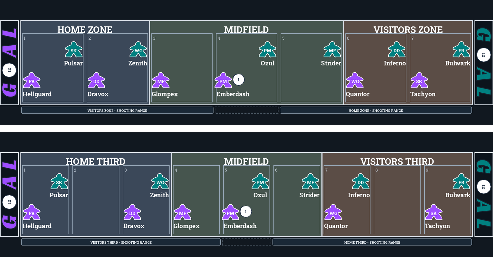

# The D12Ball Charter: Laws of the Game

This document is the final authority on the rules of D12 Ball. It states each rule once and settled, for each of the three modes a game may be played in: **training**, **standard** and **advanced**. History, open questions and the places upstream has not caught up yet all belong in [rules-log.md](rules-log.md), and the illustrated introduction to the game is [learn-to-play.md](learn-to-play.md).

## Contents

- [How to read this document](#how-to-read-this-document)
- Part I -- The game
  - [Law 1. The game in brief](#1-the-game-in-brief)
  - [Law 2. Components and definitions](#2-components-and-definitions)
  - [Law 3. Setting up a game](#3-setting-up-a-game)
  - [Law 4. The turn](#4-the-turn)
  - [Law 5. Score attempt](#5-score-attempt)
  - [Law 6. Maneuvers](#6-maneuvers)
  - [Law 7. Ball speed](#7-ball-speed)
  - [Law 8. Scoring opportunities](#8-scoring-opportunities)
  - [Law 9. Sending a player](#9-sending-a-player)
  - [Law 10. Contests for the ball](#10-contests-for-the-ball)
  - [Law 11. Own goal](#11-own-goal)
  - [Law 12. Turnovers](#12-turnovers)
  - [Law 13. Time out](#13-time-out)
  - [Law 14. Coaching Choice](#14-coaching-choice)
  - [Law 15. Exhaustion and injury](#15-exhaustion-and-injury)
  - [Law 16. The clock](#16-the-clock)
  - [Law 17. Extreme shootout](#17-extreme-shootout)
- Part II -- Standard and advanced mode
  - [Law 18. The three modes](#18-the-three-modes)
  - [Law 19. Advanced maneuvers and gambits](#19-advanced-maneuvers-and-gambits)
  - [Law 20. Species abilities](#20-species-abilities)
  - [Law 21. Special abilities](#21-special-abilities)
- [Appendix A. Quick reference](#appendix-a-quick-reference)
- [Appendix B. Glossary](#appendix-b-glossary)
- [Appendix C. The boards](#appendix-c-the-boards)
- [Appendix D. Edition notes](#appendix-d-edition-notes)

## How to read this document

The Charter is divided into **Laws**, each Law into **sections**, and each section into **paragraphs**. Every paragraph carries a number -- Law, section, paragraph, as in *6.4.2* -- and a paragraph that lists cases letters them, as in *6.4.2b*. This file and the printed edition carry the same numbers. A number in parentheses is a cross-reference to the paragraph or section it names, and in this file the words before it are also a link.

**Precedence.** Where the Charter and any other statement of the rules disagree, the Charter is right: it wins over the Learn to Play, over the text printed on a card or a board, and over the bot. Where the Learn to Play simplifies, it says so and names the Law it simplifies.

**Training, standard and advanced mode.** Laws 1 to 17 are the whole of the game in training mode. Part II is what the other two modes add and change: [Law 18](#18-the-three-modes) says which mode plays what, [Law 19](#19-advanced-maneuvers-and-gambits) is the advanced maneuvers and the gambits made with them, [Law 20](#20-species-abilities) the species abilities and [Law 21](#21-special-abilities) the special abilities. A rule in Part II wins over a rule in Part I for a game playing the module it belongs to, and applies nowhere else.

**Defined terms** are in bold where they are defined, and every one is listed in [Appendix B](#appendix-b-glossary) with the paragraph that defines it.

**Notes** are set apart under a paragraph and begin with the word *Note*. A note explains; it is never a rule, and it is never numbered.

**The point of view.** Every rule is written from the point of view of the team it applies to. **Forward** means toward the goal a team is attacking and **back** means toward the goal it is defending, so the two words point opposite ways for the two sides.

## Part I -- The game

The whole of D12 Ball in training mode, Laws 1 to 17. Nothing in Part I depends on Part II.

## 1. The game in brief

**1.1** Two coaches each control a team of nine players: six on the field and three on the bench.

**1.2** The game runs over two periods on a single clock, the first from minute 00 to minute 15 and the second from 15 to 30.

**1.3** The team in possession takes a turn. It shoots if the ball is in its shooting range, and otherwise plays a maneuver against a defender or calls a time out to buy both coaches a pause. Whichever team has the ball when a turn ends takes the next one.

**1.4** The higher score at full time wins. A level score goes to the [extreme shootout](#17-extreme-shootout) (17), so every game is settled.

## 2. Components and definitions

### 2.1 The field

**2.1.1** The field is five zones, left to right: the **Home Goal**, the **Home Zone**, **midfield**, the **Visitors Zone** and the **Visitors Goal**. The three in the middle are a row of spaces, and a game is played on a board of 7 or 9 of them.

| Board | Home Goal | Home Zone | Midfield | Visitors Zone | Visitors Goal |
| --- | ---: | ---: | ---: | ---: | ---: |
| 7 (default) | -- | 1-2 | 3-5 | 6-7 | -- |
| 9 | -- | 1-3 | 4-6 | 7-9 | -- |

**2.1.2** On the 9-space board, the only one where the three zones with spaces are equal, the Home Zone and the Visitors Zone are called the **Home Third** and the **Visitors Third**. Everything this Charter says of the Home Zone and the Visitors Zone it says of the two Thirds on that board, and together they are the two **outer zones**.

**2.1.3** A space is named by its number, counted from the home end: on board 7, spaces 1 and 2 are the Home Zone, 3 to 5 midfield and 6 and 7 the Visitors Zone.

**2.1.4** The Home Goal and the Visitors Goal are the two **goal zones**, one beyond each end of the row: the Home Goal before space 1 and the Visitors Goal after the last space, 7 or 9. A goal zone has no spaces, and no meeple is ever placed in one or moved into one.

**2.1.5** **Only the ball reaches a goal zone.** A ball sent further than the spaces left in front of it **reaches the goal zone** at that end, and comes to rest on the last space before it. That space is the end of the row, and the goal zone is what a rule names when the ball would have gone beyond it.

**2.1.6** A space belongs to nobody. Any number of meeples from either team may stand on one, and distances are counted in spaces straight across the zone boundaries.

### 2.2 Forward and back

**2.2.1** The home team attacks the Visitors Goal and the visiting team attacks the Home Goal.

**2.2.2** **Forward** means toward the goal a team is attacking and **back** means toward the goal it is defending. The two words point opposite ways for the two sides, and every rule in this document is written from the point of view of the team it applies to.

### 2.3 Shooting range

**2.3.1** A team may only shoot from within its **shooting range**, which is the far part of the field measured from the middle of the board. It is not a zone: it takes in the outer zone before the goal a team attacks and cuts partway across midfield.

| Board | The visitors may shoot from | Neither | Home may shoot from |
| --- | --- | --- | --- |
| 7 | 1, 2, 3 | 4 | 5, 6, 7 |
| 9 | 1, 2, 3, 4 | 5 | 6, 7, 8, 9 |

**2.3.2** Both boards have an odd number of spaces, so both have a true middle space, and that space is in neither team's range.

*Note.* The middle space is also the kickoff space, so no restart ever begins in range.

### 2.4 The kickoff space

**2.4.1** The **kickoff space** is the middle space of midfield, and both teams kick off from it.

**2.4.2** Every arrangement a coach settles has to cover their own kickoff space -- see [finishing a Coaching Choice](#148-finishing-a-coaching-choice) (14.8).

### 2.5 Occupancy

**2.5.1** Meeples share spaces freely in the run of play. Nothing in a maneuver, a contest or a walk-in is ever refused because a space is crowded.

**2.5.2** **Coverage** binds deliberate placement instead: a team may not put a second meeple on a space in a zone while another space in that zone has none of theirs on it.

**2.5.3** Coverage is checked one team at a time, so an opposing meeple never covers a space on your behalf. Where a zone holds more of a team's players than it has spaces, they cover every space first and the surplus stacks.

### 2.6 Players and roles

**2.6.1** A team is nine players, and in training mode the two teams are identical.

**2.6.2** Every player has an **offensive skill** from 1 to 6 and a **defensive skill** that is its inverse, so the two always total 7.

| Role | Offense | Defense | Ability |
| --- | ---: | ---: | --- |
| Fullback | 1 | 6 | **+1 space** on a pass or a deflection: a High Pass up to 4, a Deflect of 2, a Clear of 4, a Cross that may also reach 4. |
| Defender | 2 | 5 | A won Pressure also steals the ball. |
| Midfielder | 3 | 4 | Adds 3 to a skill test for a Low Pass or a Steal. |
| Playmaker | 4 | 3 | May advance an additional space when resolving a Dribble or a Burst: 2 spaces with a Dribble, or 5 with a Burst. |
| Winger | 5 | 2 | A completed Low Pass may set up a scoring opportunity. |
| Striker | 6 | 1 | Adds 3 to a score attempt taken off a set-up. |

**2.6.3** Each squad is one Fullback, two Defenders, one Midfielder, two Playmakers, one Winger and two Strikers. Beyond the standard deal, no role belongs to any particular zone.

### 2.7 The ball, the dice and the tokens

**2.7.1** The ball is a d12, and the face it shows is its **speed**.

**2.7.2** Every roll in the game is a d12: one each for a skill test or a score attempt, and two for an own-goal roll.

**2.7.3** Maneuvers are chosen in secret from the six maneuver cards -- twelve in a game played with [advanced maneuvers](#19-advanced-maneuvers-and-gambits) (19).

**2.7.4** A player's **exhaustion tokens** sit on their card. A player carrying more tokens than their defensive skill is **Exhausted**; a player who fails an injury check is **Injured** -- see [Law 15](#15-exhaustion-and-injury).

### 2.8 Definitions

**2.8.1** A player's **card** is assigned to a zone and their **meeple** stands on a space. Play pulls the two apart, and a run back is what puts them back together.

**2.8.2** The **handler** is the player with the ball, taking their team's turn with it -- see [choosing the handler](#42-choosing-the-handler) (4.2).

**2.8.3** The **challenger** is the defending player who meets a maneuver on the ball's space -- see [determining the two players](#61-determining-the-two-players) (6.1).

**2.8.4** The **carrier** is the player a resolution leaves the ball with. The carrier handles the ball on their team's next turn without a choice being offered, and never runs back -- see [choosing the handler](#42-choosing-the-handler) (4.2) and [running back after a steal](#124-running-back-after-a-steal) (12.4).

**2.8.5** An **arrangement** is where a coach's meeples were standing when they last closed a [Coaching Choice](#14-coaching-choice) (14). It is what a new play puts them back on.

**2.8.6** A **set-up** is a scoring opportunity a maneuver has created: a shot its receiver may take out of turn -- see [scoring opportunities](#8-scoring-opportunities) (8).

**2.8.7** A **skill test** is an opposed roll, one d12 to each side -- see [the skill test](#64-the-skill-test) (6.4).

**2.8.8** A **contest** is a skill test for a ball nobody is holding -- see [contests for the ball](#10-contests-for-the-ball) (10).

**2.8.9** **Sending a player** is a walk-in to the ball's space, paid for in exhaustion -- see [sending a player](#9-sending-a-player) (9).

**2.8.10** A ball is **loose** when it has come to rest on a space with nobody standing on it -- see [where the ball comes to rest](#101-where-the-ball-comes-to-rest) (10.1). A ball that comes down on somebody is not loose.

**2.8.11** **Time** is what the clock counts. Every action costs some: one that costs 1 advances time by 1 -- see [the clock](#16-the-clock) (16).

**2.8.12** A **live ball** is one in play. A **dead ball** is one being brought back into play after a goal, a missed shot, an own-goal roll, a ball out of bounds or a period's start: it is carried to where play starts again rather than travelling over the spaces between.

**2.8.13** **Exhausted** and **Injured** are the two conditions a player can be in -- see [Law 15](#15-exhaustion-and-injury). In standard and advanced mode a Cyborg's own words for them are Drained and Damaged -- see [Lithium Powered](#203-lithium-powered-cyborg) (20.3).

**2.8.14** **Behind** is the condition under which a coach may answer a gambit with one of their own in advanced mode -- see [who may make a gambit](#193-who-may-make-a-gambit) (19.3).

## 3. Setting up a game

### 3.1 Winning the toss

**3.1.1** Choose a 7- or 9-space board.

**3.1.2** One coach flips the coin: a fortune face wins them the toss and a doom face hands it to their opponent.

**3.1.3** The winner chooses whether to be home or the visitors. Home kicks off the first half and the visitors kick off the second.

**3.1.4** In a game played with [advanced maneuvers](#19-advanced-maneuvers-and-gambits) (19) the winner of the toss also **keeps the coin**, which is what lets a coach [make a gambit](#193-who-may-make-a-gambit) (19.3). It stays on the face it landed on until it passes, and is flipped each time it does.

### 3.2 The standard deal

**3.2.1** Both sides are dealt into **2-2-2** by role: the Fullback and one Defender in the outer zone before their own goal, the Midfielder and one Playmaker in midfield, the Winger and one Striker in the outer zone before the goal they attack. The remaining Defender, Playmaker and Striker start on the bench.

**3.2.2** An outer zone's two cards take the two ends of the zone, and midfield packs from that side's own end outward. On board 7 that comes out the same as filling each zone in order. It is only visible on board 9, whose zones are three spaces deep: home deals to spaces 1, 3, 4, 5, 7 and 9, and the visitors deal the mirror of it.

*Note.* Midfield packs rather than spreads because the kickoff space is in it. Every arrangement has to cover its own side's kickoff space, and packing from a side's own end reaches that space on every board.

### 3.3 Setup coaching

**3.3.1** Home takes a [Coaching Choice](#14-coaching-choice) (14) and then the visitors take one.

**3.3.2** Setup substitutions are unlimited, and a player taken off at setup goes back to the bench rather than being retired -- nobody has played yet.

**3.3.3** Each coach finishes with a player on their own kickoff space, and the positions they finish on become that side's first arrangement.

### 3.4 Kickoff

**3.4.1** The ball goes on the kickoff space at speed 1 in home's possession, with the clock at 00.

## 4. The turn

### 4.1 The order of a turn

**4.1.1** The team in possession takes a turn, in this order:

- **a.** Choose [which of their players on the ball's space handles it](#42-choosing-the-handler) (4.2).
- **b.** Choose the action: a [score attempt](#5-score-attempt) (5) if the ball is in that team's shooting range, and otherwise a [maneuver](#6-maneuvers) (6) or a [time out](#13-time-out) (13).
- **c.** Resolve the action, and anything it leads to. **The clock advances by what the action cost as soon as its outcome is decided** ([Time](#162-time) (16.2)), not once everything it leads to is done.
- **d.** If the action left nobody holding the ball, settle it [where it came to rest](#101-where-the-ball-comes-to-rest) (10.1).
- **e.** If the ball changed hands, resolve the [turnover](#12-turnovers) (12).
- **f.** If [last possession](#163-last-possession) (16.3) was declared, it goes to the team that takes the next turn.

**4.1.2** Whichever team has the ball at the end of all that takes the next turn.

### 4.2 Choosing the handler

**4.2.1** Any of the possessing team's players standing on the ball's space may handle it, and the coach picks between them -- unless the last resolution left the ball with one player in particular, the carrier, in which case that player handles it and there is nothing to choose.

**4.2.2** These leave the ball with a particular player:

- **a.** a Dribble, with the player who dribbled it;
- **b.** a completed Low Pass and a received 2-space High Pass, with the receiver;
- **c.** a Steal, with the interceptor;
- **d.** a ball won where it came to rest, or a won High Pass contest, with the winner;
- **e.** a Pressure, with the handler who was shoved back still holding it -- including one who has just survived an own-goal roll, and with the Defender instead where their Pressure also stole it.

**4.2.3** These leave it with nobody in particular: a kickoff or any other restart, and a required [pickup](#106-picking-the-ball-up) (10.6). A [Deflect](#68-deflect) (6.8) leaves nobody in possession at all, so who gets it is settled -- by a contest, or automatically if only one side is there -- before anybody handles it.

**4.2.4** The carry holds for one turn only. If that player is no longer on the ball by the time the turn comes round, their coach chooses in the ordinary way.

**4.2.5** The player holding the ball [never runs back](#124-running-back-after-a-steal) (12.4).

### 4.3 Choosing the action

**4.3.1** A score attempt is offered only inside the team's [shooting range](#23-shooting-range) (2.3).

**4.3.2** A maneuver is always available.

**4.3.3** A [time out](#13-time-out) (13) is offered only outside shooting range, only while that side still has its time out for the half, and never once [last possession](#163-last-possession) (16.3) has been declared.

### 4.4 Finishing the turn

**4.4.1** The ball [where it came to rest](#101-where-the-ball-comes-to-rest) (10.1) comes first: an action that left nobody holding it is settled before anything else, however it left the ball there.

**4.4.2** Then the turnover, if the ball changed hands. A [steal](#124-running-back-after-a-steal) (12.4) runs players back and play carries straight on; a [new play](#125-resetting-after-a-new-play) (12.5) resets both sides and offers a Coaching Choice.

**4.4.3** The clock has already advanced by then: the action's own cost is charged [the moment its outcome is decided](#162-time) (16.2), whether or not the action goes on to turn the ball over. Running back, resetting, contests, rolls, pickups and Coaching Choices all cost no time.

**4.4.4** If the clock reached the period's last minute during the action, [last possession](#163-last-possession) (16.3) was declared the moment it did, and it goes to the team that takes the next turn.

## 5. Score attempt

### 5.1 When a shot may be taken

**5.1.1** A shot may only be taken from within the shooting team's [range](#23-shooting-range) (2.3).

### 5.2 The roll

**5.2.1** The handler shoots and both coaches roll one d12.

**5.2.2** The attack adds the shooter's offensive skill, the [ball speed modifier](#7-ball-speed) (7) -- in full from the outer zone before the goal being shot at, and **half of it, rounded down, from midfield** -- and 3 more if a Striker is shooting off a [set-up](#8-scoring-opportunities) (8). The defense adds the skill of every defending player in the way, as [what the defense adds](#53-what-the-defense-adds) (5.3) says.

**5.2.3** **The attack scores on a total higher than the defense's.** A tie is a miss.

### 5.3 What the defense adds

**5.3.1** A defending player standing on the ball's own space adds their **whole** defensive skill.

**5.3.2** A defending player standing anywhere between the ball and the goal being shot at adds **half** of it, rounded up.

**5.3.3** A defender behind the ball adds nothing at all.

**5.3.4** The halving is per player rather than over the group: two defenders of 5 in the way add 3 + 3 = 6, where halving their combined 10 would give 5.

### 5.4 The cost of a shot

**5.4.1** An ordinary shot costs its shooter nothing. A shooter taking a shot off a set-up exhausts 1 after the roll, whether it went in or not.

**5.4.2** A score attempt costs 1 time, charged as soon as the shot has resolved, goal or miss, and before play restarts. A set-up's shot costs that on top of the maneuver that created it, which was charged when that maneuver's winner was decided.

### 5.5 After the shot

**5.5.1** Goal or miss, the ball is dead and the game restarts as a [new play](#125-resetting-after-a-new-play) (12.5), with speed back to 1.

**5.5.2** A goal restarts from the conceding side's own kickoff space with them in possession. Every arrangement is required to cover that space, so nothing further is owed.

**5.5.3** A miss gives the ball to the side that just defended it, on the last space before their own goal, which carries no such guarantee: if nobody of theirs is standing there once the reset settles, they [pick it up](#106-picking-the-ball-up) (10.6) exactly as after an out-of-bounds ball.

## 6. Maneuvers

### 6.1 Determining the two players

**6.1.1** The player maneuvering for the offense is the handler.

**6.1.2** A defending player already standing on the ball's space **challenges**. They have nowhere to walk and nothing to pay, so that challenge cannot be declined, and nobody may be walked in past them. Where more than one of them shares the space, the defending coach chooses which of them challenges.

**6.1.3** Otherwise the defending coach may [send a player](#9-sending-a-player) (9) to the ball's space, who exhausts 1 per space, **or send nobody** rather than pay for the challenge.

**6.1.4** With no challenger, the maneuver the offense chooses succeeds outright: there is nothing to reveal against, no ranking to read and no test to roll. Nobody moves and nobody pays. The clock still advances by the maneuver's cost, as it succeeds ([Time](#162-time) (16.2)).

### 6.2 Choosing and revealing

**6.2.1** Both coaches secretly choose one of their maneuvers and reveal together.

**6.2.2** The offense chooses from Low Pass, Dribble and High Pass; the defense from Deflect, Steal and Pressure. In a game played with [advanced maneuvers](#19-advanced-maneuvers-and-gambits) (19) a coach who makes a gambit chooses from their three advanced maneuvers instead -- see [Law 19](#19-advanced-maneuvers-and-gambits).

### 6.3 Who wins

**6.3.1** The three ranks a side form a cycle. Equal ranks tie.

| Offense | Deflect (D1) | Steal (D2) | Pressure (D3) |
| --- | --- | --- | --- |
| Low Pass (O1) | Tie | Steal wins | Low Pass wins |
| Dribble (O2) | Dribble wins | Tie | Pressure wins |
| High Pass (O3) | Deflect wins | High Pass wins | Tie |

**6.3.2** An [injured](#154-playing-injured) (15.4) participant changes this in both directions: a maneuver they would have won outright goes to a skill test they have to win, and a tie against one healthy opponent is their automatic loss with nothing rolled.

### 6.4 The skill test

**6.4.1** Both participants exhaust 1, and then each rolls a d12.

**6.4.2** The offense adds the handler's offensive skill and the defense adds the challenger's defensive skill. On top of that:

- **a.** a Midfielder adds 3 more when the maneuver being tested is their own Low Pass or their own Steal;
- **b.** a defense contesting with Steal adds the [ball speed modifier](#7-ball-speed) (7).

**6.4.3** The higher total wins and their maneuver is what resolves.

**6.4.4** A tie is rolled again, and each participant exhausts 1 more for it.

**6.4.5** When the test finally resolves, every participant who is Exhausted takes an [injury check](#153-the-injury-check) (15.3).

### 6.5 Low Pass

**6.5.1** **Rank O1. Costs 1 time. Beats Pressure, loses to Steal.**

**6.5.2** The ball goes to a teammate, and there are at most three destinations to choose between: the nearest teammate up to 2 spaces ahead of the ball, the nearest teammate up to 2 spaces behind it, and a teammate standing on the ball's own space. A nearer teammate blocks a farther one in the same direction, so the choice is between directions rather than distances. Where several teammates are standing on the destination, the passer chooses which of them receives it.

**6.5.3** A pass has to reach a different player -- the handler cannot pass to themselves -- and a pass across a shared space also sends the passer 1 space forward if there is a space in front of them to move into.

**6.5.4** Ball speed rises by 1, to a maximum of 12. The ball is left with the receiver.

**6.5.5** With no legal destination at all, the maneuver still resolves: the ball rolls 1 space forward, its speed still rises, and it settles [where it lands](#101-where-the-ball-comes-to-rest) (10.1).

**6.5.6** *Winger:* a completed Low Pass may offer its receiver a [scoring opportunity](#8-scoring-opportunities) (8), at any of the three distances, if the ball is in shooting range.

### 6.6 Dribble

**6.6.1** **Rank O2. Costs 1 time. Beats Deflect, loses to Pressure.**

**6.6.2** The handler and the ball move 1 space forward together. The handler then changes the ball's speed by up to their offensive skill, in either direction, within the range 1 to 12.

**6.6.3** The ball is left with the handler.

**6.6.4** *Playmaker:* may advance 2 spaces instead of 1 -- an additional space.

### 6.7 High Pass

**6.7.1** **Rank O3. Costs 2 time. Beats Steal, loses to Deflect.**

**6.7.2** The ball is thrown 2 or 3 spaces forward, and a Fullback may throw it 4. Only distances that land on a space short of the goal zone are offered, and a distance is dropped when a shorter one already reaches the space it would land on -- the longer throw would be the same pass at a disadvantage.

| The throw | What happens |
| --- | --- |
| 2 spaces, a teammate on the landing space | Received. The ball is left with the receiver, who may take a [scoring opportunity](#8-scoring-opportunities) (8) if it is in range. |
| 3 or 4 spaces, a teammate there | Received but contested: the receiver has to win the [High Pass contest](#104-the-high-pass-contest) (10.4) to keep it. |
| Nobody there | The ball is [loose](#101-where-the-ball-comes-to-rest) (10.1). |

**6.7.3** A 2-space pass that lands short of shooting range is still received. The range rule takes away the shot, not the catch.

**6.7.4** A throw longer than the spaces left in front of the ball **reaches the goal zone**, and comes to rest on the last space before it. With the ball 0 or 1 spaces from that last space, every distance reaches the goal zone and comes to rest on the same space, so nothing is offered and the throw reaches the goal zone before anyone chooses. A throw that reaches the goal zone with a teammate on that last space offers that receiver the scoring opportunity **or** the High Pass contest: they are two halves of one choice, declining the shot means taking the contest, and the ball speed modifier counts **against** them either way.

**6.7.5** **A passer never receives their own pass.** Thrown from the last space, the ball reaches the goal zone and comes back to rest where it was, and a teammate sharing that space receives it and is offered the choice above.

**6.7.6** With no other teammate on that last space, there is nowhere left to throw it and nobody to throw it to: the ball goes [out of play](#105-out-of-bounds) (10.5), the other team gains possession, and the gaining side sends somebody to pick it up. The throw still costs its 2 time.

### 6.8 Deflect

**6.8.1** **Rank D1. Costs 1 time. Beats High Pass, loses to Dribble.**

**6.8.2** The ball moves 1 space back -- toward the goal the offense is defending. Ball speed drops by 1, never below 1. Neither player moves.

**6.8.3** *Fullback:* deflects the ball 2 spaces instead of 1.

**6.8.4** A Deflect turns nothing over by itself, and settles nothing either: it knocks the ball out of anybody's possession, so what happens next depends on who, if anyone, is standing where it lands. That is [the ordinary three-way rule](#101-where-the-ball-comes-to-rest) (10.1): nobody there and it is loose, one side there and it is theirs, both there and they contest it on the spot.

**6.8.5** The one exception is a deflection that reaches the goal zone **while** the player who played the Deflect is standing on the last space before it: rather than being contested, that player gets a [scoring opportunity](#8-scoring-opportunities) (8). **Only the player who played the Deflect may take it**, even with teammates standing on the same space. Possession flips for it and speed resets, and it is the shot that follows -- goal or miss -- that makes the new play. A deflection that reaches the goal zone while that player is standing anywhere else sets up nothing, and lands by the ordinary rule above.

### 6.9 Steal

**6.9.1** **Rank D2. Costs 1 time. Beats Low Pass, loses to High Pass.**

**6.9.2** Possession flips and ball speed resets to 1. The challenger and the ball then move 1 space back for their side, toward the goal the new possessing team is defending.

**6.9.3** Once everyone has run back, the interceptor changes the ball's speed by up to their defensive skill, in either direction.

**6.9.4** The ball is left with the interceptor, who therefore does not run back.

### 6.10 Pressure

**6.10.1** **Rank D3. Costs 1 time. Beats Dribble, loses to Low Pass.**

**6.10.2** The handler and the ball go 1 space back, toward the goal the offense is defending, and the challenger moves 1 space forward onto the same space. Possession does not change, and the ball is left with the handler.

**6.10.3** Where the handler is already standing on the last space before their own goal there is nowhere to push them: the ball reaches their own goal zone, and the pressure risks an [own goal](#11-own-goal) (11) instead.

**6.10.4** *Defender:* a won Pressure also steals the ball -- unless the push reached their own goal zone and became an own-goal roll, which takes priority whichever way it goes.

## 7. Ball speed

### 7.1 The speed and its modifier

**7.1.1** The ball's speed is the face its d12 shows, from 1 to 12. Its **modifier** is the speed itself: a ball at speed 5 adds 5.

### 7.2 What changes it

**7.2.1** Only maneuvers change it. In standard mode there are four: Low Pass adds 1, Deflect takes 1 off, and Dribble and Steal let the player change it by up to their own skill.

### 7.3 Turnovers reset it

**7.3.1** Every turnover resets the speed to 1.

### 7.4 Where the modifier is added

**7.4.1** The modifier is added in three places and nowhere else: to a [score attempt](#5-score-attempt) (5), by the attack, halved and rounded down on a shot from midfield; to a maneuver skill test, by a defense contesting with Steal; and to a [High Pass contest](#104-the-high-pass-contest) (10.4), by the side that threw the pass. In advanced mode one player adds it to every roll they make: see [Oozes](#216-oozes) (21.6).

**7.4.2** The ball [where it came to rest](#101-where-the-ball-comes-to-rest) (10.1) belongs to nobody yet, so neither contestant adds it there.

### 7.5 A High Pass that reaches the goal zone

**7.5.1** A High Pass that reaches the goal zone turns the sign around: the modifier counts against the shot it sets up and against the contest behind it.

## 8. Scoring opportunities

### 8.1 What a set-up is

**8.1.1** A scoring opportunity is an ordinary [score attempt](#5-score-attempt) (5) taken out of turn.

**8.1.2** What the set-up buys is the shot, not a shot from anywhere: it obeys the range rule like any other, so a set-up out of range simply does not happen.

### 8.2 The set-ups

**8.2.1**

| Set up by | Who shoots |
| --- | --- |
| A received 2-space High Pass | The receiver |
| A High Pass that reaches the goal zone, with a teammate on the last space | The receiver |
| A Winger's completed Low Pass | The receiver |
| A Deflect that reaches the goal zone | The player who played the Deflect, and only if they are standing on the last space before it |

### 8.3 The shooter

**8.3.1** The shooter exhausts 1 after the roll either way, and a Striker adds 3 to it.

### 8.4 Declining

**8.4.1** Declining costs nothing and the maneuver resolves as it otherwise would have.

**8.4.2** The one exception is a High Pass that reached the goal zone, where declining the shot means taking the [High Pass contest](#104-the-high-pass-contest) (10.4) instead.

### 8.5 The cost in time

**8.5.1** Taking the shot costs its own 1 time on top of the maneuver that set it up. The maneuver's cost is already on the clock by the time the shot is offered; the shot's 1 is added once it has resolved.

## 9. Sending a player

### 9.1 The three occasions

**9.1.1** Three rules ask a coach to send a player to the ball's space: the [maneuver challenge](#61-determining-the-two-players) (6.1), a [loose ball](#101-where-the-ball-comes-to-rest) (10.1) -- the [High Pass contest](#104-the-high-pass-contest) (10.4) included, which is the one contest a send may be offered against an occupied space -- and the [pickup](#106-picking-the-ball-up) (10.6) after an out-of-bounds ball, a [time out](#13-time-out) (13), a missed shot or an avoided own goal.

**9.1.2** All three ask it in the same way, and a player's zone has nothing to do with it.

### 9.2 The two nearest

**9.2.1** A coach may send either of their two nearest players to the space: the nearest one in front of it and the nearest one behind it, counted in spaces along the field.

**9.2.2** Where the ball is on the last space before a goal zone, there is nobody beyond it, and the nearest in front is the only one offered.

**9.2.3** Where two or more are tied for nearest on one side, all of them are offered and the coach chooses between them.

### 9.3 A player already there

**9.3.1** A player already standing on the space is not sent anywhere -- they are there already, and where the rule makes them act, there is nothing to choose.

### 9.4 What a send costs

**9.4.1** A sent player moves onto the space and exhausts 1 for every space they travelled.

### 9.5 Sending nobody

**9.5.1** The maneuver challenge and a loose ball offer the choice to send nobody. **A pickup never does**: the ball is that side's, and one of theirs has to go and get it.

### 9.6 Staying put

**9.6.1** Nothing brings a sent player home again. They stay where the contest left them until a turnover [runs them back](#124-running-back-after-a-steal) (12.4) or [resets](#125-resetting-after-a-new-play) (12.5) them.

## 10. Contests for the ball

### 10.1 Where the ball comes to rest

**10.1.1** Some actions leave the ball on a space with nobody named as holding it -- a pass that reaches nobody, a [Deflect](#68-deflect) (6.8), and in advanced mode a [Clear](#198-clear) (19.8). **What is standing on that space decides what happens, and there are three answers.**

| On the space the ball lands on | What happens |
| --- | --- |
| Nobody | The ball is **loose**. Each side may [send a player](#9-sending-a-player) (9) after it, or send nobody. |
| One side only | The ball is simply **theirs**, uncontested. No roll, and the other side is not offered a send. |
| Both sides | A **contest**. The players already standing there roll for it, and nobody else may be sent. |

**10.1.2** **"Loose" means the space was empty, and it means nothing else.** A ball that comes down on somebody has not gone loose: either it has landed on a player who simply has it, or it has landed between two who fight for it on the spot. Nobody walks in on either -- a side is offered a send only against an empty space.

**10.1.3** Where a side has several players on the space, their coach picks which of them takes the ball or contests for it. A player already standing there is not sent anywhere and pays nothing, and their side may not withhold them.

### 10.2 The contest

**10.2.1** Both contestants roll a skill test: the side that last had the ball adds their player's offensive skill, the other side adds their player's defensive skill.

**10.2.2** The higher total wins the ball and is left holding it. A tie is rolled again, and each exhausts 1.

**10.2.3** Neither side adds the [ball speed modifier](#7-ball-speed) (7) -- the ball is nobody's yet. A [High Pass contest](#104-the-high-pass-contest) (10.4) is the one exception.

### 10.3 A loose ball

**10.3.1** A loose ball is contested the same way, once each side has decided who to send.

**10.3.2** Where both sides send somebody they roll as above; where only one does, that player takes the ball without a test; where neither does, the ball goes [out of bounds](#105-out-of-bounds) (10.5). Only an empty space can come to that.

### 10.4 The High Pass contest

**10.4.1** A High Pass of 3 spaces or more onto a teammate is caught, but not kept: the receiver has to win a contest to keep it, and the receiver standing on the ball is their side's contestant. A pass that reached the goal zone and whose set-up was declined comes to the same place. A pass of 2 does not -- a teammate there simply receives it and possession does not change, exactly as with a [Low Pass](#65-low-pass) (6.5).

**10.4.2** **A High Pass is the one exemption to [where the ball comes to rest](#101-where-the-ball-comes-to-rest) (10.1).** A landing space holding only one side's players may still be contested by the other, who [send a player](#9-sending-a-player) (9) after it exactly as they would to an empty space. Every other way the ball comes to rest is settled by whoever is already standing there.

*Note.* The ball is high in the air, which gives players time to run towards it.

**10.4.3** Otherwise it is [the contest](#102-the-contest) (10.2) above, with one difference: the side that threw the pass adds the [ball speed modifier](#7-ball-speed) (7), and adds it against themselves if the pass reached the goal zone.

**10.4.4** A pass that reaches nobody carries no modifier. It is not this contest at a disadvantage; the ball is simply loose on an empty space, and there is no receiver for the throw to have favoured.

**10.4.5** The ball is left with the winner. A receiver who loses it has been stolen from.

### 10.5 Out of bounds

**10.5.1** Where neither side sends anybody after a loose ball, the ball goes out. The side that did not have it takes over at speed 1.

**10.5.2** It is a [new play](#125-resetting-after-a-new-play) (12.5) rather than a steal -- nobody took the ball off anyone, it simply went dead. Once both sides have reset, the side that gained it [picks the ball up](#106-picking-the-ball-up) (10.6).

### 10.6 Picking the ball up

**10.6.1** An out-of-bounds ball, a [missed shot](#5-score-attempt) (5), an [avoided own goal](#11-own-goal) (11) and a [time out](#13-time-out) (13) can all leave the ball on a space nobody of the gaining or keeping side is standing on. Once everything else has settled, that side [sends a player](#9-sending-a-player) (9) to the ball's space -- unless one of theirs is already standing there, which settles it for nothing.

**10.6.2** **Every pickup is the same**, whichever of the four left it owed. The coach of the side with the ball is offered the [two nearest](#92-the-two-nearest) (9.2) -- the nearest in front of the ball and the nearest behind it, only the one in front where the ball is on the last space before a goal zone, and every player tied for nearest -- and **must send one of them**: a pickup cannot be declined. The player sent exhausts 1 for every space they travel, **after a time out as after anything else**.

**10.6.3** A pickup is a placement rather than a contest: nobody rolls for it, nobody may contest it, and the ball is left with nobody in particular afterwards.

### 10.7 Who has been stolen from

**10.7.1** The ball ending up with the side that did not last have it is a [steal](#12-turnovers) (12).

## 11. Own goal

### 11.1 When it is risked

**11.1.1** Only a Pressure whose push reaches the handler's own goal zone risks an own goal: there is nowhere left to push them back to.

### 11.2 The own-goal roll

**11.2.1** The handler rolls **two d12, keeps the higher, and adds their offensive skill**. On a total of 7 or more the own goal is avoided.

**11.2.2** The player rolling exhausts 1 whichever way it goes. It is not a skill test, so it owes no injury check.

**11.2.3** Either result is a [new play](#125-resetting-after-a-new-play) (12.5).

### 11.3 Avoided

**11.3.1** The ball stays where the Pressure left it and the same side keeps it. Like a [time out](#13-time-out) (13), it is a new play that does not change possession -- but it resets both sides, and it ends last possession, exactly like any other.

**11.3.2** That reset carries no guarantee the ball's own space is covered -- unlike a kickoff space, it is wherever the play happened to reach -- so if nobody of that side ends up standing there, they [pick it up](#106-picking-the-ball-up) (10.6) exactly as after an out-of-bounds ball.

### 11.4 Conceded

**11.4.1** The goal counts for the other team and is recorded against the player who put it in.

**11.4.2** The conceding side restarts from their own kickoff space at speed 1.

## 12. Turnovers

**12.1** Every change of possession resets ball speed to 1. There are two kinds, and what follows is different for each.

| Cause | Kind | What follows |
| --- | --- | --- |
| Steal, a Defender's won Pressure, a lost High Pass contest, a loose ball the other side wins -- and in advanced mode Intercept and a beaten Burst | Steal | Players run back. No pause and no Coaching Choice: the ball is still live. |
| A goal, a missed shot, an own goal conceded or avoided, a ball out of bounds -- and in advanced mode a Cross that found nobody | New play | Both sides reset, and the side with the ball may call a Coaching Choice. |

**12.2** A [time out](#13-time-out) (13) is a new play too, though not a turnover: possession does not change, but both sides reset and the ball goes back to speed 1.

**12.3** **Only a turnover moves anybody.** A resolution that leaves possession where it was runs nobody back and resets nobody, however far out of position it left them -- a receiver who won their High Pass contest, the defender who walked in and lost it, a side that recovered its own loose ball. Whoever is out of position stays there, and pays nothing for it, until a turnover comes.

### 12.4 Running back after a steal

**12.4.1** A steal sends players back to their own zones. Two groups run, on both sides:

- **a.** everyone standing outside the zone their card is assigned to -- they have to come back, so the only question is which space;
- **b.** one of any group of teammates sharing a space, while their zone still has a space with none of their team standing on it.

**12.4.2** Nobody else moves. A player alone in their own zone is already where they belong and pays nothing, and **the player holding the ball never runs back**.

**12.4.3** A player running back goes to a space in their own zone that their team has not covered, and exhausts 1 for every space they travel. Where the zone is already covered, any space in it will do.

**12.4.4** **Where two teammates share a space, the one holding the ball stays and the other runs back. Where neither of them is holding it, their coach chooses which of them goes.**

**12.4.5** A stack only has to break up while its zone still has an uncovered space. A formation that puts more players in a zone than the zone has spaces settles doubled up, and nobody moves.

**12.4.6** Running back never changes an arrangement.

*Note.* The scramble a steal forces is not a shape anybody chose, and the next new play undoes it.

### 12.5 Resetting after a new play

**12.5.1** Every fielded meeple on **both** sides goes back to the space its coach's [arrangement](#14-coaching-choice) (14) puts it on. It costs nobody anything, and it happens before either coach is offered a Coaching Choice.

**12.5.2** Because every arrangement covers its own side's kickoff space, a goal restarts without anybody having to be dropped back to take the kickoff.

**12.5.3** An out-of-bounds ball is [picked up](#106-picking-the-ball-up) (10.6) after the reset, at the usual cost -- an arrangement covers a side's zones, not wherever the ball happens to be lying.

## 13. Time out

### 13.1 What a time out is

**13.1.1** A side out of [shooting range](#23-shooting-range) (2.3) may call a **time out** instead of playing the ball. **Possession does not change and the ball does not move.** What a time out buys is the pause, not the ball.

**13.1.2** **A time out is a [new play](#125-resetting-after-a-new-play) (12.5).** Ball speed goes back to 1, and once both coaches have taken their Coaching Choice, every fielded meeple on both sides goes back to the space its coach's arrangement puts it on -- the arrangement as it stands after those Choices, changed or not. It is not a turnover: the side that called it keeps the ball.

### 13.2 The three conditions

**13.2.1** A time out may be called under three conditions, and no others:

- **a.** the side is **out of shooting range**;
- **b.** the side has **not yet taken a time out this half** -- it is once a half, per side;
- **c.** **[last possession](#163-last-possession) (16.3) has not been declared** -- a time out is legal on minute 14 and not on 15, on minute 29 and not on 30.

### 13.3 Nobody to bring on

**13.3.1** A side with nobody left to bring on may still call one: what a time out buys is the whole [Coaching Choice](#14-coaching-choice) (14), not the substitution.

### 13.4 What a time out costs

**13.4.1** A time out costs **1 time** and no exhaustion, charged the moment it is called, before either Coaching Choice. A [pickup](#106-picking-the-ball-up) (10.6) it leaves owed is charged like any other.

### 13.5 The two Coaching Choices

**13.5.1** **Both coaches then take a Coaching Choice** -- the side that called it first, the other in reply. These are the time out's own two, so the new play offers no further one. Then both sides reset. Nobody runs back.

### 13.6 The pickup

**13.6.1** Possession is the team's and stays with them either way. Only after the reset is it asked whether anybody has to go and get it: a player is sent to the ball **if and only if** none of theirs is standing on its space then -- which is to say, their coach's arrangement does not put anybody there. Then they [pick it up](#106-picking-the-ball-up) (10.6): one of their two nearest must go, at 1 exhaustion a space.

## 14. Coaching Choice

### 14.1 What a Coaching Choice is

**14.1.1** A Coaching Choice is a pause. The coach may take any number of the actions below, in any order, and then finish. None of it costs exhaustion or time.

### 14.2 What a coach may do

**14.2.1**

| Action | What it does |
| --- | --- |
| Formation | Re-deals the six on the field into a new shape. |
| Substitution | Brings a player on for one on the field. Whoever comes on inherits the outgoing player's zone and stands where they stood. |
| Zone assignment | Trades two fielded players' zones, cards and meeples together. |
| Space positioning | Moves a meeple to another space in its own zone. Where the target is taken and the mover would leave their own space empty, the two trade places. |

**14.2.2** The Coaching Choice before the shootout offers the substitution alone.

### 14.3 When a coach gets one

**14.3.1**

| When | Substitutions | Who goes first | A player taken off | Positioning |
| --- | --- | --- | --- | --- |
| Setup | Unlimited | Home, then the visitors | Returns to the bench | Yes |
| A new play | 2 per half | The side that called it, then the reply | Goes to the back bench | Yes |
| A time out | 2 per half, the same two | The side that called it, then the other | Goes to the back bench | Yes |
| Halftime | 2, its own | The visitors, then home | Goes to the back bench | Yes |
| Before the shootout | 1, its own | Home, then the visitors | Goes to the back bench | No |

**14.3.2** The Coaching Choice before the shootout positions nobody, because a shootout is played by who is on the field and by nothing about where they stand. It neither opens on a coach's arrangement nor records one.

### 14.4 A new play always offers one

**14.4.1** Every new play offers the side restarting play a Coaching Choice, however many they have already had this half, and it costs nothing; if they take it, the other coach gets one in reply.

**14.4.2** Passing takes the reply down with it -- a coach who changes nothing was never asked for by anybody.

**14.4.3** **A time out is once a half**, per side, and is the only Coaching Choice a side has to spend anything to get.

### 14.5 How many substitutions

**14.5.1** The substitutions are a separate count from either. **A side has two substitutions per half**, spent across every Coaching Choice it takes in that half -- new plays and its time out alike.

**14.5.2** A side that has spent both may still coach: they get the rearrangement without the swaps.

**14.5.3** The two come back at halftime. Between them, a side can substitute up to seven times in a game: two in each half, two more at halftime, and one before the shootout.

### 14.6 Who may come on

**14.6.1** While anybody is still sitting on the bench, substitutions come from the bench. Once it has drained, healthy players on the back bench may come back on.

**14.6.2** An injured player never may, from either bench.

**14.6.3** A player returning from the back bench keeps half their exhaustion tokens, rounded down.

**14.6.4** The only side with nobody to bring on is one whose bench is empty and whose three back-bench players are all injured.

### 14.7 Changing formation

**14.7.1**

| Formation | Outer zone before their own goal | Midfield | Outer zone before the goal they attack | Boards |
| --- | ---: | ---: | ---: | --- |
| 2-2-2 | 2 | 2 | 2 | 7, 9 |
| 2-3-1 | 2 | 3 | 1 | 7, 9 |
| 1-3-2 | 1 | 3 | 2 | 7, 9 |
| 3-2-1 | 3 | 2 | 1 | 9 |
| 1-2-3 | 1 | 2 | 3 | 9 |

**14.7.2** A formation is read from a coach's own goal forward. 3-2-1 and 1-2-3 are played on the nine-space board alone; the other three are played on every board. No shape either board plays is deeper than the zone it fills, so a formation change deals one card a space -- but a shape that did would be dealt anyway, stacking.

**14.7.3** A formation change re-deals the whole side. The six on the field are ordered by defensive skill, highest first, and dealt from the coach's own end outward: one to each space of a zone, and then any surplus onto that zone's stack space.

**14.7.4** The stack space is the middle space of a three-space zone, or the space nearer the middle of the board in a two-space one.

**14.7.5** A coach who wants a particular player on a particular space moves them there afterwards with space positioning.

### 14.8 Finishing a Coaching Choice

**14.8.1** **Every arrangement covers its own side's kickoff space**, in every Coaching Choice and either half, and a coach may not finish while theirs is empty. Both sides kick off from the one space, and each owes it its own coverage. The standard deal and all five formations already satisfy it, so it only ever bites on a coach who has emptied the space with space positioning.

*Note.* That is what lets a restart kick off without anybody being moved back and charged for it.

**14.8.2** The Coaching Choice before the shootout positions nobody, so it has no arrangement to hold to.

**14.8.3** The positions a coach finishes on become that side's **arrangement**, and that is the shape every later new play puts them back on.

**14.8.4** A coach who is offered a Coaching Choice and passes changes nothing, and keeps the arrangement they already had.

## 15. Exhaustion and injury

### 15.1 Gaining tokens

**15.1.1**

| What costs tokens | How many |
| --- | --- |
| Entering a maneuver skill test, and every re-roll of it | 1 to each participant |
| Being sent to the ball -- a challenge, a loose ball, a contest, a pickup | 1 per space travelled |
| Running back | 1 per space travelled |
| An own-goal roll | 1 to the player rolling |
| Taking a scoring opportunity | 1 to the shooter, after the roll |

**15.1.2** Nothing else costs anything. An ordinary score attempt, a maneuver won outright, a reset, a Coaching Choice and a shootout test are all free.

**15.1.3** An injured player never exhausts.

**15.1.4** **Exhaust** is the verb for gaining tokens: a player who **exhausts 2** adds 2 exhaustion tokens to their card. [Clearing](#155-recovery) (15.5) takes them off.

### 15.2 Becoming Exhausted

**15.2.1** A player is **Exhausted** the moment their tokens exceed their defensive skill. So a Fullback can carry six and be fine, while a Striker is Exhausted on their second.

### 15.3 The injury check

**15.3.1** When a skill test resolves -- a maneuver's, a contest for the ball, or a High Pass contest's -- every Exhausted participant rolls one d12. A roll **higher** than the tokens they are currently carrying is safe, and anything else injures them.

**15.3.2** Tokens added for that very test count, including the ones a re-roll charged.

**15.3.3** Only a skill test causes checks: a score attempt and an own-goal roll never do. A shootout test has a check of its own, rolled before it ([17.4](#174-each-test)).

**15.3.4** **Nothing modifies an injury check.** It is the bare d12 against the tokens: no skill, no ball speed and no bonus of any kind is added to it. In advanced mode the one exception is an ability that names the injury check itself -- [Kindlefinger's](#213-fire-demons) (21.3), whose check can ignite.

### 15.4 Playing injured

**15.4.1** An **Injured** player clears every token they hold and can add no more, so they can never be checked again.

**15.4.2** Until they are substituted off:

- **a.** in a maneuver, against a healthy opponent, a tie loses outright with nothing rolled, and a maneuver they would have won outright goes to a skill test they have to win instead;
- **b.** in a contest for the ball or a High Pass contest, they add no skill modifier at all: their offensive or defensive skill comes off the roll, and only that. Ball speed and role abilities still apply.
- **c.** they may use no ability that would exhaust or drain them -- a Cyborg's [Overdrive](#203-lithium-powered-cyborg) (20.3), a Telekinetic's [Mind Pull](#204-mind-pull-telekinetic) (20.4), or any [special ability](#21-special-abilities) (21) with a token cost. They can add no tokens, so the cost is not waived: the ability is not theirs to use.

**15.4.3** Nothing else is withheld. The forced skill test above is rolled with their skill in full, and a score attempt is untouched -- an injured Striker still adds 3 off a set-up.

**15.4.4** The maneuver disadvantage is measured against a healthy opponent, so two cases escape it: a tie where **both** participants are injured is an ordinary tie, and an unchallenged maneuver has no opponent at all and succeeds as always.

**15.4.5** Nothing compels a coach to take an injured player off. They may leave them on, disadvantaged, for the rest of the game.

### 15.5 Recovery

**15.5.1** At halftime every fielded player clears 1 exhaustion, and each coach then chooses one of their fielded players to clear 1 more.

**15.5.2** A player coming back on from the back bench keeps half their tokens, rounded down.

**15.5.3** Nothing else clears a token.

## 16. The clock

### 16.1 One clock

**16.1.1** One clock runs over both periods: the first half from 00 through 15, the second from 15 through 30. **It does not stop.**

### 16.2 Time

**16.2.1**

| Action | Cost |
| --- | ---: |
| Any maneuver except a High Pass or a Cross | 1 |
| A High Pass, or a [Cross](#197-cross) (19.7) -- the advanced High Pass | 2 |
| A score attempt | 1 |
| A scoring opportunity taken off a set-up | 1, on top of the maneuver's |
| A time out | 1 |
| Running back, resetting, a pickup, a contest, any roll, a Coaching Choice | 0 |

**16.2.2** A maneuver's cost is flat. It does not depend on how far the ball or a player actually moved, or on whether the ball reached a goal zone and came to rest short of the distance chosen.

**16.2.3** **The maneuver charged is the one that resolves.** A beaten card costs nothing of its own: a High Pass beaten by a Deflect costs the Deflect's 1, not the High Pass's 2.

**16.2.4** **The clock advances the moment the action's outcome is decided**, not once everything it leads to has been resolved:

- **a.** a maneuver, as soon as its winner is known -- on the cards, when a skill test is won (before any [injury check](#153-the-injury-check) (15.3) it owes), or, with no challenger, as soon as the offense's maneuver succeeds;
- **b.** a score attempt, as soon as the shot has resolved, goal or miss, and before play restarts;
- **c.** a time out, as soon as it is called, before either Coaching Choice.

**16.2.5** Everything the action leads to -- its movement, a loose ball, a contest, a run back, a pickup, an own-goal roll -- happens on the clock as it already stands. A set-up shot therefore advances it twice: by the maneuver's cost when the maneuver's winner is decided, and by the shot's 1 once the shot has resolved. A goal is recorded at the minute the ball crosses the line, before the shot's own 1 is added.

### 16.3 Last possession

**16.3.1** When the clock reaches the period's last minute -- 15 in the first half, 30 in the second -- **last possession is declared at once**, in the middle of the action if that is where the clock reaches it. The action being resolved is still finished in full, even if it turns the ball over.

**16.3.2** **Last possession** goes to the team offered the next turn: whichever team holds the ball once the action has resolved -- the side that kept it, or the side a turnover has just handed it to. It is theirs from the moment that turn is offered.

**16.3.3** Their next turnover ends the period immediately. No run back, no reset, no Coaching Choice, and nothing else that turnover would have led to.

**16.3.4** The clock keeps running through all of it, and every turn of a last possession is charged as usual -- the one that ends the period included, since its cost was on the clock the moment its outcome was decided, before the turnover. A period therefore ends on the minute its last turnover falls on, rather than on its last minute -- a first half can genuinely end at 19.

### 16.4 Halftime

**16.4.1** Every fielded player [clears](#155-recovery) (15.5) a token, and each coach then picks one more player to clear one more.

**16.4.2** The visitors take a [Coaching Choice](#14-coaching-choice) (14) and then home takes one, with two substitutions each. Those two are halftime's own: they are counted against neither half, and they leave each side's own once-a-half time out unspent.

**16.4.3** Each coach finishes with a player on their own kickoff space.

**16.4.4** **The second half starts at 15** however far past 15 the first half ran, with the visitors kicking off from their own kickoff space at speed 1. Each half therefore gets the same fifteen minutes of play from its own kickoff. So minutes 15 and up can occur twice in a game -- once in the first half and once in the second -- which is why a goal is recorded with its period as well as its minute.

### 16.5 Full time

**16.5.1** The second half ends the way the first did: on the first turnover under last possession.

**16.5.2** The higher score wins. A level score goes to the [extreme shootout](#17-extreme-shootout) (17), after one substitution to each coach -- home first.

## 17. Extreme shootout

### 17.1 Every game is settled

**17.1.1** A game level at full time is settled on the shootout. There is no other ending.

### 17.2 Who shoots

**17.2.1** The shootout is played by the six players on the field when the shooting starts, which is **after** the full-time substitution. They carry whatever exhaustion and injuries the second half left them with, and nothing clears.

### 17.3 Setting the order

**17.3.1** Each coach secretly puts their six in the order they will shoot in, and both sides reveal their top card together.

### 17.4 Each test

**17.4.1** **Each test starts with an [injury check](#153-the-injury-check) (15.3)**: before the dice, each shooter who is not already injured rolls one, Exhausted or not -- a flat check against the tokens they are carrying, safe on a roll higher than them. A shooter it injures shoots as an injured shooter -- without their skill, and keeping an Overdrive or Boost they declared before it.

**17.4.2** The two shooters roll one d12 each and add their **offensive** skill -- a shootout has no defender. An injured shooter adds nothing at all and rolls the bare d12.

**17.4.3** The higher total scores a goal. A tie scores for neither side and is not rolled again.

**17.4.4** A shootout test costs no exhaustion, and owes no check but the one it starts with.

### 17.5 A shootout goal is a goal

**17.5.1** A shootout goal goes on the scoreboard, so a game level at 2:2 and settled 4-3 on the shootout finishes 6:5.

### 17.6 Winning the shootout

**17.6.1** Six tests make a round, and a round stops the moment one side's lead is bigger than the number of tests still to come.

**17.6.2** A level round goes to **sudden death**: each coach secretly picks one of their players who has not yet shot in this round, and that pair roll. Any lead at all wins the game.

**17.6.3** Once all six have shot, a new round begins and everybody is available again.

## Part II -- Standard and advanced mode

What standard and advanced mode add to Part I and where they change it, Laws 18 to 21. In training mode, nothing in Part II exists.

## 18. The three modes

### 18.1 What each mode plays

**18.1.1** A game is played in one of three modes, declared before the toss. Each adds to the one before it:

- **a.** **Training mode** is Part I and nothing else. Species is only a name on the card, and every player follows the standard rules. The tutorial is a training game.
- **b.** **Standard mode** adds the [species abilities](#20-species-abilities) (20).
- **c.** **Advanced mode** adds the [advanced maneuvers](#19-advanced-maneuvers-and-gambits) (19) and the [special abilities](#21-special-abilities) (21) to standard mode.

### 18.2 Part II wins in its own mode

**18.2.1** A rule in Part II wins over a rule in Part I for a game playing the module it belongs to. In training mode Part II does not apply.

### 18.3 Where Part II changes Part I

**18.3.1**

| Part I says | Part II says instead | Module |
| --- | --- | --- |
| Every turnover resets ball speed to 1 ([Law 7](#73-turnovers-reset-it) (7.3)) | A beaten Burst hands the ball over at the speed the burst put into it ([Burst](#196-burst) (19.6)) | Advanced maneuvers |
| A defense adds the speed modifier when contesting with Steal ([Law 6](#64-the-skill-test) (6.4)) | With Intercept too ([Intercept](#199-intercept) (19.9)) | Advanced maneuvers |
| A Midfielder adds 3 for their own Low Pass or Steal ([Law 6](#64-the-skill-test) (6.4)) | For their own Pinpoint or Intercept too ([Pinpoint](#195-pinpoint) (19.5), [Intercept](#199-intercept) (19.9)) | Advanced maneuvers |
| The skill test adds one challenger's defensive skill ([Law 6](#64-the-skill-test) (6.4)) | After a won Double Team its partner Merges through the next maneuver ([Double Team](#1910-double-team) (19.10)) | Advanced maneuvers |
| A contest for the ball is rolled ([Law 10](#102-the-contest) (10.2)) | After a failed Cross the side that beat it takes the ball without a roll ([Cross](#197-cross) (19.7)) | Advanced maneuvers |
| A coach chooses from three cards ([Law 6](#62-choosing-and-revealing) (6.2)) | The coach holding the coin may swap them for their three advanced maneuvers against a challenge, and a coach who is behind may answer in kind ([Law 19](#19-advanced-maneuvers-and-gambits)) | Advanced maneuvers |
| A player's skills are their role's, 1 to 6 and totalling 7 ([Law 2](#26-players-and-roles) (2.6)) | A player's advanced skill replaces their role's ([Advanced skills](#212-advanced-skills) (21.2)) | Special |
| A player is Exhausted when tokens exceed defensive skill ([Law 15](#152-becoming-exhausted) (15.2)) | A Cyborg is Drained at 7 or more, whatever their skill ([Lithium Powered](#203-lithium-powered-cyborg) (20.3)) | Species |
| A player who fails an injury check is Injured ([Law 15](#153-the-injury-check) (15.3)) | A Cyborg's check is a damage test, and failing it makes them Damaged -- the same check and condition under their own words ([Lithium Powered](#203-lithium-powered-cyborg) (20.3)) | Species |
| Nothing else costs tokens ([Law 15](#151-gaining-tokens) (15.1)) | Mind Pull costs 1 and Overdrive 3 ([Mind Pull](#204-mind-pull-telekinetic) (20.4), [Lithium Powered](#203-lithium-powered-cyborg) (20.3)) | Species |
| A ball at rest is settled by whoever stands there ([Law 10](#101-where-the-ball-comes-to-rest) (10.1)) | A Telekinetic may pull or take a moving ball before it settles ([Mind Pull](#204-mind-pull-telekinetic) (20.4)) | Species |
| A skill test is rolled by two players ([Law 6](#64-the-skill-test) (6.4)) | An Ooze on the space who is not rolling adds to their side ([Slimey](#205-slimey-ooze) (20.5)) | Species |
| Coverage counts every meeple ([Law 2](#25-occupancy) (2.5)) | An Ooze counts as 0 ([Slimey](#205-slimey-ooze) (20.5)) | Species |

## 19. Advanced maneuvers and gambits

### 19.1 An advanced maneuver is the advanced version of its rank

**19.1.1** Advanced mode adds an **advanced maneuver** to every rank. Playing one is **making a gambit**. An advanced maneuver does what the basic maneuver on its rank does, plus something more when the gambit succeeds -- and costs the coach who made it something when the gambit fails.

**19.1.2** **An advanced maneuver is the advanced version of the basic maneuver on its rank.** Double Team *is* Pressure, advanced: it beats what Pressure beats, loses to what Pressure loses to, ties Pressure itself, and where the cards tie it resolves as Pressure. Rank alone decides who wins, so [the cycle](#63-who-wins) (6.3) is unchanged and the table below is the whole of what a coach has to learn about matchups.

| Advanced maneuver | Rank | Advanced version of |
| --- | --- | --- |
| Pinpoint | O1 | Low Pass |
| Burst | O2 | Dribble |
| Cross | O3 | High Pass |
| Clear | D1 | Deflect |
| Intercept | D2 | Steal |
| Double Team | D3 | Pressure |

### 19.2 Only against a challenge

**19.2.1** **A gambit can only be made against a challenge.** Where the defense sends nobody, the offense plays a basic maneuver -- so declining a challenge is a defensive weapon as well as a saving.

**19.2.2** A gambit is [declared](#193-who-may-make-a-gambit) (19.3) only when the maneuver is challenged. An unchallenged maneuver is always played with a basic card.

### 19.3 Who may make a gambit

**19.3.1** **The coach holding the coin may make a gambit.** The winner of the toss holds it first ([winning the toss](#31-winning-the-toss) (3.1)).

**19.3.2** At any challenged maneuver, until both maneuvers are revealed, the coach holding the coin may **declare a gambit**: they set their three basic cards aside and choose from their side's three advanced maneuvers instead. The advanced cards have their own back, so a gambit is public the moment it is made. A maneuver that coach had already chosen is withdrawn.

**19.3.3** **Declaring a gambit hands the coin to the other coach, who flips it** and holds it from then on, and may declare a gambit of their own at a later maneuver. The coin passes only this way, and it carries through halftime and the shootout. The face it lands on decides nothing: it stays face up in front of the coach holding it until the coin passes again.

**19.3.4** **The other coach may answer the gambit with one of their own**, in the same maneuver, only while their team is **behind**, which is one of two things:

- **a.** their team has **scored fewer goals** than the other team;
- **b.** their team **fields more Exhausted-or-Injured players** than the other team. Only the six on the field count, and a Cyborg's [Drained](#203-lithium-powered-cyborg) (20.3) and [Damaged](#203-lithium-powered-cyborg) (20.3) are Exhausted and Injured under their own words.

**19.3.5** **A coach who may answer does so before either coach chooses a card**: they answer with a gambit of their own, setting their three basic cards aside for their three advanced maneuvers, or they keep their basic cards. The answer is public, as the declaration is. Holding the coin they have just been handed does not by itself let them answer, and an answering gambit hands the coin to nobody: they keep it.

**19.3.6** **A coach facing a gambit chooses again, from three cards.** A basic card they had already chosen is set aside if they answer with a gambit, and otherwise stands only once they confirm it; they may change it for another of their three. **Each coach chooses from three cards, never six**: the declarer from their advanced maneuvers, the other coach from whichever three their answer kept.

**19.3.7** Until both are down, the coach who declared may change which advanced maneuver they play, as either coach may change a maneuver while the other is still choosing.

**19.3.8** Behind is read when the maneuvers are chosen, off the scoreboard and off the field, and the coin sits in front of the coach holding it, so **who may make a gambit is public knowledge**: neither coach learns anything from it the other cannot see for themselves.

### 19.4 Successful and failed gambits

**19.4.1** **Rank decides, not the dice -- and it decides about each card separately.** A gambit **succeeds** when the advanced maneuver wins on rank -- on the cards, before any die is rolled -- and **fails** when it loses on rank.

| A gambit that | Is | Carries |
| --- | --- | --- |
| **Won on rank** | **Successful** | Its **successful outcome**, when it is the maneuver that resolves. |
| **Lost on rank** | **Failed** | Its **failed outcome**, against the side that made it. |
| Tied on rank | Neither | Nothing. The winner of the skill test resolves the **basic** maneuver on their rank instead. |

**19.4.2** A tie is the commonest case where nothing fires, but it is not the test. What matters is what the cards said about **that card**. Everything below follows from it:

- **a.** an [injured](#154-playing-injured) (15.4) participant's automatic loss of a tie carries nothing -- nobody won or lost on the cards, so no gambit succeeded or failed; the injury only settled it without a roll;
- **b.** where the cards were decisive and the card-winner also wins the skill test their injury forced, both outcomes land where the cards put them: the successful gambit's, and the failed one's;
- **c.** where the card-winner is injured and *loses* that skill test, neither fires: the card now resolving lost on the cards, so it resolves as the basic maneuver on its rank, and the card that won on the cards is not a failed gambit for a matchup it won.

**19.4.3** In each section below, what the advanced maneuver does is its successful outcome, and the paragraph headed *Failed gambit* is its failed outcome.

*Note.* Twenty-four of the thirty-six pairings are decisive; twelve are ties and make no gambit succeed or fail.

### 19.5 Pinpoint

**19.5.1** **Rank O1. Costs 1 time. Beats Pressure and Double Team, loses to Steal and Intercept.**

**19.5.2** A Low Pass with the nearest-teammate rule taken off and a space more reach. The ball goes to **any** teammate up to **3 spaces** away, ahead or behind; a nearer teammate blocks nobody. Where several are standing on the destination, the passer chooses which of them receives it.

**19.5.3** Ball speed rises by **3**, to a maximum of 12. Everything else is a Low Pass's: the pass has to reach a different player, a pass across a shared space also sends the passer 1 space forward, and a Winger may offer their receiver a [scoring opportunity](#8-scoring-opportunities) (8).

**19.5.4** *Midfielder:* adds 3 to the skill test for their own Pinpoint, as for a Low Pass.

**19.5.5** *Failed gambit:* the defender who took the ball plays an unopposed Low Pass with it, once everyone has run back and the ball's speed is set. It costs the defense no clock -- the steal has already been charged.

### 19.6 Burst

**19.6.1** **Rank O2. Costs 1 time. Beats Deflect and Clear, loses to Pressure and Double Team.**

**19.6.2** The handler carries the ball **up to 4 spaces forward**, and defenders are no obstacle. The coach chooses how far, and the handler **exhausts 1 per space travelled**. A handler nearer the goal zone than their run may go only as far as the last space before it.

*Note.* It is the only maneuver that charges by distance, which is what makes the shorter runs worth taking.

**19.6.3** *Playmaker:* may run up to 5 spaces instead of 4 -- an additional space, same as the Playmaker's Dribble ability -- at the same token a space as everyone else.

**19.6.4** The ball is left with the handler **at speed 12** -- not a choice, and not bounded by anybody's skill.

**19.6.5** *Failed gambit:* possession is lost, and the ball **keeps the speed the burst put into it** rather than resetting to 1 -- the one exception to [every turnover resetting it](#73-turnovers-reset-it) (7.3). The defense then changes that speed by up to the challenger's defensive skill, as a steal's would.

### 19.7 Cross

**19.7.1** **Rank O3. Costs 2 time. Beats Steal and Intercept, loses to Deflect and Clear.**

**19.7.2** The passer picks the ball out **0, 1 or 3 spaces** ahead. A teammate standing where it lands receives it and takes a [scoring opportunity](#8-scoring-opportunities) (8), with the ball's speed counting for it as it stands: a Cross does not change the speed.

**19.7.3** **Every distance that lands on a space short of the goal zone may be picked**, whether or not anybody of the passing side is standing there. `0` is the one exception: it means a teammate sharing the passer's own space -- a passer never receives their own pass -- so it may only be picked while somebody else is standing there.

**19.7.4** *Fullback:* may also set up at 4 spaces.

**19.7.5** **A pass that lands on nobody is still a pass.** With no teammate where it lands there is no set-up, but the ball has been thrown all the same and it settles where it stops, exactly as a [Deflect](#68-deflect) (6.8)'s does: [loose](#101-where-the-ball-comes-to-rest) (10.1) if the space is empty, and the other side's outright and uncontested if they are standing there. A space both sides are standing on is a teammate standing on it, so it is the set-up above rather than a contest.

**19.7.6** **A Cross never reaches the goal zone**, so the only way it runs [out of play](#105-out-of-bounds) (10.5) is having nowhere to pick it out to at all: the passer standing on the last space before the goal zone, where even 1 space would reach it, with no teammate beside them to take it at `0`. Then the other team gains possession, both sides reset, and the gaining side sends somebody to pick the ball up.

**19.7.7** *Failed gambit:* **the card that beat the pass resolves as itself, and the side that played it wins any contest for the ball that follows without a roll.** The ball goes back as that card sends it -- 1 space for a [Deflect](#68-deflect) (6.8), 3 for a [Clear](#198-clear) (19.8), a space more for a *Fullback* -- and its speed drops as that card's own does, by 1 or by 3.

**19.7.8** It lands exactly as that card's deflection does, and only a contest changes. Where both sides are standing on the space it stops on, or both send somebody after it on an empty one, the player of the side that beat the pass takes it and nothing is rolled, so nobody owes an injury check for it. On an empty space both coaches are offered a send as always, and a player sent still exhausts for every space they travel. Where only one side ends up there it is theirs as always -- an offense left alone on the space keeps the ball -- and a deflection that reaches the goal zone with the player who played it on the last space before it is still that player's [scoring opportunity](#8-scoring-opportunities) (8).

**19.7.9** A [Slitheron](#216-oozes) (21.6) of the passing side wins every contest too, so against one the two cancel and the contest is rolled as usual.

- **a.** beaten by a **Deflect**, 1, 2 or 3 spaces back;
- **b.** beaten by a **Clear**, 2, 3 or 4 spaces back;
- **c.** a *Fullback* who beat it adds 1 to each: 2, 3 or 4 for a Deflect, 3, 4 or 5 for a Clear.

### 19.8 Clear

**19.8.1** **Rank D1. Costs 1 time. Beats High Pass and Cross, loses to Dribble and Burst.**

**19.8.2** A Deflect at three spaces. The ball moves **3 spaces back**, toward the goal the offense is defending, and ball speed drops by **3**, never below 1. Neither player moves.

**19.8.3** It lands exactly where a Deflect's does -- [loose](#101-where-the-ball-comes-to-rest) (10.1) if the space is empty, uncontested if only one side is there, a forced contest if both are -- including the deflection that reaches the goal zone with the player who played it on the last space before it, which offers that player -- and only that player -- a [scoring opportunity](#8-scoring-opportunities) (8) exactly as a Deflect's does. A Clear can reach the goal zone from further out than a Deflect can, and one that reaches it with the player who played it anywhere else sets up nothing.

**19.8.4** *Fullback:* the ball goes back 4 spaces instead of 3. The speed still drops by 3 -- a Fullback's extra space is distance, not speed, exactly as it is on a Deflect.

**19.8.5** *Failed gambit:* the defender who played it **exhausts 2**.

### 19.9 Intercept

**19.9.1** **Rank D2. Costs 1 time. Beats Low Pass and Pinpoint, loses to High Pass and Cross.**

**19.9.2** A Steal with the sign flipped. Possession flips and ball speed resets to 1, and the challenger and the ball then move 1 space **forward** -- toward the goal the new possessing team attacks, rather than back toward the one they defend. It is the only card that moves the ball against the way the offense was going.

**19.9.3** A defense contesting with Intercept adds the [ball speed modifier](#7-ball-speed) (7) to the skill test, as a Steal does.

**19.9.4** *Midfielder:* adds 3 to the skill test for their own Intercept, as for a Steal.

**19.9.5** Once everyone has run back, the interceptor changes the ball's speed by up to their defensive skill. The ball is left with the interceptor, who therefore does not run back.

**19.9.6** Where the interceptor is already on the last space before the goal they attack, the ball reaches that goal zone: there is nowhere to carry it, and the interception is a [scoring opportunity](#8-scoring-opportunities) (8) for them instead.

**19.9.7** *Failed gambit:* a [High Pass contest](#104-the-high-pass-contest) (10.4) the pass would have owed is not held -- the receiver simply keeps the ball.

### 19.10 Double Team

**19.10.1** **Rank D3. Costs 1 time. Beats Dribble and Burst, loses to Low Pass and Pinpoint.**

**19.10.2** A Pressure, with help. The handler and the ball go **1 space back** and the challenger moves 1 space forward onto the handler's space, as for a [Pressure](#610-pressure) (6.10), and **the partner** joins them there -- free of exhaustion, however far they came.

**19.10.3** **The partner is the defending player nearest the ball, on its space or behind it**, measured before anything moves -- behind meaning toward the defending side's own goal. Where several are equally near, the defending coach chooses which of them it is. With nobody else of theirs on the ball's space or behind it, nobody joins.

**19.10.4** Possession does not change and the ball is left with the handler. Where the push reaches the handler's own goal zone -- the handler on the last space before it -- it risks an [own goal](#11-own-goal) (11) as a Pressure does. A Defender's steal applies as it does on a won Pressure.

**19.10.5** **The partner Merges through the defending side's next maneuver**, as an Ooze does ([Slimey](#205-slimey-ooze) (20.5)): standing on the ball's space and not one of the two rolling, they add their defensive skill to that maneuver's skill test and to any contest for the ball it leads to. It ends with that maneuver, before the offense chooses its next action, and sooner at a [new play](#125-resetting-after-a-new-play) (12.5) or when the partner's side takes the ball. A partner who is an Ooze Merges once, not twice, and an [injured](#154-playing-injured) (15.4) partner adds nothing.

**19.10.6** *Failed gambit:* the challenger and the partner -- found as above, before the ball moves -- each move 1 space forward, away from their own goal. Neither exhausts for it.

## 20. Species abilities

### 20.1 One ability per species

**20.1.1** There is one ability per species, and every player of that species has it whichever team is fielding them. A player fielded on both sides of one game -- the same person in two kits -- carries it on both cards.

**20.1.2** The species abilities are played in standard mode and in advanced mode, and never in training mode.

### 20.2 Volatile (Fire Demon)

**20.2.1** **A Fire Demon's die can ignite.** In the rolls listed below, when the die's own face -- before any skill or modifier -- comes up a natural **6 or 7**, the Fire Demon immediately rolls a second d12:

- **a.** **5-12: a blaze.** Add the second die to the Fire Demon's total for that roll.
- **b.** **1-4: a burn.** Subtract it.

**20.2.2** Ignite is not a choice, and the second die never ignites in turn -- one reroll, however it falls.

**20.2.3** Four rolls are covered: their die in a [skill test](#64-the-skill-test) (6.4) or a [contest for the ball](#101-where-the-ball-comes-to-rest) (10.1) -- and if both players rolling are Fire Demons, each checks their own -- the shooter's die in a [score attempt](#5-score-attempt) (5), and a [shootout test](#17-extreme-shootout) (17). An [injury check](#153-the-injury-check) (15.3) and an [own-goal roll](#11-own-goal) (11) never ignite: a natural 6 or 7 there is only a 6 or 7.

**20.2.4** **In a maneuver skill test the blaze or burn can decide a tier.** Four cases, one for each way an ignite can land:

- **a.** **A blaze that wins** resolves that side's maneuver as **its advanced version -- the advanced maneuver on its rank, with its successful outcome** -- even where the [cards would have resolved the basic maneuver](#194-successful-and-failed-gambits) (19.4), and whether or not that coach [may make a gambit](#193-who-may-make-a-gambit) (19.3) this turn. A maneuver already resolving as an advanced maneuver gains nothing more.
- **b.** **A burn that loses** resolves the *opponent's* maneuver as its advanced version, the same way.
- **c.** **A blaze that loses** and **a burn that wins** change nothing but the number.

**20.2.5** **An ignite never decides a [failed gambit](#194-successful-and-failed-gambits) (19.4).** A player who loses the skill test takes their own failed gambit's outcome exactly where they would have without the ignite, whichever way it went.

*Note.* A blaze that wins is an upgrade nearly every time: a skill test usually means the cards tied, and a card that did not win on the cards does not resolve as an advanced maneuver on its own, so even a player who *did* make the gambit gets it resolving as one for the first time. A burn that wins won carrying a penalty; the rider is the loser's to hand over, not theirs to earn.

**20.2.6** Outside a maneuver skill test -- or in standard mode, which plays the species abilities without the [advanced maneuvers](#19-advanced-maneuvers-and-gambits) (19) -- there is no tier to change, and the blaze or burn is only the number.

### 20.3 Lithium Powered (Cyborg)

**20.3.1** **A Cyborg's tokens are drain.** They are added and spent exactly as exhaustion tokens -- wherever a rule has a player exhaust or clear an exhaustion token, a Cyborg adds or clears a drain token instead -- but a Cyborg does not become [Exhausted](#152-becoming-exhausted) (15.2) on the ordinary threshold.

**20.3.2** **Drain** is also the verb, as [exhaust](#151-gaining-tokens) (15.1) is everybody else's: a Cyborg who **drains 2** adds 2 drain. Wherever a rule has a Cyborg exhaust, they drain that many instead.

**20.3.3** A Cyborg carrying **7 or more** drain is **Drained**, which counts as Exhausted everywhere the rules use that word: the [injury check](#153-the-injury-check) (15.3) after a skill test, the halftime [recovery](#155-recovery) (15.5) re-test, and anywhere else. Below 7 a Cyborg is never Exhausted, however low their defensive skill.

**20.3.4** **A Cyborg's injury check is a damage test, and a Cyborg who fails it is Damaged, not Injured.** It is the same check and the same disadvantage under the Cyborgs' own words -- everywhere the rules say [injury check](#153-the-injury-check) (15.3) or [Injured](#154-playing-injured) (15.4), a Cyborg's damage test or a Damaged Cyborg is meant, and nothing about the check, the disadvantage or the substitution rules differs for them. Only the words (and the token art) are a Cyborg's own.

**20.3.5** **Overdrive.** **Once per roll**, *before* the die is thrown, a Cyborg may **drain 3** to add **+5** to that roll. It is declared blind. It may be spent on any d12 the Cyborg themselves rolls -- a [skill test](#64-the-skill-test) (6.4), a [score attempt](#5-score-attempt) (5), an [own-goal roll](#11-own-goal) (11), a [contest](#101-where-the-ball-comes-to-rest) (10.1) or a [shootout test](#17-extreme-shootout) (17), where it is declared before the test's injury check, so the drain counts toward it. **It never reaches an [injury check](#153-the-injury-check) (15.3)**: a damage test is rolled bare.

**20.3.6** A tie that is rolled again is a fresh roll: the +5 does not carry, and the re-roll may be Overdriven by draining another 3. A Drained Cyborg may still Overdrive -- the drain stacks. A [Damaged](#154-playing-injured) (15.4) Cyborg may not: Overdrive drains, and a Damaged Cyborg drains no more.

**20.3.7** **Charge-up.** Whenever players [run back](#124-running-back-after-a-steal) (12.4), a Cyborg who **does not move** clears **1 drain**. Once per run back, never below zero.

**20.3.8** **Any player who moves is running back**, whatever moved them and however far, so any Cyborg who moves clears nothing. A player standing outside their own zone has to return and therefore can never charge up; a player already in their own zone charges up unless something moves them anyway, and the [carrier who never runs back](#124-running-back-after-a-steal) (12.4) charges up like anyone else standing still.

**20.3.9** Where several of a side's players share a space and one of them must go to an uncovered space in that zone, the coach chooses which -- and a Cyborg among them charges up only if they are not the one sent.

*Note.* Holding a Cyborg still is a real reason to send somebody else.

**20.3.10** A [new-play reset](#125-resetting-after-a-new-play) (12.5) is not a run back and triggers no Charge-up.

### 20.4 Mind Pull (Telekinetic)

**20.4.1** **When the opponent's ball moves to or through a Telekinetic's space** -- it passes over the space on its way somewhere, or comes to rest on it -- the Telekinetic may **exhaust 1** and roll one d12. On **11-12** they pull the ball in: it stops on their space, their side takes possession, and the Telekinetic holds it.

**20.4.2** The token is paid whether or not the pull lands, and Mind Pull is a choice. The roll is not a skill test and owes no [injury check](#153-the-injury-check) (15.3).

**20.4.3** The ball's own starting space does not count as "moved to" -- only a ball changing spaces can be pulled, and only the opposing team's ball.

**20.4.4** **Whoever the movement itself moved is not offered a pull, or a Smooth.** The ball has to move to or through a space the player was *already standing on* and stayed on: a player the maneuver carried never had it move to them, because they and it arrived together. So the challenger a [Pressure](#610-pressure) (6.10) brings forward onto the ball is owed nothing for it, nor is a [Double Team](#1910-double-team) (19.10)'s partner, nor the handler either card shoves back, nor the handler of a [dribble](#66-dribble) (6.6) who moves with the ball by definition. A player shoved nowhere -- already on the last space before their own goal, with the ball pushed into the goal zone -- has not been carried, and is offered whatever they would have been offered standing still.

**20.4.5** **One roll per Telekinetic per ball movement.** Where the ball's path crosses two Telekinetics, each may try in the order the ball reaches them; the first to succeed stops the ball there and the rest get no roll.

**20.4.6** **Only a live ball can be pulled.** A ball being brought back into play after it has gone dead -- the kickoff after a [goal](#5-score-attempt) (5), the restart after a shot that missed, a [second-half kickoff](#164-halftime) (16.4) -- is carried to where play starts again rather than travelling over the spaces between, so it crosses nobody and offers nobody a pull however far it goes.

**20.4.7** Mind Pull resolves **before** the ball settles [where it comes to rest](#101-where-the-ball-comes-to-rest) (10.1): a pull that lands pre-empts whatever the movement would have led to -- a reception, a scoring opportunity, a contest, a loose ball. A pull that misses or is declined leaves all of that to resolve as normal, the Telekinetic included if the ball comes down where they stand.

**20.4.8** A successful pull is a [steal](#12-turnovers) (12): ball speed resets to 1, players run back, and the Telekinetic is the carrier who does not. The maneuver that moved the ball still costs its 1 time.

**20.4.9** **Smooth.** The other half of the ability, with the price taken off. **When the Telekinetic's own side has possession and the ball comes to rest on their space**, they may take it over: no token, no roll, and it cannot fail. The ball stays on their space and they become the [carrier](#42-choosing-the-handler) (4.2).

**20.4.10** **Smooth is offered only where the ball arrives, never on a space it passes through** -- the one place it parts from a pull. A Telekinetic the ball merely crosses on its way somewhere else is offered nothing. The rest of the path reading holds as it does for a pull: the ball's own starting space does not count as moved to, a ball that goes nowhere arrives nowhere, and a ball being brought back into play after it has gone dead reaches nobody. Where several of a side's Telekinetics stand on the space the ball arrives at, each is asked in turn and the first to take it holds it.

**20.4.11** **Taking it over means taking it off somebody, so the player the movement is delivering it to is not offered a Smooth.** A [Low Pass](#65-low-pass) (6.5) aimed at a Telekinetic, a Telekinetic who catches a [High Pass](#67-high-pass) (6.7) or a [Cross](#197-cross) (19.7), a Telekinetic who has just taken the ball by [Steal](#69-steal) (6.9) or [Intercept](#199-intercept) (19.9) -- each of them ends the movement holding the ball anyway, and there is nothing left for the ability to change. A teammate standing on the same space as the intended receiver *is* offered one, and taking it is what makes them the carrier instead. **A ball nobody is holding offers no Smooth at all.** Where the ball comes to rest with nobody named as holding it -- a [Deflect](#68-deflect) (6.8), a pass that reaches nobody, a [Clear](#198-clear) (19.8), a beaten Cross, or a [High Pass contest](#104-the-high-pass-contest) (10.4) -- [what is standing on the space](#101-where-the-ball-comes-to-rest) (10.1) decides it as it always does: a Telekinetic alone there simply has it, one among teammates is their coach's to pick, and one sharing the space with an opponent contests for it like anyone else. **Once a teammate has won that contest they are holding the ball**, and a Telekinetic sharing their space is offered a Smooth to take it over from them -- after the contest's own [injury checks](#153-the-injury-check) (15.3), and never after a ball their side simply picked up, which their coach could already give to whichever of them they liked.

*Note.* It is the same sentence as the one above about whoever the movement moved, read at the other end: a Smooth is for a ball that was going somewhere else.

**20.4.12** **Smooth resolves before the ball settles**, and takes with it whatever the arrival was going to lead to -- a reception or a scoring opportunity. A Pressure that risks an [own goal](#11-own-goal) (11) moves the ball nowhere, so it reaches no space and offers no Smooth.

**20.4.13** **Smooth is not a [turnover](#12-turnovers) (12).** Possession never changed hands, so nobody runs back, ball speed is untouched, and the turn simply ends with a different player holding the ball. The one movement Smooth cannot pre-empt is a run back that a turnover has already caused: there the Telekinetic takes the ball over and the run back still happens, with them as the carrier who stays.

**20.4.14** **Both halves are asked on one movement, Mind Pull first.** Every pull the movement offers -- on a space the ball passes through or on the space it lands on -- is offered before the Smooth where it lands. A pull that lands ends the movement and no Smooth is offered; once every pull has been declined or has missed, the Smooth is offered exactly as it would have been.

### 20.5 Slimey (Ooze)

**20.5.1** **Merge.** In a [maneuver skill test](#64-the-skill-test) (6.4), a [contest for the ball](#101-where-the-ball-comes-to-rest) (10.1) or a [High Pass contest](#104-the-high-pass-contest) (10.4) fought out on the ball's space, an Ooze standing there who is **not** one of the two players rolling adds to their own side's total: their **offensive** skill on the attacking side, their **defensive** skill on the defending side. Every such Ooze adds -- two of them add twice. An [injured](#154-playing-injured) (15.4) Ooze adds nothing.

**20.5.2** **Merge in a [score attempt](#5-score-attempt) (5) is the attack alone.** An Ooze standing on the ball while a teammate shoots adds their **offensive** skill to the attack. The defence gains nothing from it: defending players on and beyond the ball are already counted by [what the defense adds](#53-what-the-defense-adds) (5.3), and an Ooze among them is not counted twice.

**20.5.3** **Spreadable.** Every Ooze counts as 0 toward its own zone's [occupancy](#25-occupancy) (2.5), always -- nothing for a coach to declare. It still has exactly one meeple on exactly one real space; the rule is a coverage exemption only, not a second body on the board, so nothing about a challenge, where the ball can be sent, or a genuine run back off the space changes.

**20.5.4** The one place it reaches further is a stack: an Ooze sharing a space with a teammate assigned to the same zone is never made to break that stack up to cover another space in the zone, and neither is the teammate.

## 21. Special abilities

### 21.1 Whose they are

**21.1.1** **Some players carry an ability of their own, and five carry an advanced skill.** Both are played in [advanced mode](#181-what-each-mode-plays) (18.1) and in no other. A special ability belongs to the player rather than their role or their species, so a player fielded on both sides of one game carries it on both cards.

**21.1.2** A special ability is played **beside the player's role ability, never instead of it**: a player keeps their role's ability in advanced mode. The advanced side of a card prints the special ability in the role's place, and the role's is on the other side.

**21.1.3** Most special abilities change the player's own [species ability](#20-species-abilities) (20). Where the two say different things, the special ability wins for that player, and everything it does not mention works as the species ability says.

### 21.2 Advanced skills

**21.2.1** **A player's advanced skill replaces their role's skill of the same kind**, everywhere a skill is added or read, and a player with no advanced skill of that kind keeps their role's. An advanced skill is not held to 1 to 6, and a player's two skills need not total 7.

| Player | Offense | Defense |
| --- | ---: | ---: |
| Flux (Defender, Cyborg) | 5 | 5 |
| Gurgoth (Defender, Ooze) | 5 | 6 |
| Hellguard (Fullback, Fire Demon) | 1 | 8 |
| Ozul (Playmaker, Ooze) | 6 | 5 |
| Tachyon (Striker, Cyborg) | 6 | 4 |

### 21.3 Fire Demons

**21.3.1** **Blazebulk always blazes.** When their die [ignites](#202-volatile-fire-demon) (20.2), the second die is added whatever it shows; Blazebulk never burns.

**21.3.2** **Sizzifizik ignites on 5 to 8.** Their die ignites on a natural 5, 6, 7 or 8, in the rolls Volatile covers.

**21.3.3** **Brightburn's burn upgrades nothing.** A burn that loses a maneuver skill test does not resolve the opponent's maneuver as its advanced version. Every burn, in any roll, clears 1 token from Brightburn.

**21.3.4** **Emberdash runs further.** Emberdash's [Dribble](#66-dribble) (6.6) may go up to 3 spaces, and their [Burst](#196-burst) (19.6) costs no exhaustion.

**21.3.5** **Flickerwing shoots past the wall.** In every [score attempt](#5-score-attempt) (5) Flickerwing makes -- off a [set-up](#8-scoring-opportunities) (8) or not -- only the defending players standing on the ball's space add their skill to the defense; a defending player between the ball and the goal adds nothing, unless they count as on the ball -- as [Goopkeeper](#216-oozes) (21.6) does, who adds their full skill.

**21.3.6** **Inferno lights the ball.** Whenever Inferno receives the ball -- is left holding it, however that happened: a pass, a steal, a won contest, a pull, a Smooth, or [picking it up](#106-picking-the-ball-up) (10.6) -- its speed goes to 12. Being chosen to handle a ball they were already standing on is not receiving it. Anything that sets the speed later in the same resolution, such as the speed step after a [Steal](#69-steal) (6.9), still does.

**21.3.7** **Kindlefinger's injury check can ignite.** Kindlefinger's die in an [injury check](#153-the-injury-check) (15.3) ignites on a natural 6 or 7 exactly as a [Volatile](#202-volatile-fire-demon) (20.2) roll does, and the blaze or burn is added to or subtracted from the check. A blaze also clears 1 token from Kindlefinger and on a burn they exhaust 1, **before** the check is compared with their tokens -- so the token can decide it, as the tokens a skill test charges count toward the check that follows it.

**21.3.8** **Scorchit may force the test.** When Scorchit's maneuver loses on the cards, their coach may send it to a [skill test](#64-the-skill-test) (6.4) anyway, once the cards are revealed and before anything resolves. Entering it, Scorchit exhausts 2 and their opponent nothing; a tie is rolled again and each exhausts 1, as always. The higher total wins and their maneuver resolves. Whether a gambit succeeded or failed still follows the cards, as it does after a test an [injury](#154-playing-injured) (15.4) forced: if the card that won on the cards also wins the test, its successful outcome and the outcome of Scorchit's failed gambit both land; if Scorchit wins the test, neither fires and Scorchit's card resolves as the basic maneuver on its rank. Where the winner on the cards is injured, the test is the one their injury already forces, and costs its usual token each.

### 21.4 Cyborgs

**21.4.1** **Bulwark is Drained at 10.** Bulwark is Drained at 10 or more drain tokens rather than 7, and never below.

**21.4.2** **Voltus Overdrives for 2.** Voltus's [Overdrive](#203-lithium-powered-cyborg) (20.3) drains 2 rather than 3, for the same +5.

**21.4.3** **Gearclaw may Boost.** **Once per roll**, before the die is thrown, Gearclaw may **drain 1** to add **+3** to that roll. It is declared blind, on any roll Gearclaw could Overdrive, and follows every rule of Overdrive. **Boost and Overdrive are each once per roll, and neither excludes the other**: on one roll Gearclaw's coach may Boost, Overdrive, do both -- draining 4 for +8 -- or do neither. A tie that is rolled again is a fresh roll, on which each may be declared once more.

**21.4.4** **Strider runs on less.** When Strider [charges up](#203-lithium-powered-cyborg) (20.3), they clear 2 drain rather than 1. A [run back](#124-running-back-after-a-steal) (12.4) drains Strider 1 at most, however far they run.

**21.4.5** **Quantor runs onto the pass.** When a teammate's won [High Pass](#67-high-pass) (6.7) or [Cross](#197-cross) (19.7) is about to resolve, Quantor may **drain 3** to move to the space the pass is aimed at and receive it there, without a contest. The pass then resolves with Quantor as its receiver: a High Pass of 2 in range and a Cross set up Quantor's [scoring opportunity](#8-scoring-opportunities) (8), and a longer High Pass is simply received. It is declared with the pass's distance, only for a distance whose space is on the field, and never on Quantor's own pass.

**21.4.6** **Pulsar charges up on the ball.** Whenever Pulsar receives the ball, as Inferno does, they clear 1 drain, never below zero.

**21.4.7** **Synapse's Overdrive decides a tier.** When Synapse wins a maneuver skill test on a roll they Overdrove, their maneuver resolves as its advanced version -- the advanced maneuver on its rank, with its successful outcome -- whether or not their coach [may make a gambit](#193-who-may-make-a-gambit) (19.3) this turn, exactly as a [blaze that wins](#202-volatile-fire-demon) (20.2) does. A maneuver already resolving as an advanced maneuver gains nothing more.

### 21.5 Telekinetics

**21.5.1** **Noxar pulls from beside them.** Noxar may [Mind Pull](#204-mind-pull-telekinetic) (20.4) a ball that moves to or through a space next to their own, as well as their own space. A pull that lands brings the ball to Noxar's own space.

**21.5.2** **Quillon pulls for free.** Quillon takes no token for a Mind Pull.

**21.5.3** **Spectra pulls harder.** Spectra's Mind Pull succeeds on 9 or more.

**21.5.4** **Dravox and Hexis make their gambits on the dice.** When Dravox wins a maneuver skill test with a defensive advanced maneuver they played, or Hexis with an offensive one, it resolves as the advanced maneuver, with its successful outcome -- where a card that did not win on the cards [would otherwise resolve as its basic maneuver](#194-successful-and-failed-gambits) (19.4). A basic card they played is not upgraded.

**21.5.5** **Umbrik plays the long ball on defense.** Umbrik adds their defensive skill rather than their offensive skill to an [own-goal roll](#11-own-goal) (11) and to a maneuver skill test over their own [High Pass](#67-high-pass) (6.7). A [High Pass contest](#104-the-high-pass-contest) (10.4) they receive in is played on their offensive skill as usual.

**21.5.6** **Vorix's long pass is a set-up.** When Vorix's won High Pass of 3 spaces reaches a teammate, there is no High Pass contest: the ball's speed goes to 12, the teammate receives it, and they may take a [scoring opportunity](#8-scoring-opportunities) (8) if it is in range, exactly as off a 2-space pass.

**21.5.7** **Zenith flies.** When a [steal](#124-running-back-after-a-steal) (12.4) is about to run players back, Zenith's coach may first move Zenith to any space on the field, exhausting 1 for every space travelled. Zenith then does not run back. An [injured](#154-playing-injured) (15.4) Zenith cannot fly, nor can Zenith holding the ball, and a [new-play reset](#125-resetting-after-a-new-play) (12.5) is not a run back.

**21.5.8** **Zytheris shoots off any pass.** Whenever a teammate's pass is received by Zytheris, they may take a [scoring opportunity](#8-scoring-opportunities) (8) if it is in range -- after a [Low Pass](#65-low-pass) (6.5) or a [Pinpoint](#195-pinpoint) (19.5) as after a 2-space High Pass. A High Pass of 3 or more is contested as usual, and only if Zytheris wins the [High Pass contest](#104-the-high-pass-contest) (10.4) -- or keeps the pass because nobody contests it -- may they then take the scoring opportunity.

### 21.6 Oozes

**21.6.1** **Glompex joins the ball.** Once a maneuver's challenger is in place and before either coach chooses a card, Glompex -- standing on a space next to the ball's, and not one of the two players -- may exhaust 1 to move onto the ball's space, where [Merge](#205-slimey-ooze) (20.5) counts them. It is offered only against a challenge, since an unchallenged maneuver rolls nothing.

**21.6.2** **Goopkeeper blocks in full.** In a [score attempt](#5-score-attempt) (5), Goopkeeper standing anywhere between the ball and the goal counts as on the ball, and adds their full defensive skill rather than half. Behind the ball they add nothing, like anyone else.

**21.6.3** **Slitheron wins every contest.** In any [contest for the ball](#102-the-contest) (10.2) -- a [High Pass contest](#104-the-high-pass-contest) (10.4), a [loose ball](#103-a-loose-ball) (10.3) both sides sent somebody after, or a ball that comes to rest where Slitheron and an opponent are both standing, such as a [Deflect](#68-deflect) (6.8) landing on them -- Slitheron takes the ball without a roll. Nothing is rolled, so nobody owes an injury check for it. Against another player with the same ability, the contest is rolled as usual.

**21.6.4** **Viscor merges harder.** Whenever Viscor [Merges](#205-slimey-ooze) (20.5) -- adds their skill to their side as an Ooze on the ball who is not rolling -- they add 3 more.

**21.6.5** **Shpritz may Smooth.** Shpritz has the Telekinetics' [Smooth](#204-mind-pull-telekinetic) (20.4), and takes their own side's ball over exactly as a Telekinetic does. Shpritz has no Mind Pull.

**21.6.6** **Zorch rolls with the ball.** Zorch adds a ball speed modifier of their own -- **half the ball's speed, rounded down**, not the full [ball speed modifier](#7-ball-speed) (7) -- to every roll they make but an [injury check](#153-the-injury-check) (15.3), which nothing modifies: a maneuver [skill test](#64-the-skill-test) (6.4) on either side, a [contest for the ball](#102-the-contest) (10.2) and an [own-goal roll](#11-own-goal) (11). Where the roll already adds the ball speed modifier to Zorch's side -- Zorch's [score attempt](#5-score-attempt) (5), a skill test Zorch contests with Steal or Intercept, or the throwing side of a [High Pass contest](#104-the-high-pass-contest) (10.4) -- that modifier is added and Zorch's own is not, and a [High Pass that reaches the goal zone](#75-a-high-pass-that-reaches-the-goal-zone) (7.5) still counts it against the pass. A [shootout test](#17-extreme-shootout) (17) adds it too, but full time has turned the ball over and left it at speed 1 ([Turnovers reset it](#73-turnovers-reset-it) (7.3)), so Zorch adds nothing. The defense's die in a score attempt is not Zorch's own roll, so Zorch defending a shot adds nothing, even as the only defender in the way.

**21.6.7** **Acidel turns a pressure into a shot.** When Acidel is the challenger whose won [Pressure](#610-pressure) (6.10) or [Double Team](#1910-double-team) (19.10) would risk an [own goal](#11-own-goal) (11), there is no own-goal roll: Acidel's side takes the ball, at speed 1, and Acidel has a [scoring opportunity](#8-scoring-opportunities) (8) from that space. Declining it leaves Acidel's side holding the ball where it stands.

## Appendix A. Quick reference

| Roll | Dice | How it reads |
| --- | --- | --- |
| Score attempt | 1d12 each | Attack adds offense and the speed modifier, halved from midfield; defense adds full skill on the ball and half beyond it. A tie is a miss. |
| Skill test | 1d12 each | Offense against defense, plus any ability and modifier. Higher wins; a tie is re-rolled and each exhausts 1. |
| Own goal | 2d12, keep the higher | Add offensive skill. 7 or more avoids it. |
| Injury check | 1d12 | Higher than the player's token count is safe. |
| Shootout test | 1d12 each | An injury check each first. Both add offensive skill. Higher scores; a tie stands. |

**A turn:** choose the player, choose the action, resolve it -- the clock advances as soon as the outcome is decided -- settle the ball, turnover. A last possession declared on the way goes to whoever takes the next turn.

**A turnover:** reset speed to 1, then -- a steal runs players back; a new play resets both sides and offers the side with the ball a Coaching Choice. **A time out** is not a turnover: the ball stays put and both coaches get one.

**Species abilities (standard and advanced mode):**

| Species | Ability |
| --- | --- |
| Fire Demon | **Volatile.** A natural 6 or 7 ignites in a skill test, a contest, a score attempt or a shootout test (never an injury check or an own-goal roll): reroll and add it (5-12) or subtract it (1-4). In a maneuver skill test: a blaze that wins resolves that maneuver as its advanced version (its rank's advanced maneuver), and a burn that loses upgrades the opponent's. |
| Cyborg | **Lithium Powered.** Tokens are drain; Drained at 7; a damage test rather than an injury check, Damaged rather than Injured. Overdrive: once per roll, drain 3 for +5, declared before it; never on a damage test, and never while Damaged. Charge-up: -1 drain for not moving at all during a run back. |
| Telekinetic | **Mind Pull.** The opponent's ball moves to or through your space: exhaust 1, roll d12, on 11-12 pull it in and take possession. Smooth: your own ball is brought to a teammate on your space -- take it over from them, free. |
| Ooze | **Slimey.** Merge: a non-rolling Ooze on the ball's space adds their skill to a skill test or contest there -- offensive on the attack, defensive on the defence -- and their offensive skill to a teammate's score attempt. Spreadable: every Ooze always counts as 0 toward its own zone's occupancy, and is never made to break up a stack sharing its space. |

## Appendix B. Glossary

| Term | Defined in |
| --- | --- |
| Advanced maneuver | [An advanced maneuver is the advanced version of its rank](#191-an-advanced-maneuver-is-the-advanced-version-of-its-rank) (19.1) |
| Advanced skill | [Advanced skills](#212-advanced-skills) (21.2) |
| Arrangement | [Definitions](#28-definitions) (2.8); settled in [finishing a Coaching Choice](#148-finishing-a-coaching-choice) (14.8) |
| Back, forward | [Forward and back](#22-forward-and-back) (2.2) |
| Behind | [Who may make a gambit](#193-who-may-make-a-gambit) (19.3) |
| Blaze, burn | [Volatile (Fire Demon)](#202-volatile-fire-demon) (20.2) |
| Boost | [Cyborgs](#214-cyborgs) (21.4) |
| Card, meeple | [Definitions](#28-definitions) (2.8) |
| Carrier | [Definitions](#28-definitions) (2.8); [choosing the handler](#42-choosing-the-handler) (4.2) |
| Challenger | [Determining the two players](#61-determining-the-two-players) (6.1) |
| Coin | [Winning the toss](#31-winning-the-toss) (3.1); holding it and handing it over in [who may make a gambit](#193-who-may-make-a-gambit) (19.3) |
| Contest | [The contest](#102-the-contest) (10.2) |
| Coverage | [Occupancy](#25-occupancy) (2.5) |
| Damaged, damage test, drain (verb), Drained | [Lithium Powered (Cyborg)](#203-lithium-powered-cyborg) (20.3) |
| Dead ball, live ball | [Definitions](#28-definitions) (2.8) |
| Exhausted | [Becoming Exhausted](#152-becoming-exhausted) (15.2) |
| Exhaustion token | [The ball, the dice and the tokens](#27-the-ball-the-dice-and-the-tokens) (2.7); [gaining tokens](#151-gaining-tokens) (15.1) |
| Gambit, making a gambit | [An advanced maneuver is the advanced version of its rank](#191-an-advanced-maneuver-is-the-advanced-version-of-its-rank) (19.1); declaring and answering one in [who may make a gambit](#193-who-may-make-a-gambit) (19.3); successful and failed in [successful and failed gambits](#194-successful-and-failed-gambits) (19.4) |
| Goal zone, Home Goal, Visitors Goal, reaching the goal zone | [The field](#21-the-field) (2.1) |
| Handler | [Choosing the handler](#42-choosing-the-handler) (4.2) |
| Injured | [Playing injured](#154-playing-injured) (15.4) |
| Kickoff space | [The kickoff space](#24-the-kickoff-space) (2.4) |
| Last possession | [Last possession](#163-last-possession) (16.3) |
| Loose | [Where the ball comes to rest](#101-where-the-ball-comes-to-rest) (10.1) |
| Modifier (ball speed) | [The speed and its modifier](#71-the-speed-and-its-modifier) (7.1) |
| New play, steal | [Turnovers](#12-turnovers) (12) |
| Offensive skill, defensive skill | [Players and roles](#26-players-and-roles) (2.6) |
| Outer zone, Home Zone, Visitors Zone, Home Third, Visitors Third | [The field](#21-the-field) (2.1) |
| Special ability | [Whose they are](#211-whose-they-are) (21.1) |
| Sending a player | [Sending a player](#9-sending-a-player) (9) |
| Set-up, scoring opportunity | [Scoring opportunities](#8-scoring-opportunities) (8) |
| Shooting range | [Shooting range](#23-shooting-range) (2.3) |
| Skill test | [The skill test](#64-the-skill-test) (6.4) |
| Speed | [The ball, the dice and the tokens](#27-the-ball-the-dice-and-the-tokens) (2.7) |
| Time | [Time](#162-time) (16.2) |
| Time out | [Time out](#13-time-out) (13) |
| Training mode, standard mode, advanced mode | [What each mode plays](#181-what-each-mode-plays) (18.1) |

## Appendix C. The boards

The two boards at kickoff, with the standard deal on each: their zones, their shooting ranges and their kickoff spaces. The 9-space board is the one where the deal is not obvious -- home deals to spaces 1, 3, 4, 5, 7 and 9, and the visitors deal the mirror of it.

## Appendix D. Edition notes

This edition of the Charter is the living rules of D12 Ball restructured into Laws, with no rule changed; the date of the edition is the date the file was last committed. What changed in the rules and when, and what is still open, is in [rules-log.md](rules-log.md). The Charter itself carries no history.
